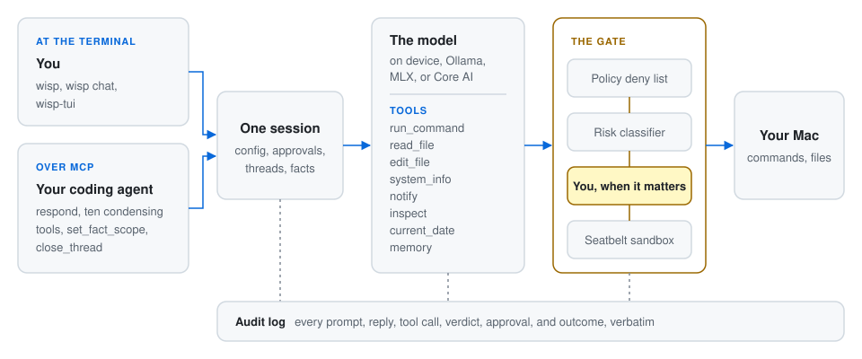

# wisp

**wisp** is a small AI agent that runs on your Mac and stays there. It drives Apple's on-device
Foundation Model, the one behind Apple Intelligence, and gives it tools: it can run a command, read
and edit a file, report on the machine, and send you a notification. You use it from the terminal, as
a command or a chat, and your coding agent uses it as an MCP server, handing it the local chores that
would otherwise fill the agent's context: run the tests and return the failures, condense a log,
summarise a diff, scan a commit for secrets. Every command the model runs passes a policy, a sandbox,
a risk classifier, and, when it matters, you, and every step is written to an audit log you can read
back.

You and your coding agent reach the same session, and a command the model asks for passes the gate
before it touches your Mac:

<picture>
  <source media="(prefers-color-scheme: dark)" srcset="docs/images/overview-dark.svg">
  
</picture>

## What you can do with it

### At the terminal

Ask it something, or hand it a task:

```bash
wisp "What is the date in Tokyo?"
wisp "What is listening on port 8080, and how much disk is free?"
wisp --yes "Run the tests in $PWD and tell me if they pass"
wisp chat                              # a conversation; /help lists the commands
```

Running tests changes state, so it counts as a `moderate` action: `chat` asks you before doing it, and
plain `wisp "…"` cannot ask, so it refuses unless you pass `--yes`. In `chat` you answer each request
once, for the session, for this project, or always, and `/model` switches models mid-conversation. On a
terminal the chat runs in `wisp-tui`, installed beside `wisp`: the conversation scrolls in your
terminal's own history above a pinned input and status line, with the model's tool calls shown as they
happen.

Some subcommands need no prompt at all. They put the model, or plain rules, to one job each:

```bash
wisp watch 'swift test 2>&1'           # rerun on every save; a notification when it starts or stops failing
git diff --cached | wisp scan          # credentials in a commit, before it is made; exits 1 on a finding
wisp redact crash.log | pbcopy         # secrets and personal data replaced by markers, ready to paste
wisp draft > /tmp/msg && $EDITOR /tmp/msg && git commit -F /tmp/msg   # a commit message from the staged diff
make test; wisp notify "Tests finished" --sound                        # a macOS notification
wisp logs --last 20                    # what just happened, from the audit log
wisp approvals                         # what it has been told to remember; revoke or clear here
```

`wisp --help` lists every subcommand; [wisp.md](docs/wisp.md) is the reference.

### From your coding agent

Register wisp as an MCP server and Claude Code, Codex, or any other MCP client can delegate work to it.
For Claude Code, in `.mcp.json`:

```json
{
    "mcpServers": {
        "wisp": {
            "command": "/opt/homebrew/bin/wisp",
            "args": ["mcp"]
        }
    }
}
```

The agent then has `respond`, which runs a task on the local model with wisp's tools and returns the
reply with a receipt of what it did, and ten condensing tools that read something large on your Mac
and return something small:

| Tool | Gives back |
| --- | --- |
| `respond` | The model's reply to a task, on a named thread you can continue; with a JSON Schema, a reply of that shape |
| `triage` | Only the failures from a build or test run, read exactly from known formats or judged by the model |
| `summarise_diff` | A diff as one line per file, with review flags: a deleted test, a credential, a binary |
| `draft_change` | A commit message, PR description, or changelog line from a diff |
| `scan_secrets` | Where credentials, and optionally personal data, occur, with the values masked |
| `redact` | The text with them replaced by numbered markers |
| `condense_log` | A log as its distinct messages, ranked by severity; a crash report as what explains it |
| `json_shape` | A JSON document's structure without its data |
| `dependency_audit` | An npm, cargo, or pip audit as what needs action, most severe first |
| `flaky_tests` | Tests that pass in some runs and fail in others |
| `hot_paths` | A profile's folded stacks as where the time goes |
| `close_thread` | Frees a `respond` thread |

A failing `swift test` run comes back as a headline and a few `file:line: message` findings; two
minutes of the unified log, 14,333 lines, came back as its top thirty message templates in about 10 KB. The raw output never
leaves the Mac and never enters the calling agent's context. When the model inside `respond` wants to
run a risky command, the approval dialog reaches you through your client, and a client that cannot show
one gets a refusal, never a silent run. [mcp.md](docs/mcp.md) has each tool's arguments and result.

## Why it is different

**Nothing leaves your machine.** The default model runs on your Apple silicon, so prompts, files, and
command output stay local, and there is no API key, no account, and no bill. Apple's Private Cloud
Compute is an explicit opt-in (`--model private-cloud`), noted on stderr and in the audit log; it needs
an entitlement that an unsigned command-line binary cannot carry, so it is refused from this build
([backends.md](docs/backends.md)). Any model a local Ollama serves can be chosen with `--model
ollama:<name>` when a task needs a larger window than the on-device model's 8k tokens; `wisp models`
lists what will work.

**Every command passes a gate, and the gate is fast.** Before a command runs it must clear a deny list
(`sudo`, `rm -rf /`, piping into a shell, disk tools), and it runs under a Seatbelt sandbox that
confines writes to the directory wisp was launched in, the temporary directory, and configured build
caches. Then a classifier rates each simple command in the line `safe`, `moderate`, or `dangerous`.
Rules set the floor and a Core ML text classifier, shipped with each release and trained on 2,135
labelled commands, 1,075 of them real, can only raise the level; it answers in under a millisecond
however busy the Mac is. On 996 real commands it rated 817 exactly, against 664 for the on-device
language model at 2.5 seconds a verdict ([approval.md](docs/approval.md)). A command the rules know
to be read-only, such as `git status`, never reaches a classifier at all. You can train a version on
your own history with `wisp classifier train --from-audit`.

**You decide, at the level you choose.** At `moderate` and above wisp asks. Your answer has a scope,
this turn, this session, this project for 30 days, or always for 30 days, and is remembered by the
program and its verb, so approving `git commit` never approves `git push`. A `dangerous` verdict is
never remembered beyond the session, so a stored `rm` approval never covers `rm -rf build`. A dialog
nobody answers is a refusal. `wisp approvals` shows what is remembered; `revoke` and `clear` forget it.

**You can see exactly what happened.** `~/.wisp/logs/audit.jsonl` records every prompt, reply, tool
call, policy decision, classifier verdict, approval, and command outcome, verbatim, in order. `wisp
logs` reads it, and `respond` returns each turn's receipt folded from the same events, so a calling
agent can check delegated work without reading the log. [trust.md](docs/trust.md) states in one page
what wisp can and cannot do to your Mac.

**It is a microharness.** One binary, one session, a registry of seven tools, and the smallest correct
agent loop; the framework runs the loop and wisp puts the care around it. Your own tools are command
templates in `~/.wisp/config.json`, run through the same gate as everything else
([tools/custom.md](docs/tools/custom.md)). State is a directory, `~/.wisp`, that you can read, edit,
and delete.

## Install

An Apple silicon Mac on macOS 27 or later with Apple Intelligence enabled, and Homebrew.

```bash
brew install pidster/tap/wisp   # installs wisp and wisp-tui
wisp doctor                     # checks the model, sandbox, classifier, config, and home directory
wisp "What is the date in Tokyo?"
```

State lives in `~/.wisp`: an optional `config.json` (change it with `wisp config set` or `/config set`
in chat), saved transcripts, remembered approvals, the audit log, and the classifier versions. Upgrade
with `brew upgrade pidster/tap/wisp`; remove with `brew uninstall wisp` and `rm -rf ~/.wisp`.

## Documentation

Everything is under [docs/](docs/README.md). Start with the row that matches your question.

| If you want to… | Read |
| --- | --- |
| Understand what wisp is for and what is out of scope | [objective.md](docs/objective.md) |
| Use the command line: subcommands, flags, `config.json`, exit codes | [wisp.md](docs/wisp.md) |
| See what the model can do and the limits on each tool | [tools/](docs/tools/README.md) |
| Know how well each delegated task works, as measured | [measurements.md](docs/measurements.md) |
| Choose a model or a local backend | [backends.md](docs/backends.md) |
| Connect it to another harness over MCP | [mcp.md](docs/mcp.md) |
| Know what it can do to your Mac, what it remembers, and how to undo | [trust.md](docs/trust.md) |
| Know how commands are confined and when you are asked | [tools/run_command.md](docs/tools/run_command.md), [approval.md](docs/approval.md) |
| Read or query the audit log, or debug wisp itself | [logging.md](docs/logging.md) |
| Understand how the code is put together | [design.md](docs/design.md) |
| Know why a decision was made | [decisions/](docs/decisions/) (one record per decision) |
| Work on the code to the project's standard | [engineering.md](docs/engineering.md) |
| Cut a release | [release.md](docs/release.md) |

Two background pages record what we learned about the platform:
[context-management.md](docs/context-management.md) on living inside a small context window, and
[policy-and-sandboxing.md](docs/policy-and-sandboxing.md) on what macOS and the framework offer for
confinement.

## Developing wisp

You need macOS 27 and Xcode 27 (the Command Line Tools alone lack the `@Generable` macro plugin), and
Rust 1.98 or later for the terminal front end in `tools/`.

```bash
git clone git@github.com:pidster/wisp.git
cd wisp
scripts/check install-hooks                        # once: enables the pre-commit gate
swift build --package-path harness
harness/.build/debug/wisp tools
harness/.build/debug/wisp "What is the date in Tokyo?"
cargo build --manifest-path tools/Cargo.toml       # wisp-tui, the terminal front end
WISP_BIN=harness/.build/debug/wisp tools/target/debug/wisp-tui
```

To see every tool working together on your Mac, ask wisp to run the functional evaluation in
`functionality-self-test.wisp`. It is a step-by-step guide to wisp's tools and checks, which wisp itself
wrote during a self-test:

```
$ harness/.build/debug/wisp chat
› Read functionality-self-test.wisp and carry out each step, then report pass or fail for each.
```

Expect it to ask before commands that change anything, and to refuse `sudo` by policy. Some probes exit
non-zero when they find nothing: `lsof` on an unused port, and `du` or `find` on folders macOS will not
let them read. One step appends a line to the guide itself to exercise `edit_file`, and the last posts
a notification; `git checkout -- functionality-self-test.wisp` undoes the edit. It is a quick smoke
check, not a measurement; `scripts/check eval` measures the model.

| Path | What it is |
| --- | --- |
| `harness/` | The Swift package: the `wisp` binary, `WispCore`, `WispMCP`, and the model backends |
| `tools/` | The Cargo workspace: `wisp-tui`, the terminal front end over `wisp chat --json` |
| `docs/` | Documentation and decision records |
| `training/` | Labelled training sets for the fast classifiers, with their reviews |
| `scripts/check` | The quality gate: lint, warnings-as-errors build, tests, hygiene, coverage, model eval |

How we work, in short:

- `scripts/check` is the whole gate and the pre-commit hook runs it. Lint is strict, warnings are
  errors, Swift 6 strict concurrency stays on, and there are no escape hatches.
- Tests never need the model. The model is exercised by running the binary, and by `scripts/check eval`
  for the classifier and every delegated task ([measurements.md](docs/measurements.md)).
- A change is done when it is tested, documented in code, and documented in `docs/`, in the same
  commit. A choice that is non-obvious or hard to reverse gets a decision record.
- Dogfooding: `.mcp.json` registers this repository's own release build (`swift build -c release`) as
  an MCP server, so Claude Code sessions here use it.

[engineering.md](docs/engineering.md) is the full standard, and [AGENTS.md](AGENTS.md) the orientation
given to AI agents working in this repository.
