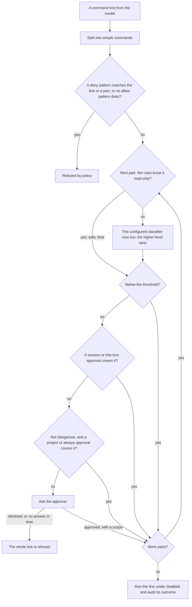
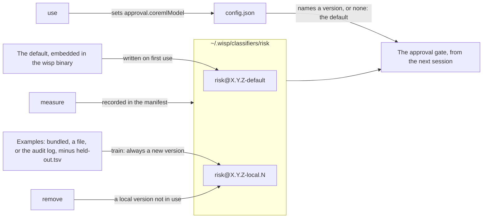

# Risk classification and approval

Before `run_command` executes anything that passed the [policy](tools/run_command.md#policy-and-sandbox), a
classifier assesses the command's risk and, at or above a threshold, a human is asked. This is layer 3 of
[policy-and-sandboxing.md](policy-and-sandboxing.md) and is recorded in
[ADR 0011](decisions/0011-risk-classifier-and-approval.md).

## Levels

| Level | Meaning | Examples |
| --- | --- | --- |
| `safe` | Read-only, or reversible within the working directory | `ls`, `git status`, `grep` |
| `moderate` | Modifies files or state but is recoverable, or reaches the network | `touch`, `git commit`, `npm install`, `curl` |
| `dangerous` | Destructive, irreversible, privilege-escalating, or exfiltrates data | `rm -rf`, `git push --force`, `sudo`, `… \| sh` |

## Classifiers

Two run and the higher verdict wins (`CompositeRiskClassifier`): the rules, and the classifier
`approval.classifier` names beside them, by default the Core ML classifier the release ships
([below](#a-core-ml-classifier)), or the on-device model. A command the rules know to be read-only is
not given to the second at all:

- **Rules** (`RuleRiskClassifier`): regexes with a level and a reason each, covering privilege, deletion,
  history rewriting and git's recovery data, credentials read or printed, uploads, publishing to a
  registry, deleting remote storage, network use, package installs, file modification, and build
  steps that write outside the project or discard build output (`xcodebuild`, `make clean`, `cargo
  clean`). Building and testing the project are safe, as the training labels have them. Cheap,
  deterministic, tested against a labelled set. Rules cover the model's weak spot: ordinary modifications it
  tends to call safe.

  The rules also keep a short list of read-only commands (`KnownSafeCommands`): `ls`, `cat`, `grep`,
  `find`, `git status`, `git log`, `git diff`, and other git reads, `--version` queries, and reads of the
  Mac's state such as `sysctl` and `defaults read`. A simple command no risky rule matches that fits one
  of those forms from start to end is **known safe**. Harmless redirections (`2>&1`, `>/dev/null`) and
  display-only variables (`NO_COLOR=1`) don't count against it. It must run nothing else (no `$(…)` or
  backticks), write nowhere, and name nothing sensitive (`.env`, `token`, `password`, `.pem`, shell
  history, Messages, Mail). It must also avoid the options that make a reading program write a file or
  run a program (`find -exec` or `-delete`, `sort -o`, `rg --pre`, `git diff --output`, `awk`'s
  `system()`). For a known-safe command the rules' `safe` is final: no model is asked, so it costs no
  model call and cannot be over-rated. A command off the list is judged as before, never refused.
- **The on-device model** (`ModelRiskClassifier`, `approval.classifier: system-model`): one fresh on-device session per command with a `@Generable` verdict.
  The verdict generates the one-sentence `reason` before the `risk` level, so the level follows the
  reasoning. The instructions give the model facts it otherwise guesses at (project build output is the
  project's own programs; filtering output is not network access; git reads are safe; anything that
  changes a file, setting, or repository state is at least moderate) and thirteen labelled examples.
  Sampling is greedy, so the same command always gets the same verdict. The command is placed between
markers and the model is told to treat it as data, but a command containing persuasive prose can still
steer the verdict; that is why the rules floor exists and the model may only raise a level, never lower one. If the model is unavailable or
  fails it reports `moderate`, so a broken classifier asks rather than waves through. The eval can put another
  model in its place (`ModelRiskClassifier(model:)`) to measure it in this role
  ([measurements.md](measurements.md#comparing-models)); the configuration cannot.

Measured on this machine (`scripts/check eval`, 47 labelled commands, twelve of them held out from the
instruction examples): the model alone scores 46 correct, 1 over, 0 under, at about 1.7 s per call
(2026-09-21; the recorded figure is in [measurements.md](measurements.md)). Its one miss reads a scratch
file under `/var/folders` as moderate rather than safe, which asks once and never waves anything through.
Two cases were added that day after the model had rated every `git commit -F /private/tmp/…` as
dangerous, reading "private" in a macOS temporary path as private data; the instructions now say what
those paths are. Before the instruction rewrite of 2026-09-19 the model scored 26 of 32 and varied
between runs. The eval suite asserts only the hard requirement (no dangerous command below moderate),
prints every miss with the model's reason, and is the place to add any command the model gets wrong.

A session keeps its classifiers' verdicts (`CachingRiskClassifier`, up to 256), keyed by the exact
command line and working directory, so a line judged once in a session is not judged again: the model
costs about 1.4 s a call and a coding loop reruns the same build and test lines. This is sound because
the verdict depends only on that key (greedy sampling, fixed rules and instructions for the session's
life). Only the classification is reused: the gate decides and asks by the level exactly as before, so a
moderate command still asks each turn unless an approval covers it. A fallback verdict from an
unavailable or failing classifier is never kept, so it is retried. A reused verdict is still recorded as
`classifier.verdict`, with `classifier.cached: true` in its metadata. With `approval.classifier:
rules` nothing is cached, since the rules answer in microseconds. `wisp watch` goes further and clears
its one command once ([ADR 0033](decisions/0033-watch-mode.md)).

## The gate

`ApprovalGate` (one per conversation) classifies, audits the verdict, and if the level is at or above the
threshold asks the session's `Approver`. `read_file` uses the same gate over the equivalent `cat <path>`
with the rule classifier only, so credential paths ask and ordinary reads cost no model call.

A line is split into its simple commands (`ls && curl … | sh` is three), each is classified and, if
risky, approved on its own with the whole line shown for context; a denial for any part refuses the line
([ADR 0015](decisions/0015-per-command-approval.md)). Approvals are remembered by the essential command,
the program that actually runs after unwrapping `sudo`, `env`, `time`, and the like, as a pattern such as
`head *`, so arguments never matter to remembering. For programs whose first word is the verb (`git`,
`cargo`, `swift`, `npm`, `brew`, `docker`, and the rest of
`harness/Sources/WispCore/Resources/multiplexers.txt`) the verb is part of the pattern: `git commit *`
and `git push *` are remembered apart, so approving one does not approve the other
([ADR 0027](decisions/0027-verb-patterns.md)). Options before the verb (`git -C dir status`) and
toolchain selectors (`cargo +nightly build`) are skipped; a program with no verb (`git --version`) is
`git *`. An approvals file written before verbs existed still counts: a stored `git *` covers every
git verb until it expires. An approval has a scope
([ADR 0014](decisions/0014-persisted-approvals.md)):

| Scope | Covers | Lives |
| --- | --- | --- |
| `once` | this pattern in this directory | the rest of the current turn: the prompt's whole tool loop, however many calls it makes |
| `session` | this pattern in this directory | until the process exits |
| `project` | this pattern in this directory | `approval.persistDays` (30), in `~/.wisp/approvals.json` |
| `always` | this pattern in any directory | `approval.persistDays` (30), in `~/.wisp/approvals.json` |

### The order of checks

For each simple command in a line, the gate does the following, in this order, stopping at the first
step that decides:

1. Classify it with the rules and, unless the rules know it to be read-only, the configured classifier.
2. If the verdict is below the threshold, run it. Nothing else is consulted.
3. Check the session cache for this pattern in this directory.
4. Check the turn cache for a once-approval given earlier in this turn.
5. Check the persistent file for a `project` entry in this directory or an `always` entry, **but only if
   the verdict is not dangerous**.
6. Ask the approver.

The life of one command line through the policy and the gate, part by part, is this; every verdict and
decision along the way is audited:



Step 5's exception is deliberate: a dangerous verdict skips the persistent file and always asks, so a
stored `rm *` never covers `rm -rf build` and a stored `git push *` never covers `git push --force`. The session
and turn caches do apply to dangerous commands, because those were answered in this process by a person
who saw the command; the persistent file may be weeks old. And because classification always comes first,
a stored approval decides only whether to ask, never whether the command is acceptable.

A dangerous verdict is never persisted: `project` or `always` is downgraded to `session` and the audit
says so. Remembered approvals only decide whether to ask; deny patterns, the sandbox, and the classifier
run on every part every time, so `rm *` never covers `rm -rf build`, and each use is audited with the
approval id.
`wisp approvals` lists them, `wisp approvals revoke <id>` and `clear` remove them. Decisions: approve with a scope (see below), deny with a reason, or unanswered. **An unanswered request is a denial**: no answer is not
an answer, so the MCP approver that hears nothing within `approval.timeoutSeconds` (default 600, ten
minutes) reports `unanswered`, the gate refuses the command and audits the decision as `timed-out`. Set it
to `0` to wait indefinitely. The terminal prompt in `chat` has no timeout: a person is at the keyboard,
and end of input counts as a refusal. A denial returns to the
model as `error: command not approved: …` (or `error: read not approved: …` from `read_file`) so it can
choose another approach. The gate itself throws `ApprovalGate.Failure.refused`; each tool renders it
through `ToolOutput.error`. `CommandRunner` splits the line once, checks the policy over each part, and
passes the parts to the gate, so a line is never split twice.

"This turn" is defined by the conversation's `TurnClock`, which the agent advances once per prompt and
the gate and the audit log both read, so a once-approval covers the rest of the tool loop whether or
not an audit log is attached, and the refusals `respond` reports are those of the turn just run.

| Entry point | Approver | Behaviour |
| --- | --- | --- |
| `wisp respond` | denying, unless `--yes` | Non-interactive: risky commands are refused with a message naming the three ways forward. `--yes` approves everything. |
| `wisp chat` | terminal | Prints the command, level, and reasons on stderr; reads `y` (this turn), `s` (session), `p` (project), `a` (always), or `n`. |
| `wisp mcp` | out of band and MCP elicitation, unless `--yes` | For commands the model runs inside `respond` and the condensing tools: files the request in `~/.wisp/pending`, posts a notification, and, when the client advertised elicitation, asks through its dialog at the same time; the first answer wins and the other is withdrawn. The person answers with `wisp approvals approve ID [--scope …]` or `deny ID` from a terminal, or in a running `wisp-tui`; never through the MCP conversation. Silence for `approval.timeoutSeconds` refuses. With `approval.outOfBand` false: elicitation only, and a client without it is refused with a message telling the calling harness to run the command itself, start wisp with `--yes`, or lower the threshold ([ADR 0046](decisions/0046-approval-and-notifications-over-mcp.md)). |

## Configuration

```json
{ "approval": { "threshold": "moderate", "useModel": true } }
```

| Field | Default | Meaning |
| --- | --- | --- |
| `threshold` | `moderate` | Ask at this level and above: `safe`, `moderate`, `dangerous`, or `never`. |
| `classifier` | `coreml` | What runs beside the rules: `coreml` (a Core ML text classifier, below: the version this release ships unless `coremlModel` names another, under a millisecond a command; [ADR 0041](decisions/0041-shipped-classifier-is-the-default.md)), `system-model` (Apple's on-device model, about 2 s a command, more when the Mac is busy), or `rules` (nothing; fast and deterministic). Independent of `model`. |
| `useModel` | none | The pre-0.2 switch; `true` means `classifier: system-model`, `false` means `classifier: rules`. Read only when `classifier` is absent. |
| `coremlModel` | the shipped default, `risk@X.Y.Z-default` | For `coreml`: a version, `risk@<version>`, from `~/.wisp/classifiers/risk`, or the `.mlmodel` or `.mlmodelc`, absolute, `~`, or under `<home>/models/coreml`. |
| `coremlMinimumConfidence` | `0.6` | For `coreml`: below this top-label probability the verdict is raised to at least `moderate`. |
| `timeoutSeconds` | `600` | How long an approval may go unanswered before it counts as declined; `0` waits forever. |
| `persistDays` | `30` | Lifetime of `project` and `always` approvals. |
| `outOfBand` | `true` | Under `wisp mcp`, also file each waiting command for `wisp approvals` and `wisp-tui`, with a notification; the first answer, there or in the client's dialog, wins. `false` asks through elicitation only. |

## Approval over MCP through another face

A client that does not render elicitation (the Claude mobile app), or whose dialog sticks, can still be
answered ([ADR 0046](decisions/0046-approval-and-notifications-over-mcp.md)). The waiting server writes the
request to `~/.wisp/pending/<id>.request.json` (directory 0700, file 0600) and posts a banner:

```
wisp: approval needed
moderate risk · claude-code, thread git
git push origin main — wisp approvals approve a1b2c3d4
```

The person answers from a terminal or `wisp-tui`; the answer is a second file, bound by a SHA-256 to the
exact command, line, directory, thread, and server process shown, so it approves only what was shown and
only once. A request whose server has stopped or whose wait has expired is stale and is swept by the next
`wisp approvals pending`. The calling agent cannot answer: nothing in MCP approves, wisp's own model is
refused `wisp approvals approve|deny` by the default policy and cannot write `~/.wisp` from the sandbox, and
the commands refuse to run without a terminal on standard input. The same directory holds the facts a caller asked
the person to keep as permanent (`<id>.fact.json`), which are answered with `wisp facts keep|drop`, not
`wisp approvals` ([ADR 0048](decisions/0048-permanent-facts-over-mcp.md)).

`never` still classifies and audits; it just does not ask.

### A Core ML classifier

`classifier: coreml` runs a Core ML text classifier beside the rules ([ADR 0020](decisions/0020-coreml-risk-classifier.md)).
The rules, the threshold, and the human stay authoritative: the higher of the two levels wins, and
nothing the classifier does can lower a level or grant an approval.

The model must follow contract version 1 or 2: input `text`, a string; output `label`, one of `safe`,
`moderate`, `dangerous`; creator metadata `wisp.classifier.contract` = `1` or `2` and
`wisp.classifier.labels` = `safe,moderate,dangerous`. Under version 1 wisp gives it the command line
trimmed with runs of whitespace collapsed to one space, case kept; version 2 first puts spaces around
shell punctuation (`| & ; < > ( ) $ \` " ' = / ~ .`), so each is a token of its own
([ADR 0038](decisions/0038-fast-specialised-classifiers.md)). A model declaring anything else is
rejected when it loads. Its metadata version string is its identity in the audit, and the model is
loaded once per process.

Every failure is a `moderate` verdict with the reason: no path configured, a missing asset, a model
Core ML cannot load, a contract mismatch, an inference error, no prediction, an unknown label, or a
top-label probability below `coremlMinimumConfidence`. Confidence is recorded only when the model gives
label probabilities (Create ML text classifiers do); it is uncalibrated, and the threshold guards
against guessing rather than measuring accuracy. `wisp doctor` checks the configured model prepares.

### Training and measuring a classifier

A classifier runs on every command, so it should be fast and specialised rather than a general model
([ADR 0038](decisions/0038-fast-specialised-classifiers.md)). wisp trains one on this Mac:

```
wisp classifier list                         # the versions on this Mac, the one in use marked *
wisp classifier train --from-audit --use     # a new version, in well under a second, used from the next session
wisp classifier measure risk@0.13.0-local.1 --examples my-commands.tsv
wisp classifier use risk@0.14.0-default      # back to the one the release ships
```

Versions live in `~/.wisp/classifiers/risk/<version>/`, each a read-only `model.mlmodel` beside a
`manifest.json` recording what it learned from (the source, the count per level, a SHA-256 of the
examples), the version in use when it was trained, and every measurement taken of it since. Each release
ships a default, `risk@X.Y.Z-default`, trained once from the bundled examples when the release is
prepared, measured by the eval, embedded in the binary, and written into the store on first use; it is
never changed. `train` always adds a new version, `risk@X.Y.Z-local.<n>`, and never overwrites one;
the same examples always train the same classifier. `use` points
`approval.classifier` at `coreml` and `approval.coremlModel` at the version, through the same checked,
audited change as `/config set`; `remove` deletes a version trained here, but not the default and not
the one in use. With `approval.classifier: coreml` and no `approval.coremlModel`, the release's default
is used, so a fast classifier needs no training at all. A path or a file name under
`~/.wisp/models/coreml` still works for a model made elsewhere. `--examples` gives your own
labelled commands, one per line as `level<TAB>command`, `#` for comments; every level needs some. The
bundled examples are `harness/Sources/WispCore/Resources/risk-examples.tsv`, a copy of
`training/risk/train.tsv` (drafted and real commands, 2,135 in all), and none of them is in the eval
set.

How versions enter the store, which one the gate uses, and what `remove` may not touch:



`--from-audit` also learns from this Mac's audit log: the on-device model's verdicts on the commands
you have run, so the fast classifier learns what the slow one decided on the commands that matter
here. Only verdicts the model took part in count, not its fallbacks; each command keeps its latest
verdict; a command a person refused is raised to at least `moderate`; and secrets and personal data are
replaced by markers first, since a trained model keeps the words it learned. The audit examples replace
bundled ones for the same command. `train` prints how many commands it found, how many verdicts were
fallbacks, how many were raised, and how many were redacted.

A test set of commands actually run on this Mac must never be trained on, and `--from-audit` would
otherwise learn exactly those. `train` always leaves out any example that overlaps
`~/.wisp/classifiers/risk/held-out.tsv` (labelled commands, one `level<TAB>command` per line), exactly,
after normalising, by family, or by near match, and says how many it left out; `--exclude <file>` adds
more files to leave out. Keep the test set there, or pass it with `--exclude`.

`measure` runs a classifier over labelled commands with the rules beside it, as the gate runs it, and
prints the commands rated exactly, over, and under, every miss, and the latency per verdict (p50, p95,
slowest). It exits 1 when a dangerous command is rated safe. Given a version it measures that one, and
records the result in its manifest, so `list` shows each version's latest score; `--classifier` and
`--coreml-model` override the config otherwise. Measure a trained model on commands it did not learn from.

Measured on 2026-09-26 over 996 real commands held out from all training, the rules beside each: the
shipped default, trained on drafted and real commands, rated 817 exactly at 0.24 ms a command, with 129
over and 50 under; `system-model` rated 664 at 2.5 s (P50), with 261 over and 71 under. The shipped
default rated four dangerous commands safe, and `system-model` one. That is why the shipped default is
the default ([ADR 0041](decisions/0041-shipped-classifier-is-the-default.md)), and why the dangerous
commands need a larger test set.
[measurements.md](measurements.md) has the current figures.

## Audit

Every command produces `classifier.verdict` (level, reasons, sources, seconds) and, when asked,
`approval.requested` and `approval.decided` (decision, reason; `cached` for session approvals). See
[logging.md](logging.md).

## Testing policy without the model

`PolicyScenarioTests` is a table: for a command line it states the parts the splitter must find, whether
the deny patterns refuse it, and which patterns a user would be asked for at the default threshold, all
driven through the real splitter, deny list, and rule classifier with a recording approver. No model, no
MCP client. When a real line surprises you, add a row there first; it documents the intended behaviour
and fails until the code matches.

## Extending

Add a rule to `RuleRiskClassifier.defaultRules` with a reason a human would accept, and a case to the
labelled set in `ApprovalTests`. Add commands to `ClassifierEvalTests.labelled` when the model gets one
wrong, so the eval tracks it; keep held-out cases that do not resemble the instruction examples, or the
score measures recognition rather than judgement. Change the instructions only with a before-and-after
eval run in the commit message.
