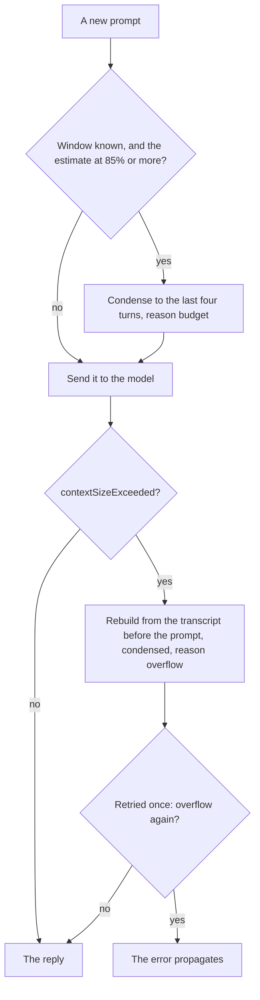

# Managing the context window

The on-device model's window is small. `LanguageModelError.contextSizeExceeded` reports both the limit and
the offending count. On this machine a session died at 4,096 tokens in 2026-09; on macOS 27 the window
measured 8,192 on 2026-09-29 (below). This page records what the framework
offers, what wisp does, and what it deliberately does not do yet.

## What the framework offers (macOS 27 SDK)

| API | Use |
| --- | --- |
| `Transcript` is `Codable` and a `RangeReplaceableCollection` of `Entry` | Save, inspect, trim, and rebuild conversations. Entries are `.instructions`, `.prompt`, `.toolCalls`, `.toolOutput`, `.response`. |
| `LanguageModelSession(model:tools:transcript:)` | Start a session from any transcript, which is how a condensed conversation continues. |
| `SystemLanguageModel.tokenCount(for:)` | Counts tokens for a prompt, instructions, tools, schema, or transcript entries, so budgets can be measured rather than guessed. Costs a model call. |
| `LanguageModelError.contextSizeExceeded(ContextSizeExceeded)` | Carries `contextSize` and `tokenCount`. |
| `ContextOptions` | Despite the name, sets `reasoningLevel` (`light`, `moderate`, `deep`) and schema inclusion. Not window management. |

There is no automatic summarisation or sliding window in the framework. Whatever fits must be arranged by
the caller.

## What wisp does

### The store and the composer

`Agent` keeps each conversation in a `ConversationStore` and asks a `ContextComposer` for the transcript
each request carries, rather than continuing one session and letting its transcript grow. This is phase 2
of the [layered-context proposal](proposals/2026-09-29-layered-context.md): the structure the later phases
build on, reproducing the behaviour below exactly.

- **The store** holds every entry of the conversation once, in order, under a stable id: the instructions,
  prompts, tool calls, tool output, and replies. Each entry refers to the audit events that recorded its
  content (`sources`: a prompt's `prompt` event, a reply's `response` event, each tool call's `tool.call`
  and each output's `tool.result`), by the events' `id` ([logging.md](logging.md)). The audit log stays
  the one verbatim record (the proposal's D8); the store adds each entry's kind, where it came from (a
  turn of this conversation, or carried in with the instructions or a resumed transcript), and whether it
  is active or was dropped, and by which `context.condensation` event.
- **Only in memory.** The store also keeps the framework's value of each entry, as a cache of the
  conversation's own entries, so composing a request never reads the audit files. Nothing new is written
  to disk: `/save` and `--resume` save and load the active transcript as before, and a resumed
  conversation rebuilds its store from it, with those entries carried and without sources.
- **The composer**, for now, sends the store's active entries literally, in order, and decides the
  condensing below; the agent applies it. Dropped entries stay in the store, marked, and are no longer
  composed.
- **The session** is kept while each composition is what it already holds, which is every turn that does
  not condense, so the runtime's processed prefix and the session's token totals carry over as before. A
  condensation, an overflow retry, or `/new` starts a new session from the composition.
- **Linking tool entries.** The tools record their own events, which the agent does not see, so every
  `Conversation` also tees its audit log into a `ToolEventTrail`. After each turn, succeeded or failed, the
  agent stores the entries the session added and links each tool call to the latest `tool.call` event of
  the same tool and arguments, and each output to its call's `tool.result`. An agent built without a
  conversation (tests, the context eval) links prompts and replies only.
- **`/model`** opens the new model's agent over the old agent's store, so its first request carries the
  same active view and the store keeps its history and references (the proposal's D10, which will
  recompose for the new window once the composer does more than literal turns).
- **`/new`** starts a new store over the instructions alone.

Equivalence is tested: `ContextEquivalenceTests` drives scripted conversations (tools, condensing ahead
and on overflow, a failed turn, fail-fast, a model that counts, reset and resume, a chat with `/model`,
`/inspect context`, and `/save`, and an MCP thread through `Session.conversation`) and compares every
request the model received, every audit event, every reply, every saved context file, and chat's output
with a snapshot recorded from the code before the store existed.

### Condensing

`Agent` has a `ContextPolicy`:

- `.failFast`: the error propagates.
- `.condense(keepTurns:)` (default, four turns): on overflow, the store's active view as it was before
  the failing prompt is condensed with `Transcript.condensed(keepTurns:)`, the dropped entries are marked,
  and the prompt is retried once on a new session. If it fails again, the error propagates.

`condensed(keepTurns:)` keeps the leading `.instructions` entry and the last N turns, where a turn is a
`.prompt` plus everything up to the next prompt, so tool calls and outputs stay with the prompt that caused
them. It is pure and tested. `Agent.condensations` counts recoveries so callers can tell the user; `chat`
prints a note and MCP `respond` sets `structuredContent.condensed`.

`Agent.contextTokens()` exposes the framework's count for the current transcript, or, for a model
that cannot count, the token usage the runtime reported for the last request; `chat` shows it with
`/tokens`.

### Ahead of the window, for runtimes that do not fail

Ollama and other local runtimes do not throw `contextSizeExceeded`; they drop the front of the prompt
silently, and the instructions go first. The reactive path never fires. So `Agent` also condenses ahead
of the window ([ADR 0025](decisions/0025-context-estimation.md)): a runtime reports the tokens a
request used, wisp's executors keep the last request's figure on the model (`UsageReporting`;
`LanguageModelSession.usage` accumulates across requests, so it cannot serve), and before each prompt
the agent adds a rough cost for the new prompt (four bytes per token) to that figure. A model that reports no usage but can count its transcript (the on-device model) is
counted instead. If that reaches `contextBudget` (85%) of a known window, the transcript is condensed to the
policy's turns first and the condensation is audited with reason `budget`. The window is known when the
model states it (`SystemLanguageModel.contextSize`, or `PrivateCloudComputeLanguageModel.contextSize` read when the model is resolved; for Ollama, the window wisp sized for the model or the
configured `contextLength`, sent as `num_ctx` so the server's default cannot differ from what it condenses
against; [ADR 0043](decisions/0043-context-window-from-memory.md)) or once an
overflow error has reported it. Nothing happens for a window nobody knows.

Both paths, for one prompt under the default `.condense` policy:

Tools are the other half of the answer. `run_command` keeps only the tail of output and `read_file` pages a
file, so a single tool result cannot fill the window.

## Design rules

1. Never let one tool result exceed a fixed byte budget (4 KiB by default). Paging beats truncation where the
   model can ask for more.
2. Keep tool descriptions short: every registered tool's schema is in the prompt on every turn.
3. Treat overflow as expected, not exceptional; recover, tell the caller, continue.
4. Prefer dropping whole turns to editing entries, so the transcript stays a faithful record. Since the
   store, a dropped turn also stays in the conversation's store, marked with the condensation that
   dropped it.

## On the on-device model, and what condensing costs

Measured on 2026-09-29 with the on-device model on macOS 27. Its window is now 8,192 tokens, not the
4,096 this page first recorded. Its runtime reports no token usage, so the ahead check had nothing to go
on. It also reports an overflow as a generic `inferenceFailed` whose message reads "Provided 8,913
tokens, but the maximum allowed is 8,192", not as `contextSizeExceeded`, so the retry never ran either. A
conversation that reached 91% of the window failed its next large turn instead of condensing.

Both are fixed:
- **The ahead check counts.** For a model that reports no usage, it uses the model's own count of the
  transcript.
- **The retry recognises the message form** as well as `contextSizeExceeded` (`Agent.overflow(in:)`).

A scripted chat then showed what condensing costs. It planted a fact ("the codename is BLUE HERON")
in turn 1, then asked the model to read and summarise six of these docs, about 1,400 tokens a turn:
- Before turn 7 the transcript was condensed from six turns to four, and the planted fact went with the
  first two.
- Asked for the codename, the model said it did not know.
- Asked which file it read first, it named the oldest file still in its window, confidently and
  wrongly. Nothing tells a model that older turns were dropped.
- Four turns of that size keep the transcript near the 85% budget, so from then on it condensed before
  almost every turn, a turn at a time.

That chat is now an eval, `ContextEvalTests` (`scripts/check eval`), with four facts, a task, a fact
that changes, a ten-file digression, and six questions. It is the baseline the
[layered-context proposal](proposals/2026-09-29-layered-context.md) is measured against. On 2026-09-29
today's dropping scored 0 of 6 on the on-device model and 1 of 6 on `granite4.1:8b` at the same 8,192-token
window. Granite scored 6 of 6 at 32,768, where nothing was dropped. Both models again confidently named a
later file as the first one read. The proposal's "Evaluation" section has the figures.

To see this for yourself, `/inspect context` in chat saves the exact context the next request carries:
instructions, prompts, tool calls, tool output, and replies. It writes Markdown to read and JSON to
rebuild a session from, in `~/.wisp/context/`. Every condensation also saves the transcript before and
after it, and names both files in its `context.condensation` event (`savedBefore`, `savedAfter`), so
the dropped turns can be read rather than guessed. Files are saved only while `audit.enabled` is true.

## Not done yet, and why

- **Summarisation instead of dropping.** Asking the model to summarise the dropped turns into a new
  instructions entry preserves more, at the cost of a model call and a transcript that no longer records what
  was said. Worth an experiment once there is a workload that suffers from plain dropping.
- **Counting before each prompt, for every model.** Calling `tokenCount(for:)` before each prompt is exact
  but costs a model call. The ahead check uses the free usage report where a runtime gives one, and counts
  only for a model that reports nothing (ADR 0025, amendment of 2026-09-29).
- **Map-reduce for long documents.** Summarising a file longer than the window needs chunked sub-sessions
  and a merge step. That belongs in a dedicated tool (a Rust candidate), not in `Agent`.
