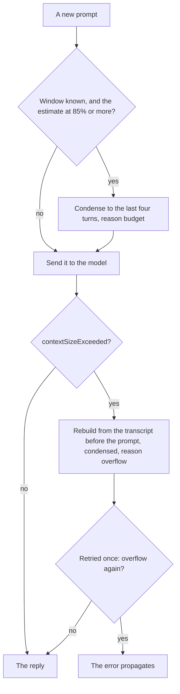

# Managing the context window

The on-device model's window is small. `LanguageModelError.contextSizeExceeded` reports both the limit and
the offending count; on this machine a session died at 4,096 tokens. This page records what the framework
offers, what wisp does, and what it deliberately does not do yet.

## What the framework offers (macOS 27 SDK)

| API | Use |
| --- | --- |
| `Transcript` is `Codable` and a `RangeReplaceableCollection` of `Entry` | Save, inspect, trim, and rebuild conversations. Entries are `.instructions`, `.prompt`, `.toolCalls`, `.toolOutput`, `.response`. |
| `LanguageModelSession(model:tools:transcript:)` | Start a session from any transcript, which is how a condensed conversation continues. |
| `SystemLanguageModel.tokenCount(for:)` | Counts tokens for a prompt, instructions, tools, schema, or transcript entries, so budgets can be measured rather than guessed. Costs a model call. |
| `LanguageModelError.contextSizeExceeded(ContextSizeExceeded)` | Carries `contextSize` and `tokenCount`. |
| `ContextOptions` | Despite the name, sets `reasoningLevel` (`light`, `moderate`, `deep`) and schema inclusion. Not window management. |

There is no automatic summarisation or sliding window in the framework. Whatever fits must be arranged by
the caller.

## What wisp does

`Agent` has a `ContextPolicy`:

- `.failFast`: the error propagates.
- `.condense(keepTurns:)` (default, four turns): on overflow, the session is rebuilt from the transcript as
  it was before the failing prompt, condensed with `Transcript.condensed(keepTurns:)`, and the prompt is
  retried once. If it fails again, the error propagates.

`condensed(keepTurns:)` keeps the leading `.instructions` entry and the last N turns, where a turn is a
`.prompt` plus everything up to the next prompt, so tool calls and outputs stay with the prompt that caused
them. It is pure and tested. `Agent.condensations` counts recoveries so callers can tell the user; `chat`
prints a note and MCP `respond` sets `structuredContent.condensed`.

`Agent.contextTokens()` exposes the framework's count for the current transcript, or, for a model
that cannot count, the token usage the runtime reported for the last request; `chat` shows it with
`/tokens`.

### Ahead of the window, for runtimes that do not fail

Ollama and other local runtimes do not throw `contextSizeExceeded`; they drop the front of the prompt
silently, and the instructions go first. The reactive path never fires. So `Agent` also condenses ahead
of the window ([ADR 0025](decisions/0025-context-estimation.md)): a runtime reports the tokens a
request used, wisp's executors keep the last request's figure on the model (`UsageReporting`;
`LanguageModelSession.usage` accumulates across requests, so it cannot serve), and before each prompt
the agent adds a rough cost for the new prompt (four bytes per token) to that figure. A model that reports no usage but can count its transcript (the on-device model) is
counted instead. If that reaches `contextBudget` (85%) of a known window, the transcript is condensed to the
policy's turns first and the condensation is audited with reason `budget`. The window is known when the
model states it (`SystemLanguageModel.contextSize`; Ollama's configured `contextLength`, which wisp
sends as `num_ctx` so the server's default cannot differ from what it condenses against) or once an
overflow error has reported it. Nothing happens for a window nobody knows.

Both paths, for one prompt under the default `.condense` policy:

Tools are the other half of the answer. `run_command` keeps only the tail of output and `read_file` pages a
file, so a single tool result cannot fill the window.

## Design rules

1. Never let one tool result exceed a fixed byte budget (4 KiB by default). Paging beats truncation where the
   model can ask for more.
2. Keep tool descriptions short: every registered tool's schema is in the prompt on every turn.
3. Treat overflow as expected, not exceptional; recover, tell the caller, continue.
4. Prefer dropping whole turns to editing entries, so the transcript stays a faithful record.

## On the on-device model, and what condensing costs

Measured on 2026-09-29 with the on-device model on macOS 27. Its window is now 8,192 tokens, not the
4,096 this page first recorded. Its runtime reports no token usage, so the ahead check had nothing to go
on. It also reports an overflow as a generic `inferenceFailed` whose message reads "Provided 8,913
tokens, but the maximum allowed is 8,192", not as `contextSizeExceeded`, so the retry never ran either. A
conversation that reached 91% of the window failed its next large turn instead of condensing.

Both are fixed:
- **The ahead check counts.** For a model that reports no usage, it uses the model's own count of the
  transcript.
- **The retry recognises the message form** as well as `contextSizeExceeded` (`Agent.overflow(in:)`).

A scripted chat then showed what condensing costs. It planted a fact ("the codename is BLUE HERON")
in turn 1, then asked the model to read and summarise six of these docs, about 1,400 tokens a turn:
- Before turn 7 the transcript was condensed from six turns to four, and the planted fact went with the
  first two.
- Asked for the codename, the model said it did not know.
- Asked which file it read first, it named the oldest file still in its window, confidently and
  wrongly. Nothing tells a model that older turns were dropped.
- Four turns of that size keep the transcript near the 85% budget, so from then on it condensed before
  almost every turn, a turn at a time.

To see this for yourself, `/inspect context` in chat saves the exact context the next request carries:
instructions, prompts, tool calls, tool output, and replies. It writes Markdown to read and JSON to
rebuild a session from, in `~/.wisp/context/`. Every condensation also saves the transcript before and
after it, and names both files in its `context.condensation` event (`savedBefore`, `savedAfter`), so
the dropped turns can be read rather than guessed. Files are saved only while `audit.enabled` is true.

## Not done yet, and why

- **Summarisation instead of dropping.** Asking the model to summarise the dropped turns into a new
  instructions entry preserves more, at the cost of a model call and a transcript that no longer records what
  was said. Worth an experiment once there is a workload that suffers from plain dropping.
- **Counting before each prompt, for every model.** Calling `tokenCount(for:)` before each prompt is exact
  but costs a model call. The ahead check uses the free usage report where a runtime gives one, and counts
  only for a model that reports nothing (ADR 0025, amendment of 2026-09-29).
- **Map-reduce for long documents.** Summarising a file longer than the window needs chunked sub-sessions
  and a merge step. That belongs in a dedicated tool (a Rust candidate), not in `Agent`.
