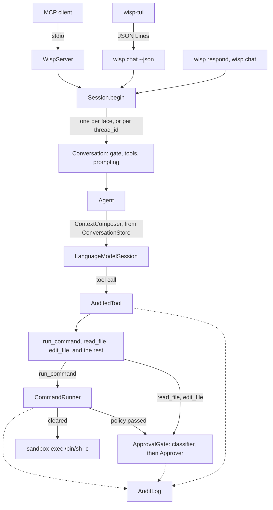

# Design

## Overview

Every face of wisp sets up through `Session.begin` and opens its conversations from the session it
returns; every tool call the model makes passes the audit wrapper, and a command also passes the policy,
the gate, and the sandbox:

The framework owns the agent loop. When the model emits a tool call, `LanguageModelSession` decodes the
arguments into the tool's `@Generable` `Arguments` type, invokes `call(arguments:)`, appends the result to the
transcript, and continues generation. `Agent` therefore contains no loop of its own; it guards
availability, composes the transcript each request carries, and shapes the API. `read_file` and `edit_file` consult the gate without `CommandRunner`;
`current_date`, `inspect`, `notify`, and `system_info` do not consult it (see "Tools" below).

## Repository layout

| Path | Contents |
| --- | --- |
| `harness/` | Swift package: the `wisp` binary and `WispCore` |
| `tools/` | Cargo workspace: one crate per Rust tool binary |
| `docs/` | This documentation and the ADRs |
| `training/` | Labelled train, dev, and test sets for the fast classifiers; only `risk/train.tsv` is built in, as `Resources/risk-examples.tsv` |
| `scripts/check` | The quality gate for both toolchains |

## Targets

| Target | Kind | Responsibility |
| --- | --- | --- |
| `WispCore` | library | All model-facing logic, grouped by folder: `Session/` (session, conversation, agent, conversation store and context composer, model selection, context policy, tool registry and catalogue), `Exec/` (command runner, policy, splitter, regex cache), `Approval/` (gate, classifiers, store, threshold), `Audit/` (events, details, log, turn clock, diagnostics, receipts, call statistics, the event relay, the tool event trail, the log tail), `Condense/` (the condensers, the secret rules, redaction and the model sweep, the personal-data classifier and its training), `Tools/` (the tools, the file reader, and the audit wrapper), `Config/` (config, home, transcripts), `CLI/` (doctor and chat input, here so they are testable), `Support/` (timeout, ids, names). |
| `WispCoreAI` | library | `CoreAIBackend`: models exported to Apple's Core AI format, through the bridge in `apple/coreai-models`. Registered by the executable at launch so `WispCore` never links it. |
| `WispMLX` | library | `MLXBackend`: models in MLX or Hugging Face layout through `mlx-swift-lm`'s bridge, compiled in only under the `MLX` package trait (Metal toolchain); otherwise registered but refusing with the reason. |
| `WispMCP` | library | `WispServer` and `ToolCatalog`: exposes wisp over MCP. Depends on `WispCore` and the official MCP Swift SDK. |
| `wisp` | executable | Argument parsing and stdin/stdout only. Subcommands `respond` (default), `chat`, `tools`, `models`, `mcp`, `logs`, `config`, `doctor`, `approvals`, `notify`, `scan`, `redact`, `watch`, `draft`, `classifier`. Session set-up is `Session.begin` in `WispCore`. |
| `EmbedSystemPrompt` | build-tool plugin | Embeds `Resources/system-prompt.md` into `WispCore` as a string constant at build time. |
| `WispTestSupport` | library, tests only | `ScriptedModel`: a `LanguageModel` that answers from a script, so the agent, tool loop, and MCP server run in tests with no model. |
| `WispCoreTests`, `WispMCPTests` | tests | swift-testing suites for model-independent logic; `WispServerWireTests` drives the server through a real MCP client on an in-memory transport. |

## Components

### `ModelSelection` and `ResolvedModel`

Local runtimes are `ModelBackend`s in the `ModelBackends` registry, keyed by scheme; `ModelSelection.local`
is spelled `<backend>:<name>` and resolves through the registry. A `ResolvedModel` carries the model's
declared capabilities and their source, and `Conversation.openAgent` refuses a request that needs tool
calling the model did not declare, then records `model.resolved`; see
[ADR 0019](decisions/0019-model-backends.md). Any `LanguageModel` can be wrapped by
`ResolvedModel(selection:custom:)`. `OllamaModel` is the first backend:
its `Executor` maps the transcript onto Ollama's chat API (system, user, assistant with tool calls, tool
messages), sends tool definitions as JSON Schema and an output schema as `format`, and streams chunks back
as `response` and `toolCalls` events with usage at the end. `resolve` checks the server lists the model
(blocking briefly, because agents are created synchronously). The framework's tool loop, streaming,
transcript, and guided generation are unchanged above it. See
[ADR 0016](decisions/0016-local-runtimes-through-an-executor.md).

`ModelSelection` names the model (`system`, `private-cloud`, or `ollama:<name>`); `resolve()` checks
availability and returns a `ResolvedModel`, which erases the concrete `LanguageModel` behind session
makers and an optional token counter. See [ADR 0013](decisions/0013-model-selection.md).

### `Agent`

Keeps the conversation in a `ConversationStore` and asks a `ContextComposer` for each request's
transcript, which a `LanguageModelSession` created by a `ResolvedModel` then runs; `resolve()` checks
availability and throws `ModelSelection.Failure.unavailable` rather than letting the first request fail
obscurely. An agent can also start from a saved `Transcript`, or from another agent's store (`/model`).

- `respond(to:)` returns a `Reply`: the text and whether the turn was condensed.
- `stream(_:onDelta:)` invokes a callback with each new fragment and returns the same `Reply`. Snapshots
  are cumulative; if a retry after mid-stream overflow starts an answer that does not continue the text
  already shown, a newline separates the two. It is a callback
  rather than an `AsyncSequence` for a concurrency reason recorded in
  [ADR 0003](decisions/0003-callback-streaming.md).
- On context overflow the `ContextPolicy` (default: keep the last four turns) rebuilds the session from a
  condensed transcript and retries once; `condensations` counts recoveries. See
  [context-management.md](context-management.md) and [ADR 0008](decisions/0008-context-condensation.md).
- `transcript` (the composed view the next request carries), `store`, `contextTokens()`, and `reset()`
  support saving, budgeting, and starting over.

### `ConversationStore` and `ContextComposer`

The layered-context proposal separates the conversation as stored from the context each request carries
([proposal](proposals/2026-09-29-layered-context.md); phase 2, the structure without the behaviour). One
turn, as the agent runs it:

1. The prompt is audited; the composer decides whether to condense ahead of the window, and the agent
   applies it: saves the archive, records `context.condensation`, and marks the dropped entries in the
   store with that event.
2. The composer builds the request's transcript: for now, the store's active entries, literally.
3. The agent puts the session over it, continuing the live session when it already holds exactly that,
   and starting a new one otherwise. The framework runs the tool loop; an overflow condenses the active
   view as it was before the prompt and retries once.
4. The entries the session added, whether the turn succeeded or failed, go into the store, each with
   references (`AuditReference`: session, turn, and the event's `id`) to the audit events that recorded
   it. Tool events come from the conversation's `ToolEventTrail`, an `AuditSink` every `Conversation`
   tees its log into.

The store is a value type the agent owns, in memory only: it caches each entry's framework value so
composing never reads the audit files, and the audit log remains the only verbatim record on disk
(decision D8). The composer is pure; it holds the `ContextPolicy` and the budget. Later phases add
facts and summaries that cite store entries by id, and composers that compose more than literal turns.

### Risk classification and approval

`ApprovalGate` (an actor, one per conversation) takes an `ApprovalThreshold` (a level, or `never`) and runs a `RiskClassifier` (`CompositeRiskClassifier` over
`RuleRiskClassifier` and `ModelRiskClassifier`) and, at or above the configured threshold, asks an
`Approver` (`TerminalApprover`, `DenyingApprover`, `AutoApprover`, or the MCP `ElicitationApprover`).
`CommandRunner` consults the gate after the policy check. See [approval.md](approval.md) and
[ADR 0011](decisions/0011-risk-classifier-and-approval.md). The model beside the rules is
`CoreMLRiskClassifier` (a Core ML text classifier under contract 1 or 2; the default, with the version
the release ships, ADR 0041) or `ModelRiskClassifier` (the on-device language model), chosen by
`approval.classifier`, and a session wraps whichever it
uses in `TimedRiskClassifier` and `CachingRiskClassifier`. `RiskClassifierTraining` trains a contract-2
model with Create ML from `RiskExample`s (the bundled `Resources/risk-examples.tsv`, a file, or
`RiskExamples.fromAudit`), and `RiskMeasurement` measures any classifier's accuracy and latency; `wisp
classifier` is their CLI ([ADR 0038](decisions/0038-fast-specialised-classifiers.md)).
`KnownSafeCommands` is the rules' short list of read-only commands: a verdict it gives is known safe
(`RiskAssessment.isKnownSafe`), and `CompositeRiskClassifier` then does not ask the model. `ClassifierStore`
keeps the versions under `~/.wisp/classifiers/risk`, one directory each with a read-only
`model.mlmodel` and a `manifest.json` of its training and measurements; `ShippedClassifier` is the
release's default, embedded from `Resources/risk-default.json` and installed as `risk@X.Y.Z-default` by
`installDefault()` when a session or `wisp classifier` first needs it. `TrainingSplit` parses the sets
under `training/`, deals them into parts by family, and finds overlaps between parts, for `wisp
classifier split` and `TrainingSetsTests`.

### Audit and diagnostics

`AuditLog` records `AuditEvent`s for one session through an `AuditSink` (`FileAuditSink` with rotation,
`MemoryAuditSink` for tests). `AuditedTool` wraps every registered tool; `Agent`, `CommandRunner`, and
`WispServer` record at their boundaries; the CLI records session start and end. `Diagnostics` wraps
`os.Logger` per category with optional stderr mirroring. See [logging.md](logging.md) and
[ADR 0010](decisions/0010-audit-and-diagnostic-logging.md). Every event has its own random `id`, which
`AuditLog.record` returns as an `AuditReference`. Every `Conversation` tees its audit into a
`ReceiptCollector`, for the `respond` receipt, an `EventRelay`, which passes events to whoever is
listening at the moment, and a `ToolEventTrail`, which the agent links its store's tool entries to. The MCP server listens while a call that carried a `progressToken` runs.
`AuditTail` follows the log file, across rotation, for `wisp logs --follow`.

### `Session` and `Conversation`

`Session.begin` is the one place an entry point's flags become a running configuration: it loads
`config.json`, applies `--instructions`, `--model`, and `--unsafe`, checks `--tool` names, opens the
audit log and the `ApprovalStore`, creates the `SessionApprovals` set and the risk classifier, and
records `session.start` with the same fields for `respond`, `chat`, and `mcp`. Anything the user should
see about the set-up (the `--unsafe` warning, the off-device model note) comes back as `notes` for the
face to print; library code never writes to stderr.

What a session builds from its config is injected through `Session.Dependencies`: `live` makes the
classifier `approval.classifier` names (the on-device model, or a Core ML model resolved by
`Session.coremlModelURL`, the shipped default when none is set) and appends to the audit file; `testing()` is
rules only with a memory sink. Every unit test passes `testing()`, which is how "tests never need the
model" holds for sessions as well as for gates.

A `Conversation` is one gate plus the tools wired to it and the `Prompting` the agent starts with, built by
one function for every face of wisp. `Prompting` renders three layers into the framework's instructions:
wisp's own system prompt (the file `Resources/system-prompt.md`, embedded at build time by the
`EmbedSystemPrompt` plugin), the operator's `systemPromptExtension` from config, and the caller's
conversation instructions; see [ADR 0017](decisions/0017-three-layer-instructions.md).
The approver is the one thing that differs between faces, so it is given when a conversation is opened,
not when the session begins; a `--yes` request replaces it with `AutoApprover` inside the core, so the
flag means the same everywhere. The three faces are overlays on this core:

| Face | How it opens its conversation |
| --- | --- |
| `respond` | `session.openAgent(approver:)` with a denying approver that explains `--yes` and `chat` |
| `chat` | `session.openAgent(approver:transcript:)` with the terminal approver, resumable; `/model` reopens with `store:` so the new model continues the conversation's store |
| `mcp` | `session.conversation(id:approver:…)` per `thread_id` with the elicitation approver, its own audit session (recording its own `session.start`), gate, tools, and optional instruction, tool, and model overrides; the server keeps the thread, gate, and audit log together as one `OpenThread` in the `ThreadStore`, so they are created and dropped together |

Every conversation of a session shares its config, `ApprovalStore`, and `SessionApprovals`, so a
"this project" answer on one MCP thread is written once and a "this session" answer covers every thread.
The MCP tests build real sessions over a scratch home and check that two threads share one store.

### `Introspection`

Read-only views of wisp's own state, built once and rendered three ways: the model's `inspect` tool,
the MCP `wisp://config|status|approvals|audit` resources, and `wisp config` and `wisp logs`. It
holds the home, the effective config, the approval store, and a status closure the `Conversation`
supplies (session id, turn, tools, model, session approvals); the MCP server adds live thread ids and
the standing-approval count to the status resource. Audit reads go through the same file walk `logs`
uses. See [ADR 0018](decisions/0018-introspection.md).

### Home, config, transcripts

`Home` resolves `$WISP_HOME` or `~/.wisp` and lays out `config.json`, `approvals.json`, `logs/`,
`transcripts/`, and `classifiers/`.
`Config` is optional JSON (system prompt extension, model, `run_command` limits, MCP thread capacity) with defaults applied by
`resolved`. `TranscriptStore` saves and loads transcripts as `<name>.json`. Commands that write (audit log,
transcripts, the doctor's write probe) call `Home.ensure()`; `tools` and `logs` never create the directory.

### `ToolRegistry`

A static list, `all`, is the single source of truth for what the model can see. `select(_:)` resolves names
from the CLI and reports unknown ones so the CLI can fail before touching the model.

### Tools

Each tool is a `struct` conforming to `FoundationModels.Tool` under `harness/Sources/WispCore/Tools/`:

- `name` is the identifier the model uses; keep it `snake_case` and stable.
- `description` is prompt text; write it for the model, not for humans.
- `Arguments` is `@Generable`; use `@Guide` on each property to constrain what the model produces.
- `call(arguments:)` does the work. Keep the formatting logic in a `static` helper so it is testable without the
  model (see `CurrentDateTool.format`).

`CurrentDateTool` is the reference implementation: the on-device model has no clock, so this is the smallest
tool that changes an answer.

`ReadFileTool` pages a text file: `FileReader` streams the file in chunks through a `LineScanner`, skips to
the requested line, and stops when the page or its byte budget is full, so cost is bounded by the page, not
the file. The rendering ends with an offset hint the model follows to continue.

`EditFileTool` is its counterpart: `FileWriter` writes, appends, or replaces one exact match, and refuses
any path outside `CommandPolicy.writableRoots`, the list the Seatbelt profile is built from, so the
tool can change no more than a command could. Each edit is cleared by the gate as
`edit_file <mode> <path>` and recorded as `file.write` ([ADR 0024](decisions/0024-edit-file.md)). The
tools do not share one control path: `run_command` passes the policy patterns, the gate, and Seatbelt;
`edit_file` the writable list and the gate; `read_file` the gate's rules only; `inspect` and
`current_date` none. `NotifyTool` posts through the session's `Notifier` (`osascript` with the text in
`argv`), bounded, rate-limited, and audited as `notification`, without the gate
([ADR 0030](decisions/0030-notifications.md)).

`RunCommandTool` is the generic exec tool. It delegates to `CommandRunner`, which checks the
`CommandPolicy` patterns, consults `ApprovalGate` (rules plus a classifier, the shipped Core ML one by default, ask at
`moderate` and above through an `Approver` per entry point), then spawns `/bin/sh -c` in its own process
group (`posix_spawn`) under `sandbox-exec` with a profile rooted at the launch directory, captures stdout
and stderr separately, kills the whole group on timeout, and keeps only the tail of each stream. The
rendering (`Outcome.rendered`) is what the model sees; policy denials and refusals are rendered too rather
than thrown. See [ADR 0009](decisions/0009-command-policy-and-sandbox.md).

### MCP server

`WispMCP.WispServer` serves stdio MCP (`wisp mcp`) through `CompatibilityTransport`, which
normalises messages the SDK cannot decode although the protocol allows them (see `docs/mcp.md`). It advertises `respond`, the condensing tools (`triage`,
`summarise_diff`, `draft_change`, `scan_secrets`, `redact`, `condense_log`, `json_shape`, `dependency_audit`, `flaky_tests`, `hot_paths`), and `close_thread` from `ToolCatalog`, whose JSON Schemas and descriptions are the contract other harnesses see; wisp's own tools
are reachable only through `respond`, and are described to clients by the `wisp://tools` resources,
generated from `ToolRegistry.descriptions` (schema from each tool's `GenerationSchema`, limits and example
prompt from the tool's own `WispTool` conformance, so a changed default shows up in the catalogue).
The request types decode and validate arguments as pure, testable values; see
[ADR 0006](decisions/0006-mcp-server-over-stdio.md).

`respond` runs on a conversation thread. `ThreadStore` is an actor keeping threads by id with LRU eviction;
`ConversationThread` is an actor owning one `Agent`, so calls on a thread serialise while threads run
concurrently. Results carry `structuredContent.thread_id`; see
[ADR 0007](decisions/0007-conversation-threads.md). Each `Conversation` tees its audit log into a
`ReceiptCollector`, a bounded in-memory sink; after a turn the server folds that turn's events into a
`Receipt` for `structuredContent.receipt` ([ADR 0021](decisions/0021-receipts.md)), so the result and
the log never disagree. A call may give a JSON Schema; `OutputSchema` converts the accepted subset to a
`DynamicGenerationSchema`, `Agent.respond(to:schema:)` runs guided generation after checking the model
declares it, and the reply's JSON is parsed into `structuredContent.output`
([ADR 0022](decisions/0022-structured-output.md)). `scan_secrets` and `redact` share `SecretScanner` (the rules), `Redactor` (numbered markers), and
`ModelSweep` (the opt-in model pass over rule-redacted text, keeping only values that occur exactly)
with `wisp scan` and `wisp redact` ([ADR 0031](decisions/0031-secret-scanning-and-redaction.md)).
A chunk whose model turn fails twice is reported in `failedChunks` and keeps its rule findings. With
personal data asked for, `SecretScan` also runs `PersonalDataClassifier` over the lines nothing else
flagged. It is a Core ML model embedded from `Resources/personal-default.json`, trained by
`PersonalDataTraining` through `wisp classifier ship --task personal`
([ADR 0042](decisions/0042-personal-data-classifier.md)).
`condense_log` (`LogDigest`, `CrashReport`) and `json_shape` (`JSONShape`) are deterministic: templates
and ranking for logs, a parsed `.ips` for crashes, a merged outline for JSON
([ADR 0032](decisions/0032-log-and-json-condensers.md)). `dependency_audit` (`DependencyAudit`),
`flaky_tests` (`FlakyTests`), and `hot_paths` (`HotPaths`) are deterministic too, and `Triage` runs
`KnownFailures` on each chunk before the model, which sees only what those patterns do not explain
([ADR 0039](decisions/0039-exact-condensers.md)). The server's `condense` helper gives every condensing
tool its conversation, runner, gate, and capture.
`ModelRouting` chooses a model by input size from `Measurements.embedded` and the config's ladder, before
anything runs; `ChangeDraft.route` applies it, honouring an explicit model and passing over a rung that
cannot open ([ADR 0037](decisions/0037-routing-by-input-size.md)). An Ollama model's window is chosen when it is
resolved: `ContextSizing` reads its shape from `/api/show` and sizes the window to what `MemoryState` says
the Mac has free ([ADR 0043](decisions/0043-context-window-from-memory.md)), and the executor asks for
that window on every request. `ModelRouting.forTask` gives a task's
model pass its default when the caller names none: `ModelRouting.taskDefaults` (`secrets: system`,
measured best), overridden by `routing.tasks`. The choice is audited as `model.routed`.
While a call runs, `WispServer.relaying` turns the conversation's events into
`notifications/progress` for a caller that asked, using `ChatEvents.progress` for the text.
`draft_change` and `wisp draft` are `ChangeDraft`: a `DiffSummary` report, then one schema-shaped turn,
with the subject and body shape applied in code ([ADR 0035](decisions/0035-change-drafts.md)).
A session's model classifier is wrapped as `CachingRiskClassifier(TimedRiskClassifier(…))`: verdicts are
kept per command line and directory, and only real classifications are timed for `/stats`
([approval.md](approval.md)).
`CustomTool` turns a `tools.custom` definition from the config into a tool whose `GenerationSchema` is
built at run time and whose calls run the substituted line through the registry's `CommandRunner`, gate
included; `ToolRegistry` appends them after the built-ins and drops `tools.disabled`
([ADR 0036](decisions/0036-custom-tools.md)).
`system_info` (`SystemInfo`, `ProcessTable`) answers questions about the Mac from fixed read-only probes
through the conversation's runner without the gate, and from `libproc` for processes, since Seatbelt
will not run the setuid `ps` ([ADR 0034](decisions/0034-system-info.md)).
`wisp watch` is `Watcher` in `WispCore/Session`: a loop over an `AsyncStream` of triggers (start,
FSEvents changes from `FileWatcher`, an interval) whose running, triaging, notifying, and reporting are
injected, so it is tested without time or the file system; its command is cleared once through
`CommandRunner.authorize`, which returns an `Authorized` line that reruns without the gate but with the
policy, sandbox, and audit ([ADR 0033](decisions/0033-watch-mode.md)).
`triage` and `summarise_diff` were the first condensing tools; `DiffSummary` chunks a diff at file
boundaries and joins the model's summaries and flags onto the file list the diff itself gives. `triage` was the first: `Triage`
in `WispCore/Condense` captures a command's output through `CommandRunner` (same policy, gate,
sandbox, audit) or reads a file after the gate clears it, chunks it, judges each chunk through a
schema-shaped turn on a conversation of its own, and merges the findings
([ADR 0023](decisions/0023-condensing-tools.md)).

A `respond` call goes from `WispServer` to the `ThreadStore`, which finds or creates the
`ConversationThread` for its `thread_id`, and on to that thread's `Agent`; `close_thread` removes the
thread from the store. The overview diagram above shows the rest of the path.

### CLI

`wisp` mirrors `fm respond` where semantics match: positional prompt or stdin, `--instructions`,
`--[no-]stream`, repeatable `--tool`. `wisp chat` is a line-oriented REPL with slash commands parsed by
`ChatInput` (`/help`, `/tools`, `/tokens`, `/status`, `/approvals`, `/audit`, `/inspect`, `/last`,
`/models`, `/model`, `/stats`, `/history`, `/config`, `/save`, `/new`, `/quit`), `--resume <name>`, and `--save <name>`.
`wisp tools` lists the registry. `wisp mcp` serves MCP on stdio. Instructions default to `config.json`.
Exit codes follow swift-argument-parser conventions (64 for usage errors). The chat loop itself is
`ChatLoop` in `WispCore`, with its input and output injected, so the executable only wires the
terminal to it and `ChatLoopTests` runs the whole loop over a scripted model. Chat shows tool activity
live through `ChatEvents.Tap`, an `AuditSink` the conversation is opened with (`Session.openAgent(observer:)`
tees it beside the log and the receipt collector), so the lines the user sees are rendered from the
audited events; `ChatStatus` draws the status line above each prompt; `Style` applies colour only on a
terminal. `TextTable` pads chat output such as `/models` and `/stats` into columns, because tabs drift
in a terminal and in the TUI. `/stats` reads `CallStats`, a fixed-size ring (`Mutex`, 256 calls) that
`Session.begin` creates and every `Conversation` hands to its `Agent`, which records each turn's time,
outcome, and reported prompt tokens; the classifier is wrapped in `TimedRiskClassifier` unless it is the
rules alone, and a classifier's fallback verdict carries `RiskAssessment.failureKey` so it counts as a
failure. `ChatActivity` follows a turn's events to say what it is doing now (waiting for the model,
running a command, waiting for approval). The terminal chat redraws that as a working line; `--json`
sends it as `activity` lines. `ChatLoop.history` keeps the latest 100 typed lines for `/history`; `wisp-tui` keeps its own
list for Up and Down. `wisp chat --json` is the same loop with its IO mapped onto a JSON Lines protocol
(`ChatProtocol`, `LineRouter`, `JSONApprover`), so a front end in another process, `tools/wisp-tui`,
can own the screen while the session stays here. `/config` shows the configuration as YAML through
`YAMLText`; `/config set` and `wisp config set` go through
`ConfigSettings` (the settings that can change, and what each takes) and `ConfigEdit` (one path set or
removed, the result validated as start-up would before it is written); a chat command that needs an
answer asks a `ChatChoice` through `ChatLoop.IO.choose`, a numbered list in the plain chat and a
`choice` line in `--json`; and `ChatCompletion` gives Tab's candidates from the same catalogue, answered
beside the loop through `LineRouter.onComplete` ([ADR 0040](decisions/0040-config-from-chat.md)).

## Error handling

Errors are typed enums named `Failure`, one per subsystem, conforming to `Error`, `CustomStringConvertible`,
and `Equatable`, and they keep the underlying cause typed where a caller could act on it
(`Session.Failure.malformedConfig` carries a `ConfigProblem`). Library code never prints or calls
`fatalError`; the CLI is the only place that renders errors to stderr, and `Wisp.usage` is the one
place a bad-input failure from the core becomes a usage error (exit 64). Entry points are the closed
`EntryPoint` enum, so the values `session.start` and the approval store record cannot drift from the docs.

## Concurrency

Swift 6 strict concurrency is enabled. `LanguageModelSession` is not `Sendable`, so `Agent` is a plain
`final class` used from one task at a time, and its async methods are `nonisolated(nonsending)` so they run
in the caller's isolation. That is what lets `ConversationThread` (an actor) own an `Agent`. Do not move
session work into detached tasks.

Actor or `Mutex` is chosen by one rule. A type is an actor when its operations suspend (awaiting a human,
the model, or another actor) or when a change is a multi-step sequence that must not interleave, such as
the approval store's load-mutate-save: `ApprovalGate`, `ApprovalStore`, `ThreadStore`,
`ConversationThread`. A type is a `final class` holding a `Mutex` when every operation is a short
synchronous critical section that callers must not have to `await`: `SessionApprovals`, `TurnClock`,
`AuditLog`, the sinks, `OutputBuffer`, `ClientCapabilityFlags`.

## Visibility

`WispCore` is an implementation library for the two executables, not a published API. A declaration is
`public` when `WispMCP` or `wisp` calls it, or when it is an extension point a new component conforms
to (`WispTool`, `Approver`, `RiskClassifier`, `AuditSink`) or a type such a public signature exposes.
Everything else is internal; tests reach it through `@testable import`.

## Extension points

- New in-process tool: add a file under `Tools/`, append to `ToolRegistry.all`, add a test for its pure helper.
- New Rust tool binary: `cargo new --bin` under `tools/`, list it in the workspace, then either let the model
  reach it through `run_command` or give it a dedicated Swift `Tool` whose description tells the model when to
  use it.
- New MCP tool: add a `Tool` to `ToolCatalog`, a request type, and a case in `WispServer.call`.
- Thread persistence or context management: extend `ConversationThread`; record the choice in an ADR.
- Session persistence and structured output have shipped (`TranscriptStore`, `Agent.respond(to:schema:)`); a
  new output shape goes through `OutputSchema`.
