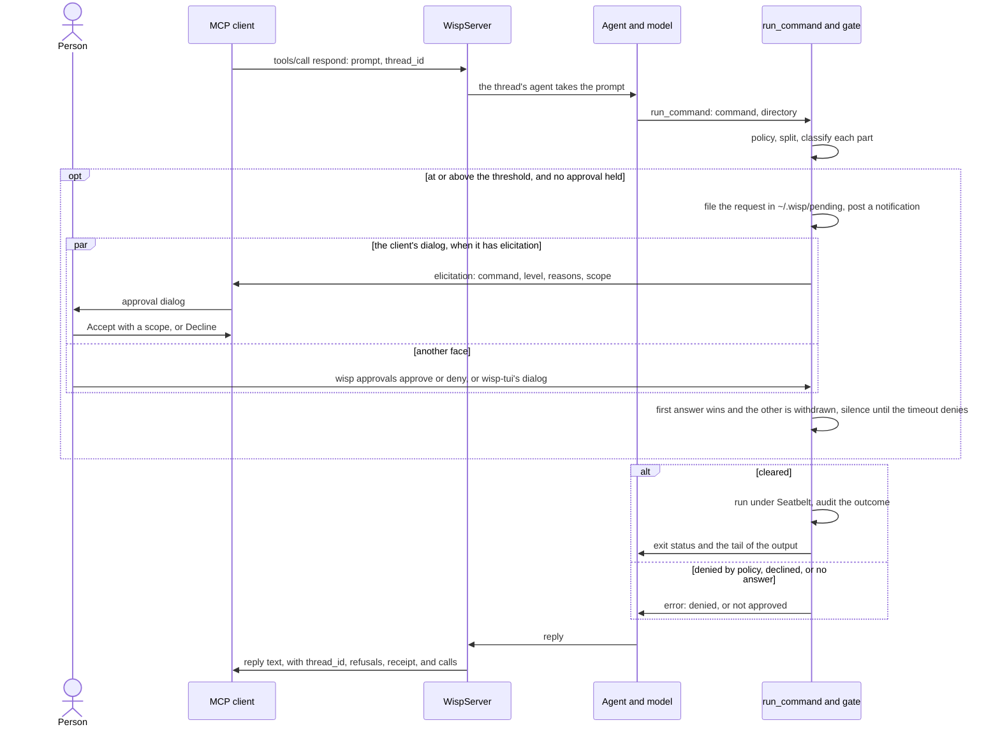
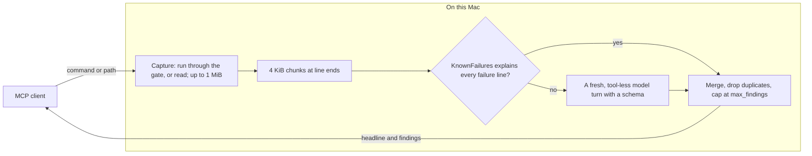

# wisp as an MCP server

`wisp mcp` speaks the Model Context Protocol over stdio, so other agent harnesses can delegate work to the
on-device model. It advertises `respond`; ten condensing tools that keep raw material on the Mac and
return a small result (`triage`, `summarise_diff`, `draft_change`, `scan_secrets`, `redact`,
`condense_log`, `json_shape`, `dependency_audit`, `flaky_tests`, `hot_paths`); `set_fact_scope`; and `close_thread`. wisp's own tools (`run_command`, `read_file`, `system_info`, and the
rest) are not exposed directly; they are reachable only by asking `respond` to use them, so every command runs under the model's policy, sandbox, and approval with the audit trail of a
turn ([ADR 0006](decisions/0006-mcp-server-over-stdio.md), amended). Stdout is the protocol channel; diagnostics go to stderr. The
server runs until the client closes stdin.

## Client configuration

Claude Code (`.mcp.json`):

```json
{ "mcpServers": { "wisp": { "command": "/path/to/wisp", "args": ["mcp"] } } }
```

Codex (`~/.codex/config.toml`):

```toml
[mcp_servers.wisp]
command = "/path/to/wisp"
args = ["mcp"]
```

## Client compatibility

wisp speaks MCP through the official Swift SDK (0.12.1). Where the SDK is stricter than the protocol,
wisp normalises the message before the SDK sees it, in `CompatibilityTransport`, rather than refuse a
compliant client. One case so far: an `initialize` whose `capabilities.experimental` has object values,
which the specification allows and Codex sends (`{"codex/auth-change": {}}`); the SDK declares the field
as a map of strings and fails the whole request with `-32603`. Each object value is replaced by its
compact JSON text (`"{}"`), nothing else in the message changes, and wisp never reads the field. Found
and fixed on 2026-09-20 against 0.1.4; the captured request is a regression test.

The same wrapper sees every outgoing message, so it records the JSON-RPC id of each approval dialog
(`elicitation/create` with `_meta` `wisp/approval`), which the SDK does not return; that is how a dialog
answered another way first is withdrawn with `notifications/cancelled` ("Approval", below).

## Discovering the model's tools

wisp's own tools are not MCP tools, so a client learns about them from two resources:

| URI | Content |
| --- | --- |
| `wisp://tools` | JSON: for each tool its `name`, `description`, `parameters` (JSON Schema generated from the same `@Generable` type the model sees), `limits`, and `examplePrompt`. |
| `wisp://tools.md` | The same as Markdown, with the prompting rules that work for the on-device model. |

Both are generated from the live registry, so they cannot drift from what the model can actually call.

## Inspecting wisp

More resources let a client read wisp's own state without spending a model turn
([ADR 0018](decisions/0018-introspection.md)). They are read-only and show the same views as the model's
[`inspect`](tools/inspect.md) tool, `wisp config`, and chat's `/inspect context`. Everything about a `respond`
thread is under `wisp://threads/{thread_id}`; the URIs with `{…}` are listed as resource templates
(`resources/templates/list`).

| URI | Content |
| --- | --- |
| `wisp://config` | JSON: every setting with defaults applied, the model, the `run_command` policy, and the paths under `~/.wisp`. |
| `wisp://status` | JSON: the server session id, entry point, model, tools, `threadCount` (threads open now) and `threadsURI` (`wisp://threads`, which lists them), approvals in force for the session, and the count of standing approvals. |
| `wisp://approvals` | JSON: the standing approvals with pattern, directory, scope, level, expiry, and source. |
| `wisp://measurements` | JSON: what the eval harness found each delegated task achieves ([measurements.md](measurements.md)); the per-tool ones also appear on `wisp://tools`. |
| `wisp://audit` | JSON Lines: the last 100 audit events across every session, as written to the audit file. |
| `wisp://audit/{session}` | JSON Lines: every event of one session that is not a `respond` thread: the server's own, a condensing tool's (`triage-<id>`, `summarise-<id>`, …), a CLI run's. A thread of this server is refused here with a pointer to its `…/audit` below. |
| `wisp://threads` | JSON: the server's threads, most recently active first, open or not: `thread_id`, `model`, `turns`, `created`, `lastActive`, `state` (`open`, `closed`, `evicted`), and `uri`. Paged. |
| `wisp://threads/{thread_id}` | JSON: one thread's `model`, `tools`, `instructions` (whether the caller gave it an instructions layer), `turns`, `created`, `lastActive`, `state`, `task` (the current task's `text`, `source`, and fact `id`, or null; set with `respond`'s `task`), and `resources`, the URIs below, including `summary`, and the facts resources the thread is given (`sessionFacts`, `permanentFacts`, `proposedFacts`). |
| `wisp://threads/{thread_id}/context` | JSON: the thread's turns, each with `turn`, `time`, `prompt` (its start), `tokens` (composed for the turn's first request, estimated at four bytes a token, tool definitions not counted), `changed` (`condensed`, `cut`, `referenced`: entries changed in the model's context since the turn before), and `uri`; and `next_request`. Paged. |
| `wisp://threads/{thread_id}/context/{turn}` | Markdown: the context wisp composed at the start of that turn, entry by entry under its store id, with the turn's own entries (its prompt, its tool loop's calls and output, its reply) marked. Paged at 16 KiB. |
| `wisp://threads/{thread_id}/context/next` | Markdown: the context the thread's next request carries, which is what chat's `/inspect context` saves. Paged at 16 KiB. |
| `wisp://threads/{thread_id}/facts` | JSON: the thread's own facts (ids `c…`): its task, the state of the work, and its proposed permanent facts. Each has `id`, `scope`, `subject`, `name`, `value`, `source` (`person`, `caller`, `tool`, `model`), `version`, `class`, `method`, `detail`, `state`, `recorded`, `turn`, `entries` and `sources` (the store entries and audit events it came from), `proposed`, `supersededBy`, `approved`, `conflict` (the winning head and the ones that disagree, when they do, including a permanent or session fact), and `uri`; plus `conflicts`, the count of its facts in conflict. Current facts only; `?all=true` adds superseded and deleted versions. Paged. The running summary is not here; it has its own resource, below. The session's and the permanent facts are in the resources below; all of them, as the model is given them, are in `…/context/next`. |
| `wisp://threads/{thread_id}/summary` | JSON: the thread's running summary of earlier turns, the one the model is given in place of the turns condensing dropped: `thread_id`, `versions` (how many have been written), and `summary` (`version`, `text`, `covered` turns, the `turns`, store `entries`, and audit `sources` it added, `through`, `recorded`, `turn`, `model`), or null before the first (one is written when condensing has dropped three or more turns not yet summarised). `?all=true` adds `summaries`, every version, oldest first. Served while the thread is open, like the facts; a thread that keeps no facts has no summary and is refused, as is an unknown thread. |
| `wisp://threads/{thread_id}/facts/{fact_id}` | JSON: one of the thread's facts (`fact`) and every version the thread holds of what it is about (`history`), oldest first, and `request`, the latest request to keep it as a permanent fact and its outcome (`set_fact_scope`, below), or null. A `p…` or `s…` id is refused with a pointer to where it is served. |
| `wisp://facts` | JSON: the permanent facts in the shared store (`~/.wisp/facts.json`, ids `p…`), which only the person moves facts into, from chat, or from `wisp facts keep` and `wisp-tui` when a caller asks (`set_fact_scope`); the same fields, with `approved` for one the person approved, and `uri`. Current only; `?all=true` adds superseded and deleted versions. Paged. |
| `wisp://facts/{fact_id}` | JSON: one permanent fact (`fact`) and every version the shared store holds of what it is about (`history`), oldest first. `fact_id` starts with `p`, so `wisp://facts/proposed` is never taken for one. |
| `wisp://facts/proposed` | JSON: the permanent facts a tool or the model proposed in any conversation of this server, awaiting the person: not yet moved to another scope. Each has the fact's fields, `thread_id` (its conversation), `reference` (`thread_id/fact_id`, which chat's `/fact` takes), and `uri` (the thread's fact, or null for a conversation that is not a thread), and `request`, the latest request to keep it and its outcome, or null. Paged. Nothing asks about them on its own: chat lists them and moves them (`/fact git/c3 permanent`), `respond`'s `facts` and `factsProposed` report them, and `set_fact_scope` moves a thread's own or asks the person to keep it. |
| `wisp://session/facts` | JSON: the session's ephemeral facts (ids `s…`): the machine now, such as a listening port, shared by every thread of this server and gone with it. Current only; `?all=true` adds superseded versions. Paged. |
| `wisp://threads/{thread_id}/output` | JSON: the thread's tool calls, oldest first, from the audit log: `turn`, `tool`, `arguments`, `command` and `exitStatus` for `run_command`, `bytes`, `id`, and `uri`. Paged. |
| `wisp://threads/{thread_id}/output/{id}` | Plain text: one tool call's output, verbatim as the tool returned it, by the `id` a `respond` result's `calls` give it (see `respond` below). |
| `wisp://threads/{thread_id}/audit` | JSON Lines: every event of the thread, for reconstructing what a delegated task did. |

Collections are paged at 50 rows: append `?page=N` (from 1); each page gives `page`, `pages`, `total`, and
`next`, the next page's URI or null. A context longer than 16 KiB is paged the same way, and each page
after the first begins with a line saying which page it is. A page past the last, a turn the thread has
not had, and a malformed URI are protocol errors (`invalidParams`).

The context resources compose the view from the thread's store, in memory, at no cost to the model
(decision D12 of the [layered-context proposal](proposals/2026-09-29-layered-context.md)). They are
served only while the thread is open: a closed or evicted thread's context went with it, and reading it
says so, while its summary, output, and audit remain. A thread's turns are numbered as its audit events
number them, from 1. A thread resumed from a saved conversation (chat's `--resume`; MCP threads are not
resumed today) shows its earlier session's entries as carried into every turn of its own, with the
references and cuts the saving session last sent; the contexts of the saving session's own turns can be
composed only as far as the saved sidecar allows, and are not addressable here.

The facts resources read the stores in memory, likewise at no model cost; a thread's own only while the
thread is open. A thread keeps facts unless `facts.enabled` is false in the config, in which case reading
its facts is an `invalidParams` error saying so ([context-management.md](context-management.md), "Facts").

The audit and output resources read the audit file, so they are empty (and an output reference is not
given) when `audit.enabled` is false. Reading any resource is not itself audited (the model's `inspect`
calls are, as tool calls).
`wisp tools --json` and `wisp tools --markdown` print the same text on the command line. The `respond`
tool description points at `wisp://tools`.

How to prompt for a tool, in short: name it, give exact arguments, say how to report the result, one tool
per prompt, and restrict `tools` on a new thread to what the task needs. For example:

```
Use run_command with working directory /path/to/repo to run exactly: swift test 2>&1 | tail -3 .
Report the exit status and output verbatim, nothing else.
```

## Tools

### `respond`

Run a prompt on the on-device model, with wisp's tools available to it, on a conversation thread.

| Argument | Type | Required | Meaning |
| --- | --- | --- | --- |
| `prompt` | string | yes | The task. Keep it short; the on-device model's window is about 8k tokens. |
| `thread_id` | string | no | Omit to start a thread (an id is generated). Supply an unused id to name a new thread. Supply a known id to continue it. `[A-Za-z0-9._-]{1,64}`. |
| `instructions` | string | no | Instructions for this thread, added under wisp's own system prompt and the server's configured extension; replaces the server's `--instructions` for the thread. Only when a thread starts; an error afterwards. |
| `tools` | string[] | no | Names of wisp tools to enable. Only when a thread starts. Omitted: all, `memory` among them, which recalls earlier material the thread's context holds only as a reference and notes facts ([tools/memory.md](tools/memory.md)). A list is exactly that list: `["run_command"]` gives `run_command` alone, and its references say to run a call again. `[]`: a text-only thread, which a model that declares no tool calling can still run; a thread that needs tools on such a model is refused with a hint before generation. |
| `model` | string | no | `system` (default), `private-cloud` (alias `pcc`; data leaves the Mac), or `ollama:<name>` (a model the local Ollama serves; `wisp models` lists them). Only when a thread starts. |
| `task` | string | no | The thread's task, in a sentence. Kept as a dynamic fact of the thread with source `caller` and shown to the model next to each request, labelled as a record ([context-management.md](context-management.md), "Facts"). Given when a thread starts or on any later call to revise it; the earlier wording stays as history in `wisp://threads/{thread_id}/facts`. A thread without it has no task, unless its model distils one from turns that leave its window or notes one with `memory "task …"`. With `assessment.enabled` on, the per-request assessment never infers a thread's task (that is chat's), never replaces the caller's, and never widens the thread's `tools`; it can register fewer of them for a request ([context-management.md](context-management.md), "The assessment per request"). An empty string is an error, as is a task for a thread that keeps no facts (`facts.enabled` false). |
| `schema` | object | no | A JSON Schema for this reply. The reply is JSON of that shape through the framework's guided generation, also parsed into `structuredContent.output`. Per call, on any thread; see "Structured output" below. |

Result content is the reply text. `structuredContent`:

```json
{ "thread_id": "…", "created": true, "condensed": false, "text": "…", "refusals": [], "receipt": { … }, "calls": [ … ], "ran": "ran: run_command ×2 (1 failed)", "facts": [ … ], "notifications": [ … ], "factsProposed": { … }, "output": null, "contextNote": null }
```

`notifications` lists every notification the turn posted or tried to, in order: the model's `notify`
calls and the banner wisp posts when a command waits for approval. MCP has no notification primitive, so
wisp posts through its own process (below, "Notifications") and tells the caller here:

```json
[{ "title": "Build", "body": "The build passed.", "source": "model", "outcome": "posted", "route": "app",
   "reason": null, "time": "2026-10-02T09:14:03Z" }]
```

`source` is `model` or `approval`; `outcome` is `posted` or `refused`, with `route` (`app` or `osascript`)
when posted and `reason` when refused (notifications off, over the per-minute limit). Empty when the turn
posted none.

`facts` lists the facts the turn recorded or changed that are still in force, from its tools and the model
(a test command's status, a distilled codename): each `{ "id", "scope", "subject", "name", "value",
"source", "proposed", "uri" }`. `scope` is `thread`, `session`, or `permanent`; `proposed` is true for a
permanent fact a tool or the model proposed, which awaits the person; `uri` is where to read it
(`wisp://threads/{thread_id}/facts/{fact_id}` for a thread's, `wisp://session/facts` for the session's).
The list is empty when the turn recorded none or the thread keeps no facts. Nothing in the reply asks the
person anything: a caller may move a fact with `set_fact_scope` (below), or ask the person to keep it as a
permanent fact, and the person changes any fact's scope from chat.

`factsProposed` says how many permanent facts a tool or the model proposed in this server's conversations are
awaiting the person, so the calling agent can mention them; nothing else announces them (no notification is
posted for a proposal, [ADR 0048](decisions/0048-permanent-facts-over-mcp.md)):

```json
{ "count": 2, "thread": 1, "uri": "wisp://facts/proposed" }
```

`count` is the server's, `thread` this thread's share of it, and `uri` where they are listed.

`output` is the reply parsed as JSON when the call gave a `schema`, and null otherwise.

`refusals` lists every command the gate refused during the turn, as `{ "command", "reason" }`, so a
harness can detect a refusal structurally instead of parsing the model's prose. The result is not
`isError` in that case: the model answered, and its answer says what it could not do.

`receipt` is what the turn did, folded from the thread's audit events so the caller can verify
delegated work without reading the log ([ADR 0021](decisions/0021-receipts.md)):

```json
{
  "turn": 3,
  "tools": [{ "name": "run_command", "arguments": "{\"command\":\"git status\"}", "bytes": 212, "seconds": 0.4 }],
  "commands": [{ "command": "git status", "exitStatus": 0, "timedOut": false, "truncated": false, "seconds": 0.3 }],
  "files": [],
  "denials": [],
  "approvals": [{ "command": "git status", "level": "moderate", "decision": "approved", "scope": "session" }],
  "errors": [],
  "condensed": false,
  "seconds": 2.1
}
```

| Field | Meaning |
| --- | --- |
| `turn` | The thread's turn number, which `wisp://threads/{thread_id}/audit` events carry as `turn`, and `wisp://threads/{thread_id}/context/{turn}` shows the context of. |
| `tools` | Every tool call in order: `name`, the model's `arguments` JSON, and the result's `bytes` and `seconds`; a call that threw has `error` instead. |
| `files` | Every file `edit_file` wrote: `path`, `mode`, `created`, `bytes` after the edit. |
| `commands` | Every command that ran: `exitStatus`, `timedOut`, `truncated`, `seconds`. Output is not repeated; the audit log has it verbatim. |
| `denials` | Commands turned away before running: `verdict` is `denied` (policy, with `reason`) or `disapproved` (the gate; also in `refusals`). |
| `approvals` | Every gate decision: `decision` (`approved`, `denied`, `timed-out`, `cached…`), the `level` it was asked at, the `scope` given. |
| `errors` | Errors not tied to a tool call, such as a failed turn. |
| `condensed`, `seconds` | As for the turn; `seconds` is null when the turn did not complete. |

Lists hold at most 64 entries each. Token usage is not reported yet: the framework does not expose it
for Apple's models, and wisp does not record what local runtimes report (`docs/backlog.md`).

`calls` lists each tool call of the turn with what it produced, so a caller can check the reply against
the real output rather than the model's account of it (decision D9 of the
[layered-context proposal](proposals/2026-09-29-layered-context.md)). Output up to `inlineOutputBytes`
(1,024 bytes by default, a [setting](wisp.md)) is inline; larger output is a reference the caller reads
only if it wants to spend its own context on it:

```json
[
  { "id": "3f9c0a1b2c3d4e5f", "tool": "run_command", "arguments": "{\"command\":\"git status --short\"}",
    "command": "git status --short", "exitStatus": 0, "bytes": 58, "output": "exit status: 0\nstdout:\n M docs/mcp.md\n" },
  { "id": "8a7b6c5d4e3f2a1b", "tool": "read_file", "arguments": "{\"path\":\"docs/mcp.md\"}", "bytes": 3981,
    "outputURI": "wisp://threads/git/output/8a7b6c5d4e3f2a1b" }
]
```

| Field | Meaning |
| --- | --- |
| `id` | The id of the `tool.result` audit event that holds the output; null when the tool threw. The thread's store keeps the same reference for the output ([logging.md](logging.md)). |
| `tool`, `arguments` | The tool and the model's arguments JSON. |
| `command`, `exitStatus` | For `run_command`: the command line and, when it ran, its exit status. A command the policy or the gate turned away has no `exitStatus`; its output is the refusal. |
| `bytes` | The output's size in UTF-8 bytes. |
| `output` | The output verbatim, when `bytes` is at most `inlineOutputBytes`. |
| `outputURI` | Otherwise, `wisp://threads/{thread_id}/output/{id}`: `resources/read` returns the output verbatim, from the audit log. Absent when `audit.enabled` is false, since there is no log to serve it from. |
| `error` | The error, when the tool threw. |

The output is what the tool returned to the model: `run_command`'s rendering of the exit status and the
tail of each stream, `read_file`'s numbered page, each already bounded by the tool. The list holds at most
64 calls. `receipt` is unchanged beside it.

`ran` is the same turn in one line, as chat prints it under the reply: the tools in the order of their first
call with their counts, and how many calls failed (a non-zero exit status, a timeout, a command that could not
start, a tool error), were denied by the policy, or were declined at approval, as in `ran: read_file ×2 ·
run_command ×3 (1 failed, 1 denied)`; at most six tools are named, then `+N more`. It is counted from the
turn's audit events, never from the reply, and every call is counted, past the 64 that `calls` lists. It is
null when the turn ran no tool, except that a reply naming one of the thread's tools then gets `ran: no
tools`, since the reply may describe work that did not happen
([ADR 0051](decisions/0051-the-turns-tool-calls-beside-the-reply.md)). The text content the caller's model
reads is the reply alone, as before.

This is the same rule chat follows (decision D12): the transcript carries every tool's real output, from
the same `tool.result` audit event, whatever the model's reply says, and only the rendering differs by
face. Chat prints it under the call's note and folds past `shownOutputLines`; `wisp-tui` folds it and
expands it in a panel; `respond` inlines it up to `inlineOutputBytes` and gives a reference above that.
The model is told the person sees the output, so its reply comments on it rather than repeating it,
unless the prompt asks for a copy. Within the thread's own context, each output is whole only in the turn
that produced it and a compact reference in every later request ([context-management.md](context-management.md),
"Output handling"); `wisp://threads/{thread_id}/context/next` shows what the model will carry.

**A caller's task ranks with the person's.** The MCP caller is the person's agent, so its `task` takes the
person's precedence over what a tool or the model says about the task (decision D2), and is recorded apart
as `source: caller`, so the audit and the facts resource say who set it. It is the only fact a caller sets
in this version. Deleting a fact is chat's, and making one permanent is the person's: the caller can move a
fact between `thread` and `session` with `set_fact_scope` (below), and can ask the person to keep one as
`permanent`, but never keeps one itself.

`condensed` is true when older turns were dropped to fit the window on this call. `contextNote` is null
unless condensing could not bring the thread's context to its target even with only the last turn left
(the instructions, the last turn, and the request are too large for the window's target): then it says so
in a sentence, with the figures, and the call still answers. A request that cannot fit the window at all
fails with `the request does not fit the model's context window: …` and what to do
([context-management.md](context-management.md), "Condensing"). Threads live in memory for
the server's lifetime; the least recently used is evicted beyond `maxThreads` (32), which is audited as a
`session.end` with reason `evicted`. Naming a new `thread_id` from two concurrent calls creates it once. Calls on one thread run
in order; different threads run concurrently.

### Facts a turn recorded, and their scope

A fact has a scope, which is where it lives: `permanent` (the shared store under `~/.wisp`, kept across
sessions), `thread` (the conversation's own facts) or `session` (shared by the server's threads, gone when
the process ends). A permanent fact a tool or the model proposes is not written to the shared store: the
thread keeps it as a proposal (`proposed: true`, in `wisp://facts/proposed`) until the person moves it.
wisp does not ask about a proposal on its own (the fact-approval dialog was withdrawn on 2026-09-30,
[ADR 0044](decisions/0044-host-effects.md)); it lists what a turn added in `respond`'s `facts` and counts
what waits in `factsProposed`. Only the person admits a permanent fact: a caller asks with `set_fact_scope`
`permanent`, and the person answers outside the conversation ([ADR 0048](decisions/0048-permanent-facts-over-mcp.md)).

### `set_fact_scope`

Move a fact to another scope, or ask the person to keep it as a permanent fact: the caller's counterpart to
chat's `/fact ID SCOPE`.

| Argument | Type | Required | Meaning |
| --- | --- | --- | --- |
| `thread_id` | string | yes | The thread that owns the fact, or that receives a session fact moved to `thread` (fact ids are per conversation, so a thread is always named). |
| `fact_id` | string | yes | `c<number>`, a fact of that thread, or `s<number>`, a session fact. A `p<number>` (permanent) fact is refused, whatever the scope: permanent facts are the person's, and a caller neither moves nor removes them. A caller that disagrees with one records a newer fact in its thread, which shows as a `conflict` in the facts resources. |
| `scope` | string | yes | `thread`, `session`, or `permanent`, which asks the person (below). |

Scope and temporal class move together: `session` makes the fact ephemeral and shared by the server's
threads, `thread` makes it the thread's own, dynamic. A proposed permanent fact moved to `thread` stops
being proposed, in place; any other move takes the fact into the target store as a new fact (a new id, in
`structuredContent.fact`) and leaves the old one as history, superseded by it. Moving a fact to the scope it
is already in is an error, as are an unknown fact and a thread that is not open. Result content is a line
such as `moved c2 to session as s1`; `structuredContent` is `{ "thread_id", "from" (the id given), "fact" }`
with `fact` in the shape of `respond`'s `facts`. Each move is audited on the thread as `fact.scope.changed`
with `by: caller` ([logging.md](logging.md)).

**`permanent` asks the person** ([ADR 0048](decisions/0048-permanent-facts-over-mcp.md)). The request is filed
in `~/.wisp/pending` and a notification tells the person what to answer, as for a command waiting for approval
(below, "Approval"):

```
wisp: keep as a permanent fact?
release codename = BLUE HERON — wisp facts keep a1b2c3d4
```

The person answers from a terminal with `wisp facts keep a1b2c3d4` or `wisp facts drop a1b2c3d4`, or in a
running `wisp-tui`; nothing in the MCP conversation answers it, and wisp's own model cannot
([wisp.md](wisp.md), "wisp facts"). The call does not wait: it returns at once, because a fact blocks nothing
the caller is doing.

```json
{ "thread_id": "git", "from": "c1", "state": "pending", "request": "a1b2c3d4",
  "expiresAt": "2026-10-03T10:24:00Z", "fact": { "id": "c1", "scope": "thread", … },
  "uri": "wisp://threads/git/facts/c1" }
```

The outcome shows later as `request` on the fact's resource (`uri`) and on its row in
`wisp://facts/proposed`: `{ "id", "state", "kept", "via", "reason", "asked", "expiresAt", "settled" }`, where
`state` is `pending`, `kept` (with `kept`, the permanent fact's id), `dropped`, `timed-out`, `withdrawn` (the
thread closed or the server stopped), or `failed` (with `reason`, such as the fact having changed since the
person was asked). Keeping admits the fact to the shared store as the person's, as `/fact ID permanent` does,
audited as `fact.scope.changed` with `by: person` and the `request`. Dropping leaves it where it is (a proposal
stops being proposed, in place), and the thread is not asked about the same fact (subject, name, and value)
again while it is open: a second request is a tool error that says when it was dropped. Silence for
`approval.timeoutSeconds` keeps nothing and is not remembered. Asking again while a request waits returns
the same request. Each step is audited on the thread: `approval.pending`, the `notification`, and
`approval.settled`, with `kind: "fact"`.

## Structured output

Give `schema` and the reply is JSON of that shape rather than prose: the framework constrains
generation to the schema ([ADR 0022](decisions/0022-structured-output.md)), so the result parses and
has the declared properties, and `structuredContent.output` carries it parsed. The model must declare
guided generation (`system`, `private-cloud`, Ollama models that report `completion`, Core AI bundles
whose engine supports it); otherwise the call is refused before generation with a hint. The schema is
per call: the next call on the thread is prose again unless it gives one too.

Shaped replies are capped at 1024 output tokens (`Agent.maximumSchemaTokens`): a small model can loop
inside a string the schema cannot bound, and the cap turns that into a failed call instead of a full
window (probed 2026-09-21: one chunk ran to 8193 tokens and six minutes before the cap). The accepted
subset is what a small model can fill and the framework can constrain:

| Construct | Accepted |
| --- | --- |
| root | `type: object` with `properties`; `required` names the properties that must appear, the rest are optional |
| `string` | plain, or with `enum` of strings |
| `integer`, `number`, `boolean` | plain |
| `array` | `items` of one accepted schema; `minItems`, `maxItems` |
| `object` | nested, same rules; at least one property |
| `description` | passed to the model on the root and on each property |

`$ref`, `anyOf`/`oneOf`/`allOf`/`not`, `pattern`, `format`, `additionalProperties`, and a `type` list
are refused by name with the path (`schema at /notes/items/: '$ref' is not supported`) as a tool error.
The audit `prompt` event carries the schema. Example:

```json
{ "prompt": "Which language is this: fn main() {}", "tools": [],
  "schema": { "type": "object", "properties": { "language": { "type": "string", "enum": ["swift", "rust", "other"] },
              "confidence": { "type": "number" } }, "required": ["language", "confidence"] } }
```

## Approval

Commands the model runs inside `respond`, or that a condensing tool captures, that are risky (by default
`moderate` and above) need approval. wisp asks the person two ways at once, and the first answer wins
([ADR 0046](decisions/0046-approval-and-notifications-over-mcp.md)):

- **Through another of wisp's faces.** The request is filed in `~/.wisp/pending` and a notification says
  what waits and how to answer it ("wisp: approval needed", "git push origin main — wisp approvals approve
  a1b2c3d4"). The person answers from a terminal with `wisp approvals approve ID [--scope
  once|session|project|always]` or `wisp approvals deny ID`, or in a running `wisp-tui`, which shows the
  request as its approval dialog ([wisp.md](wisp.md)). This works for every client, with or without
  elicitation, and is the way out when a client's dialog sticks.
- **Through the client's dialog,** when the client advertised elicitation at initialize.

When one answers, the other is withdrawn: the request file is removed, or the dialog is cancelled with
`notifications/cancelled` (whether a client closes it then is the client's; the specification says it
should). **The calling agent cannot approve:** nothing in MCP answers a request, wisp's own model is
refused `wisp approvals approve|deny`, and those commands run only from a terminal. Set
`approval.outOfBand` to `false` for the client's dialog alone, as before 0.16.0.

In the client's dialog, the command, directory, risk level, and
reasons appear in the title, the message, and the field descriptions, because clients render different
parts; the full command leads the description so it is never trimmed. **Accept runs the command with the
scope picked in the form (this turn by default; session; project, 30 days in this directory; always, 30
days anywhere); Decline or Cancel refuses it; no answer within `approval.timeoutSeconds` (default 600; `0`
waits forever) refuses it.** Persisted scopes never apply to dangerous commands
([approval.md](approval.md)). Approvals given here share the process: a "this session" answer covers every
thread, and "project" and "always" are written to `~/.wisp/approvals.json` exactly as from the CLI.
With `approval.outOfBand` off and no elicitation, the model's tool call is refused with
`command not approved: … this client does not support elicitation …`; the reply reports that in prose and
`structuredContent.refusals` carries it structurally. The calling harness should run the command itself
or start wisp with `--yes`. See [approval.md](approval.md).

**The call waits for the answer**, as it does for the dialog, up to `approval.timeoutSeconds`. A client's
own tool-call timeout may end the call first: Claude Code's is `MCP_TOOL_TIMEOUT`. A client that then
sends `notifications/cancelled` cancels the call: wisp withdraws the request, refuses the command, and
audits `approval.settled` with outcome `abandoned`. A client that stops waiting without cancelling leaves
the request waiting until it is answered or times out, and the result goes nowhere; set the client's
timeout above `approval.timeoutSeconds` when delegating commands that need approval.

One `respond` call in which the model runs a command that needs approval, as the server handles it:



### `triage`

Run a build or test command on this Mac, or read an output file already here, and get back only the
failures. The raw output stays on the Mac: wisp captures it whole (up to 1 MiB, the tail beyond),
cuts it into 4 KiB chunks at line ends, reads each chunk's failures in known formats exactly, and
judges any chunk those do not fully explain in a fresh, tool-less model turn with a schema, then merges
the lists, drops duplicates, and caps the result ([ADR 0023](decisions/0023-condensing-tools.md),
[ADR 0039](decisions/0039-exact-condensers.md)). The exact formats: `file:line:col: error:` and
`warning:` (Swift, clang, XCTest), rustc's `error[E…]` and `warning:` with their `-->` line,
swift-testing's `✘ Test … recorded an issue at`, cargo test's `test … FAILED` and `panicked at`,
pytest's `FAILED` and `ERROR` lines, and go test's `--- FAIL:`. A chunk whose every line that looks like
a failure is one of those, or a tool's own tally, needs no model turn.

What stays on the Mac and what goes back to the client:



| Argument | Type | Required | Meaning |
| --- | --- | --- | --- |
| `command` | string | one of | Shell command line, run with `/bin/sh -c` under wisp's policy, sandbox, and approval exactly as the model's `run_command` would, and audited as `command.outcome`. Pipe stderr in yourself when it matters: `swift test 2>&1`. |
| `working_directory` | string | no | Absolute directory for the command. Default: wisp's. |
| `path` | string | one of | Absolute path of an output file on this Mac; the read clears the gate as `read_file` does. |
| `model` | string | no | The judging model, as for `respond`; it must declare guided generation. Default: the configured model. |
| `max_findings` | integer | no | Findings to return at most (default 20); `more` is true when some were dropped. |

Result content is a headline and one finding per line; `structuredContent`:

```json
{
  "source": { "command": "swift test 2>&1", "workingDirectory": "/repo", "exitStatus": 1,
              "timedOut": false, "truncated": false, "bytes": 18234 },
  "chunks": 5, "exactChunks": 3, "more": false,
  "findings": [
    { "kind": "error", "location": "Sources/A.swift:42:13", "message": "cannot find 'fooBar' in scope" },
    { "kind": "test-failure", "location": "CommandRunnerTests.swift:88:9", "message": "Expectation failed: …" }
  ]
}
```

`kind` is `error`, `test-failure`, `warning`, `crash`, or `other`; `location` is the `file:line` or test
name as printed, or null. For a file source `exitStatus` is null. Each triage is its own audited session
(`triage-<id>`: start, the command or read, one prompt and response per chunk, end), so
`wisp://audit/triage-<id>` shows exactly what the model saw. Approval for the command reaches the
client through elicitation as for `respond`.

Measured with `scripts/check eval` on this Mac on 2026-09-20 with the system model: on four abridged
fixtures (a `swift build` with two errors and a warning, a `swift test` with two failing tests, a
`cargo test` with two compile errors, a `pytest` with one failure) every expected failure was found,
7 of 7, with no spurious findings; the model reports a failing test by its assertion's `file:line` rather
than its name. Output shapes not in the fixtures are not measured. On 2026-09-26, with the exact pass,
recall stayed 7 of 7 and all four fixtures were read without a model turn (`exactChunks` 4 of 4).

### `summarise_diff`

Run a command that prints a unified diff (such as `git diff HEAD~3`), or read a diff file already on
this Mac, and get back a per-file summary with review flags. The diff stays on the Mac: wisp captures
it whole (up to 1 MiB), cuts it into 4 KiB chunks at file, then hunk, then line boundaries, judges each
chunk in a fresh tool-less turn with a schema, and joins the answers onto the file list the diff itself
gives ([ADR 0023](decisions/0023-condensing-tools.md)). Paths, change kinds, and line counts are read
from the diff headers and hunks, never from the model, and so are the flags the text proves: a deleted
test file, a test disabled on an added line (`.disabled(`, `XCTSkip`, `@pytest.mark.skip`, `#[ignore]`
and the like), a credential literal on an added line (known key prefixes, a private key block, or a
secret-named assignment of a long string, as `scan_secrets` finds them; the flag's note gives the kind
and a masked preview, never the value), and binary content. The model adds the headline, one line
per file, and any flag the rules miss; anything it says about a file the diff does not contain is
dropped. Rules never remove a flag.

| Argument | Type | Required | Meaning |
| --- | --- | --- | --- |
| `command` | string | one of | A command line that prints a unified diff, run under wisp's policy, sandbox, and approval as `run_command` would. |
| `working_directory` | string | no | Absolute directory for the command. Default: wisp's. |
| `path` | string | one of | Absolute path of a diff file on this Mac; the read clears the gate as `read_file` does. |
| `model` | string | no | The judging model, as for `respond`; it must declare guided generation. |
| `max_files` | integer | no | Files to list at most (default 40); the rest are counted in `more`. |

Result content is a headline block and one line per flag and per file; `structuredContent`:

```json
{
  "source": { "command": "git diff HEAD~1", "workingDirectory": "/repo", "exitStatus": 0, "truncated": false, "bytes": 2210 },
  "chunks": 1, "more": 0, "added": 14, "removed": 3,
  "headline": "Adds atomic writes to edit_file and tests them",
  "files": [
    { "path": "Sources/Tools/FileWriter.swift", "change": "modified", "added": 12, "removed": 1,
      "summary": "writes to a temporary file and renames it over the target" },
    { "path": "Tests/FileWriterTests.swift", "change": "modified", "added": 2, "removed": 2, "summary": "checks the mode survives" }
  ],
  "flags": [{ "kind": "deleted-test", "path": "Tests/OldTests.swift", "note": "the timeout test was removed" }]
}
```

`change` is `added`, `modified`, `deleted`, or `renamed`; `summary` is null for a file the model said
nothing about. Flag kinds: `deleted-test` (a test removed or disabled), `secret`, `binary`, `generated`,
`large`; a flag the model leaves pathless lands on the chunk's only file when it had one. Each summary is its own audited session (`summarise-<id>`), so
`wisp://audit/summarise-<id>` shows what the model saw. The measured result is in
[measurements.md](measurements.md).

### `draft_change`

Draft a commit message, a pull request description, or a changelog line from a diff on this Mac. The
diff is summarised per file as for `summarise_diff`, then written from that summary in one more turn;
the subject is kept to 72 characters, capitalised, without a trailing period, and a commit body ends
with `Why: <…>` for the reason, which a diff cannot give ([ADR 0035](decisions/0035-change-drafts.md)).

| Argument | Type | Required | Meaning |
| --- | --- | --- | --- |
| `kind` | string | yes | `commit`, `pr`, or `changelog`. |
| `command` | string | no | A command that prints the diff, run as for `triage`. Default: `git diff --cached`. |
| `working_directory` | string | no | The repository. Default: wisp's. |
| `path` | string | no | A diff file on this Mac, instead of a command. |
| `model` | string | no | The model, as for `respond`. |

Result content is the draft as it would be pasted; `structuredContent` is `{ "kind", "subject", "body":
[…], "flags": […], "text", "model", "routing" }`, plus `exitStatus` for a command; `model` is the one
that drafted and `routing` says why when it was chosen by size. An empty diff is an error. The system
model drafts small changes well and large ones poorly: with a `routing.ladder` in the config, wisp picks
the model by the diff's size from the measurements ([ADR 0037](decisions/0037-routing-by-input-size.md));
without one, pass a larger local model for a change of many files, such as `model: ollama:qwen3.8:27b`. The measured
result is in [measurements.md](measurements.md).

### `scan_secrets`

Scan a command's output or a file on this Mac for credentials, and optionally personal data, and get
back where they are with the values masked. Rules find shapes that are credentials by construction
(provider key prefixes, private key blocks, a password in a URL, secret-named assignments with a real
looking value); `thorough` adds the on-device model's pass over the rule-redacted text for what rules
cannot recognise ([ADR 0031](decisions/0031-secret-scanning-and-redaction.md)). A unified diff is
scanned by its added lines and located as `path:line` in the new file, so `git diff --cached` checks a
commit before it is made. A best effort, not a guarantee.

| Argument | Type | Required | Meaning |
| --- | --- | --- | --- |
| `command` | string | one of | Shell command line whose output to scan, run as for `triage`. |
| `working_directory` | string | no | Absolute directory for the command. Default: wisp's. |
| `path` | string | one of | Absolute path of a file on this Mac; the read clears the gate as `read_file` does. |
| `personal` | boolean | no | Report personal data too: emails, phone and card numbers, public IPs, addresses, private hostnames, and user names by rule, and lines the personal-data classifier flags. Default false. |
| `thorough` | boolean | no | Add the model's pass: names, customer numbers, unusual credentials. Up to three turns per 4 KiB, about 2 s each. Default false. |
| `model` | string | no | The model for the thorough pass, as for `respond`. Default: `routing.tasks.secrets`, else `system`, the model measured best for it; the choice is audited as `model.routed`. |
| `max_findings` | integer | no | Findings to return at most (default 50); `more` is true when some were dropped. |

Result content is a headline and one `location  kind  preview` line per finding; `structuredContent`:

```json
{
  "source": { "command": "git diff --cached", "workingDirectory": "/repo" }, "bytes": 2210, "diff": true,
  "thorough": false, "chunks": null, "more": false, "failedChunks": [], "classifier": null,
  "findings": [{ "kind": "github-token", "category": "secret", "location": "Sources/Client.swift:14",
                 "preview": "ghp_…(40 chars)", "detector": "rule" }]
}
```

`detector` is `rule`, `model`, or `classifier`. With `personal`, the personal-data classifier judges each
line where neither the rules nor the model found anything, in about 2 ms a line. A line it flags is
reported as `personal-data` with the line masked as the preview: it says where, not what. `classifier`
names it (`personal@1`), or says why it was unavailable, and is null without `personal`
([ADR 0042](decisions/0042-personal-data-classifier.md)). The value itself is in neither the result nor the `secrets.scan` audit
event. Each scan is its own audited session (`scan-<id>`).

A model turn that fails, a guardrail refusal or a runtime error, is asked once more. If it fails
again, that chunk was checked by rule only: its number goes in `failedChunks`, the headline says so,
and the scan goes on. A failed turn never fails the call or costs the rule findings.

### `redact`

Get a command's output or a file on this Mac back with credentials and personal data replaced by
numbered markers such as `[REDACTED:email#1]` (the same value, the same number), so a log, crash report,
or data file can be read without its secrets. Rules always run; `thorough` adds the model's pass, whose
answers are only kept when they occur exactly in the text, and replacing them is done by wisp, never by
the model ([ADR 0031](decisions/0031-secret-scanning-and-redaction.md)).

| Argument | Type | Required | Meaning |
| --- | --- | --- | --- |
| `command` | string | one of | Shell command line whose output to redact, run as for `triage`; narrow it yourself (`tail -500 app.log`). |
| `working_directory` | string | no | Absolute directory for the command. Default: wisp's. |
| `path` | string | one of | Absolute path of a file on this Mac; the read clears the gate as `read_file` does. |
| `secrets_only` | boolean | no | Replace credentials and keep personal data. Default false. |
| `thorough` | boolean | no | Add the model's pass for names, addresses, and identifiers. Default false. |
| `model` | string | no | The model for the thorough pass, as for `respond`. Default: `routing.tasks.secrets`, else `system`, the model measured best for it; the choice is audited as `model.routed`. |
| `max_bytes` | integer | no | Bytes of redacted text to return at most (default 32768); `truncated` is true when it was cut. |

Result content is a summary line, a blank line, and the redacted text; `structuredContent` has `source`,
`bytes`, `text`, `truncated`, `thorough`, `chunks`, `failedChunks` (chunks only the rules redacted,
as for `scan_secrets`), and `replaced` (occurrences per kind). Each
redaction is its own audited session (`redact-<id>`); the `redaction` event records the counts only.
The measured result of the thorough pass is in [measurements.md](measurements.md).

### `condense_log`

Condense a log on this Mac (an app's log, CI output, the unified log) to its distinct messages,
without a model ([ADR 0032](decisions/0032-log-and-json-condensers.md)). Each line becomes a template:
the leading timestamp is removed and numbers, hex, UUIDs, long ids, and `log show`'s `[pid:thread]` are
replaced by `<n>`, `<hex>`, `<uuid>`, `<id>`, `[<pid>]`. Lines with the same template form a group,
ranked by severity (`fault`, `error`, `warning`, `info`) and then count. Severity is the log's own type
where it states one (`log show`'s `Error` and `Fault`, or `E` and `F` in its compact style), otherwise
it comes from words such as "failed" or "panic". A line without a timestamp in a log whose lines have
them continues the line before and takes its severity. A macOS crash report (`.ips`) is recognised
instead and returned as the process, version, OS, exception, termination, and the faulting thread's top
12 frames. Up to 8 MiB is read, the tail beyond.

| Argument | Type | Required | Meaning |
| --- | --- | --- | --- |
| `command` | string | one of | Shell command line whose output to condense, run as for `triage`, such as `tail -20000 app.log`. Not `/usr/bin/log`: it refuses to run in any sandbox; use `last`. |
| `working_directory` | string | no | Absolute directory for the command. Default: wisp's. |
| `path` | string | one of | Absolute path of a log or `.ips` file; the read clears the gate as `read_file` does. |
| `last` | string | one of | Read this Mac's unified log for this long back, in wisp's own process through `OSLogStore`: `90s`, `10m`, `2h`, at most `24h`. |
| `process` | string | no | With `last`: only this process, by name (case-insensitive). |
| `subsystem` | string | no | With `last`: only subsystems starting with this, such as `com.apple.network`. |
| `max_groups` | integer | no | Groups to return at most (default 30); `more` is true when some were dropped. |

For a log, `structuredContent` is `{ "kind": "log", "lines", "templates", "more", "truncated",
"severities": { "fault": 3, … }, "groups": [{ "severity", "count", "template", "example", "firstLine",
"lastLine", "firstSeen", "lastSeen" }] }`; `example` is the first line of the group as printed, with
credentials redacted. For a crash report it is `{ "kind": "crash", "process", "version", "os",
"timestamp", "bugType", "exception", "termination", "faultingThread", "frames": [{ "image", "symbol",
"offset" }] }`. Measured on 2026-09-23: two minutes of `log show` (14,333 lines, 2.8 MB) reduced to 1,972
templates in 1.2 s, the top 30 in about 10 KB (that output was captured outside wisp, since `log` will
not run as a wisp command).

Every condensing tool given a `command` returns its `exitStatus` and `timedOut` in `structuredContent`.
When the command failed or timed out, the text starts with `warning: the command exited N` and the first
line of its output, since a failing command's output is usually its error message.

### `json_shape`

Describe the structure of a JSON document or a JSON Lines file on this Mac, or a command's JSON output,
without its data and without a model ([ADR 0032](decisions/0032-log-and-json-condensers.md)): one outline
line per place, indented by depth, giving the types seen there (`integer 1…42`, `array[0…5] of string`,
`null | object`), `?` on a key some objects lack, and a 40-character string example with credentials
and personal data redacted. The elements of an array merge into one outline, so a thousand records read
as one. Up to 16 MiB; larger input is refused rather than cut, since a document without its head does
not parse.

| Argument | Type | Required | Meaning |
| --- | --- | --- | --- |
| `command` | string | one of | Shell command line whose JSON output to outline, run as for `triage`. |
| `working_directory` | string | no | Absolute directory for the command. Default: wisp's. |
| `path` | string | one of | Absolute path of a `.json` or JSON Lines file; the read clears the gate as `read_file` does. |
| `max_depth` | integer | no | Levels of nesting to describe (default 8). |
| `examples` | boolean | no | Show string examples (default true). |

`structuredContent` is `{ "format": "json" | "jsonl", "records", "bytes", "more", "outline": [ … ] }`.
The start of the outline of 1,000 events of wisp's own audit log (471 KB), on 2026-09-23:

```
(root): array[1000] of object
  kind: string e.g. "approval.requested"
  pid: integer 1827…96284
  schema: integer 1
  session: string e.g. "release-git"
  time: string e.g. "2026-09-22T08:13:05.621Z"
  turn?: integer 1…22
  version: string e.g. "0.4.0"
  call?: string e.g. "9bdf339e"
  details: object
    command?: string e.g. "git merge --ff-only main"
```

### `dependency_audit`

Reduce a dependency audit on this Mac to what needs action, without a model
([ADR 0039](decisions/0039-exact-condensers.md)): `npm audit --json` (npm 7 and later), `cargo audit --json`,
or `pip-audit -f json`, recognised by shape. One line per advisory, most severe first and fixable before
unfixable within a severity, up to 40.

| Argument | Type | Required | Meaning |
| --- | --- | --- | --- |
| `command` | string | one of | The audit command line, run as for `triage`, such as `npm audit --json`. Its non-zero exit when it finds something is expected and not flagged. |
| `working_directory` | string | no | Absolute directory for the command. Default: wisp's. |
| `path` | string | one of | Absolute path of saved audit JSON, up to 16 MiB; larger is refused, since cut JSON does not parse. |

`structuredContent` is `{ "tool": "npm" | "cargo" | "pip-audit", "counts": { "high": 1, … }, "more",
"warnings": [ … ], "advisories": [ { "package", "version", "severity", "id", "title", "fix", "direct" } ],
"exitStatus", "timedOut" }`. `fix` is `upgrade <package> to <version>` (with `(breaking)` for a semver
major), `npm audit fix`, `upgrade to <versions>`, or `none available`. npm's `version` is the vulnerable
range, since its audit gives no installed version; npm entries that only point at another vulnerable
package are left out, as that package has its own line. `cargo audit` gives a CVSS vector rather than
a severity, so its severity is estimated from the vector; `pip-audit` gives none, so its severity is
`unknown`. `warnings` carries `cargo audit`'s unmaintained, yanked, and unsound crates.

### `flaky_tests`

Find flaky tests by comparing runs, without a model ([ADR 0039](decisions/0039-exact-condensers.md)).
Each run is read into a pass or fail per test name from swift-testing (`✔`/`✘ Test … passed|failed
after`), XCTest (`Test Case '…' passed|failed`), cargo test (`test … ok|FAILED`), pytest with `-rA` or
`-v`, or go test with `-v`; a run in which no outcome can be read is refused.

| Argument | Type | Required | Meaning |
| --- | --- | --- | --- |
| `paths` | array of strings | one of | Absolute paths of two or more saved runs' output. |
| `command` | string | one of | A test command to run several times, as for `triage`; one approval covers every run. |
| `runs` | integer | no | With `command`: how many times, 2 to 10 (default 3). |
| `working_directory` | string | no | Absolute directory for the command. Default: wisp's. |

The result lists `flaky` tests, which passed in some runs and failed in others, most often failing
first, and `alwaysFailing` tests, up to 40 in all, each with `passes`, `failures`, and its `outcomes` per
run (`pass`, `fail`, or null where a run did not report it). The text shows the outcomes as a row of `P`,
`F`, and `-`.

### `hot_paths`

Reduce a profile to where the time goes, without a model ([ADR 0039](decisions/0039-exact-condensers.md)).
The input is folded stacks, one `frame;frame;frame count` per line: what `stackcollapse-perf.pl`,
`py-spy record -f raw`, `cargo flamegraph`, and pprof's raw output reduce to. Other lines are skipped
and counted.

| Argument | Type | Required | Meaning |
| --- | --- | --- | --- |
| `command` | string | one of | A command that prints folded stacks, run as for `triage`. |
| `working_directory` | string | no | Absolute directory for the command. Default: wisp's. |
| `path` | string | one of | Absolute path of a folded-stacks file (up to 8 MiB, the tail beyond). |

`structuredContent` is `{ "samples", "stacks", "skipped", "topSelf": [ { "name", "self", "total" } ],
"topPaths": [ { "frames", "samples" } ] }`: the 15 functions with the most self time (samples in which
they were the innermost frame) with their total time (samples in which they were on the stack), and the
8 heaviest stacks, each shortened to its 6 innermost frames. The text gives both as shares of all samples.

### `close_thread`

Free a thread's model session. Its requests to keep facts that are still waiting are withdrawn.

| Argument | Type | Required |
| --- | --- | --- |
| `thread_id` | string | yes |

## Progress

A caller that sends a `progressToken` in a `tools/call` request's `_meta` gets `notifications/progress`
while the call runs. This works for `respond` and for every tool that captures a command. Each
notification's `message` is a line chat would show for the call's events:

- `⚙ run_command git status` when the model calls a tool;
- `· safe by rules: a known read-only command (0.2 ms)`, the gate's rating of each command;
- `waiting for approval [moderate]: git push`, while the approval dialog is open in the client;
- `· also waiting in wisp approvals pending and wisp-tui`, when the request is filed for another face, and
  `· answered in wisp-tui` (or `wisp approvals`, or `the client's dialog`) when it is answered; the request's
  id is not sent;
- `· approved (session)`, `· allowed by your standing approval`, `· denied`, or `· blocked by policy: …`;
- `↳ exit 0`, or a tool's result.

`progress` counts the notifications from 1 in order, with no `total`, since a turn's length is not known
ahead. All of them are sent before the result. A caller that sends no token gets none. The model pass of
the condensing tools reports nothing per chunk yet.

## Notifications

MCP has no notification primitive. A notification under `wisp mcp` (the model's `notify` tool, or the
banner for a command waiting for approval) is posted by wisp's own process: to the terminal app by its
bundle identifier when `notifications.viaTerminalApp` is on and the server inherited
`__CFBundleIdentifier` from a client started in a terminal, so the banner comes from that terminal, and
through `osascript` otherwise ([tools/notify.md](tools/notify.md)). Never through the terminal's escape
sequence: a server started by a client in a terminal shares that terminal, and a sequence written from the
server would interleave with the client's frames ([ADR 0044](decisions/0044-host-effects.md)). `respond`
lists what its turn posted in `notifications`, above.

## Audit

Every request and result is recorded in `~/.wisp/logs/audit.jsonl` under the server's session, and each
thread's turns under the `thread_id` as its own session. See [logging.md](logging.md).

## Errors

- Malformed arguments (missing `prompt`, bad `thread_id`) and unknown tool names are JSON-RPC
  `invalidParams` errors.
- Execution failures (model unavailable, unknown tool name, unknown thread, command could not start) are tool
  results with `isError: true` and the message as text.

## Smoke test by hand

```
(printf '%s\n' \
  '{"jsonrpc":"2.0","id":1,"method":"initialize","params":{"protocolVersion":"2025-06-18","capabilities":{},"clientInfo":{"name":"smoke","version":"0"}}}' \
  '{"jsonrpc":"2.0","method":"notifications/initialized"}' \
  '{"jsonrpc":"2.0","id":2,"method":"tools/call","params":{"name":"respond","arguments":{"prompt":"Say hi"}}}'; sleep 10) \
| wisp mcp
```

The `sleep` keeps stdin open; a real client holds the pipe for the whole session.
