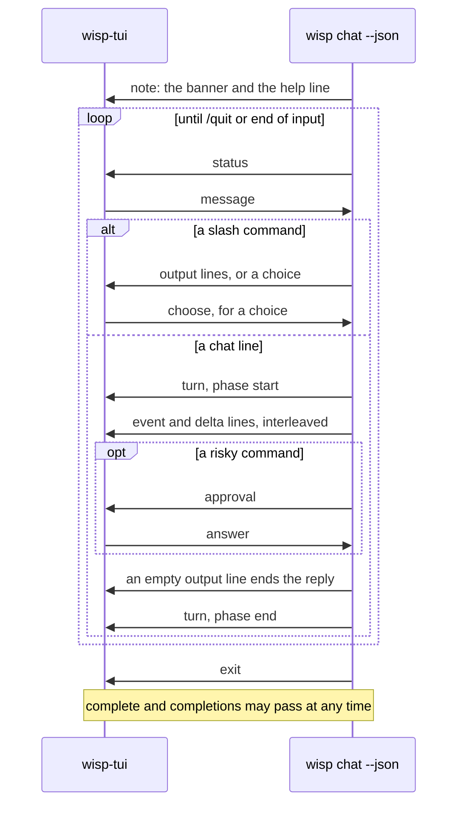

# wisp command reference

`wisp` runs Apple's on-device Foundation Model with tools. It has fifteen subcommands (`respond`,
`chat`, `tools`, `models`, `mcp`, `logs`, `config`, `doctor`, `approvals`, `notify`, `scan`, `redact`,
`watch`, `draft`, `classifier`), plus hidden maintainer ones under `classifier`; `respond` is the
default, so `wisp "<prompt>"` works.

## Subcommands

### `wisp respond [<prompt>]` (default)

One prompt in, one reply out. The prompt is read from stdin when omitted and stdin is a pipe; on a
terminal with no prompt, `wisp` prints its help instead of waiting for input.

| Flag | Meaning |
| --- | --- |
| `-i, --instructions <text>` | Instructions for this conversation, added under wisp's own system prompt and `config.json`'s `systemPromptExtension`. See [ADR 0017](decisions/0017-three-layer-instructions.md). |
| `--tool <name>` (repeatable) | Enable only these tools. Default: all registered tools. |
| `--no-tools` | Give the model no tools: a text-only conversation, which a model that declares no tool calling can still run. |
| `--stream` / `--no-stream` | Stream the reply as it is generated (default on). |
| `--unsafe` | Disable the `run_command` policy and sandbox (warns on stderr). |
| `-m, --model <model>` | `system` (default, on device), `private-cloud` (alias `pcc`; Apple Private Cloud Compute; data leaves the Mac, noted on stderr), or `<backend>:<name>` for a local runtime (`ollama:qwen3-coder`; `wisp models` lists every backend's models). A request that needs tool calling is refused before generation when the model does not declare it; see [ADR 0019](decisions/0019-model-backends.md). Defaults to `config.json`. |
| `-y, --yes` | Approve risky commands without asking. Without it, `respond` refuses commands at or above the approval threshold. |
| `--schema <path>` | A JSON Schema file; the reply is JSON of that shape through guided generation, printed whole (not streamed). The accepted subset and the capability rule are in [mcp.md](mcp.md), "Structured output". |

```
wisp "What is the date in Tokyo?"
echo "Summarise this" | wisp --tool current_date
wisp --no-stream --instructions "Answer in French" "How are you?"
wisp --no-tools --schema verdict.json "Which language is this: fn main() {}"
```

### `wisp chat`

Interactive session. Lines starting with `/` are commands; anything else goes to the model. Replies stream.

On a terminal, when `wisp-tui` is installed beside `wisp` (the Homebrew formula installs both), `wisp chat`
hands the session to it: the conversation scrolls in the terminal's own scrollback above a pinned band
with the reply in progress, an approval dialog, the input, and the status
([ADR 0029](decisions/0029-tui-front-end.md)). `--plain` keeps the line-based chat below; a piped
session is always plain. `wisp-tui` takes the same arguments as `wisp chat` and can be run directly.
In `wisp-tui`, Up and Down recall the lines submitted this session (the latest 100, a line repeating
the one before it kept once): Up from a fresh line keeps what was typed as a draft, and Down past the
newest line brings it back. The plain chat reads whole lines and has no recall; `/history` lists them
in both.

`wisp-tui`'s input edits in place, with readline's keys:

| Keys | Effect |
| --- | --- |
| Left, Right | Move a character. |
| Alt-Left, Alt-Right (or Ctrl-), Alt-B, Alt-F | Move a word. macOS terminals send Alt-B and Alt-F for Option-Left and Option-Right. |
| Home, End, Ctrl-A, Ctrl-E | Move to the start or end. |
| Backspace, Delete | Delete the character before or at the cursor. |
| Ctrl-W, Alt-Backspace | Delete back to the previous whitespace. |
| Ctrl-U, Ctrl-K | Delete to the start or to the end. |
| Alt-Enter | A newline, for a message of several lines. |
| Paste | Inserted whole (bracketed paste), newlines kept, so pasting never sends. |
| Tab | Complete the slash command being typed: the command, `/config`'s words, a setting, a setting's values, `/approvals`'s words and the approval ids after `/approvals revoke`, a model after `/model`, a view after `/inspect`. One match fills in; several fill in what they share and show above the input, and Tab again cycles through them. |

A line you send goes into the scrollback styled like the input it came from, a shade darker: its tint
edge to edge, halfway from the input's blue to black, with half-block strips above and below.

The input grows a row for each line or wrapped line of the message, up to six rows; beyond that it
scrolls within them to keep the cursor's row in sight. It shrinks back only once the input is empty, as
it is when the message is sent, so deleting across a wrap does not resize the band as you type. The
terminal's own cursor marks where typing goes. ratatui fixes an inline band's height when it is made, so
the band is redrawn at the new height; after it shrinks it can sit a row or two above the bottom of the
terminal until the next output closes the gap. Each frame is sent as one synchronized update, so a
terminal that supports it (Ghostty, iTerm2, kitty, WezTerm, Alacritty) shows only finished frames, and
lines are added above the band by scrolling a region rather than redrawing it. The band is redrawn only
when something changes it (a line from wisp, a key, a paste, a resize), never while idle. Keys other than a dialog's answers are ignored while an approval is asked and
while a turn runs.

An approval takes the input's place in the band: a rounded border in the level's colour, titled with
the level, around the command (wrapped to four rows), the whole line when the command is one part of
it, the directory, each reason, the pattern the answer is remembered under, and the keys, as `wisp
chat` offers them. Lines too long for the dialog end in an ellipsis. The answer is recorded in the
scrollback as one line, `⚠ approved for this session: git push` or `⚠ refused: …`, and the band gives
the rows back to the input. Ctrl-C or Ctrl-D refuses.

A choice, such as `/config set approval.classifier` without a value, takes the input's place the same
way: a border titled `choose` around the question, up to eight options with `▸` on the highlighted one
and `*` on the value in force, and the keys. Up and Down move, Enter chooses, and Esc or Ctrl-C leaves
the setting as it was. Where the setting takes a typed value (a number, text, a model not listed), a
row below the options takes typing, and Enter with something typed sends that instead. In the plain
chat the same choice is a numbered list: type a number or a value, or press Enter to leave it; a line
starting with `/` leaves it too.

Replies are rendered as each line goes into the scrollback, in the little Markdown the model writes:
`#` headings in bold, `-`, `*`, and `+` bullets as `•`, and `` `code` ``, `**strong**`, and `*emphasis*`
styled with their markers removed. A fenced block keeps its lines as they are, in the code colour, with
the fences dimmed; a fence left open closes at the end of the turn. Anything that is not clearly markup,
such as `2 * 3` or `snake_case`, is left as typed. The line still being streamed is shown raw until it
is complete.

What a session shows, and where it goes:

- A banner with the version, model, tool count, and audit session, then a status line above every
  prompt, in two halves:
  - On the left, `system:15% used · ~/src/wisp:main+12-3`: the model and how much of its window the
    conversation uses (amber past 80%), then the directory, its git branch, and the lines added (green)
    and removed (red) in tracked files since the last commit, staged or not.
  - On the right edge, the approval mode (`approve at moderate`, `never asks`, `--yes`).

  Each part is omitted when unknown. Before a repository's first commit there is nothing to count, so a
  change shows as `*`. `GitState` reads the branch from `.git/HEAD` and the counts from
  `git diff --numstat HEAD`, with a two-second cap. `wisp-tui` shows the same left half. Its right half
  adds the last turn and its tokens, `approve at moderate · last:3.1s · ↓4,009 ↑79`, with tokens read
  (↓) in pale yellow and written (↑) in pale blue, or the working line while a turn runs. When the row is
  too narrow, the directory shortens to its last folder.
- The model's tool activity as it happens, one dim line per call and result, from the same events the
  audit log records: `⚙ run_command git status`, then `↳ exit 0`; `⚙ read_file README.md`, then
  `↳ 2048 bytes in 0.0 s: 1\t# wisp`. `/last` prints the last tool result whole.
- What the gate decided for each command, under its call:
  - its rating: `· safe by rules: a known read-only command (0.2 ms)`, or `(remembered)` when the
    session reused an earlier verdict;
  - how it was let through: `· approved (session)`, `· allowed by your approval for this session`, or
    `· allowed by your standing approval`;
  - or why it was not: `· denied`, `· no answer in time, denied`, `· blocked by policy: …`.
  A task routed to a model says so: `· secrets runs on system: …`.
- While a turn runs, a dim line that says what it is doing and for how long, redrawn each second on
  a terminal: `… 12 s · running git status (8 s)`, `… 3 s · waiting for the model`. It is erased
  before anything else is written, and is not drawn while a reply is streaming or an approval is asked.
- Under each reply, how long the turn took and, when the model reports usage, the tokens it read and
  wrote across the turn's requests: `3.1 s · ↓4,009 ↑79`. `wisp-tui` puts the same figures in its
  status line.
- Replies on stdout; everything else (banner, status, prompt, tool lines, notes, approval dialogs) on
  stderr, so `wisp chat > transcript.txt` captures only the replies.
- Colour when stdout is a terminal, from wisp's palette (`Style.Palette`, shared with `wisp-tui`): one
  green-blue in tones, the brightest for the prompt, the main tone for status facts and ok states, a
  quiet tone for tool lines, notes, and separators; amber for approvals, moderate, and a context past
  80%; ember for dangerous and errors; white for the conversation, bold for your own words. Off when
  piped, when `NO_COLOR` is set, or when `TERM` is `dumb`.

| Flag | Meaning |
| --- | --- |
| `-i, --instructions <text>` | As for `respond`. |
| `--tool <name>` (repeatable) | As for `respond`. |
| `--no-tools` | Give the model no tools: a text-only conversation any model can run. |
| `-r, --resume <name>` | Continue a transcript saved under `~/.wisp/transcripts/<name>.json`. |
| `--save <name>` | Save the transcript under this name on exit. Defaults to the resumed name. |
| `--list` | Print the names of saved transcripts and exit. |
| `--unsafe` | Disable the `run_command` policy and sandbox. |
| `-m, --model <model>` | As for `respond`. |
| `-y, --yes` | Approve risky commands without asking; the status line says `--yes`. |
| `--plain` | The line-based chat even when `wisp-tui` is installed. |
| `--json` | Headless: JSON Lines on stdin and stdout; see "Headless chat". |

| Command | Effect |
| --- | --- |
| `/help` | List commands. |
| `/tools` | List the tools the model can call. |
| `/tokens` | Tokens used by the transcript, turns, and how often older turns were dropped. |
| `/inspect context` | Save the exact context the next request carries, as Markdown and JSON, to `~/.wisp/context/<session>-turn<N>.md` and `.json`, and say where and how many tokens. Every condensation saves the context before and after it the same way ([context-management.md](context-management.md)). Needs `audit.enabled`. |
| `/status` | wisp's own state, as the model's `inspect` tool shows it, in YAML: the model, tools, policy, and session. |
| `/approvals`, `/approvals revoke [ID]` | The standing approvals, in YAML; `revoke` removes one at once, in this session and later ones, and without an ID offers them to choose from. |
| `/audit [sessions\|ID]` | The latest 20 audit events of every session, one line each, MCP calls and other terminals included. `sessions` lists the sessions in the log, each with its latest activity, how it began (`chat`, `mcp`, `scan`, …, or `-` for an MCP thread or a condensing call), and how many events it wrote. An id shows that session's latest events, such as `/audit git` for a `respond` thread named `git`; Tab completes ids. |
| `/inspect [config\|status\|approvals\|audit]` | Kept as an alias: the same views as `/config`, `/status`, `/approvals`, and `/audit`; with no view, `/status`. `/inspect context` is its own command, above. |
| `/last` | The last tool result in full; the live line shows only its first line. |
| `/models` | The models this conversation could switch to: those that resolve and declare what its tools need, as `wisp models` decides. A table with a header (model, details, capabilities) and the current one marked `*`; `wisp models` keeps its tab-separated lines for scripts. |
| `/model [name]` | Switch the conversation to `name` (`system`, `private-cloud`, `ollama:<name>`, `<backend>:<name>`), resuming the transcript on it; the status line shows the change. No name shows the current model and its capabilities. A model that cannot serve the conversation's tools is refused with the usual hint and nothing changes. |
| `/stats` | Timings of this session's recent model turns and classifier calls: per kind and model, the count, failures, mean, P50, P95, and maximum seconds, and the mean prompt tokens where the runtime reports them (Ollama); then the latest eight calls by start time. Kept in memory only, the latest 256 calls; see below. |
| `/history` | The lines typed this session, numbered, oldest first: the latest 100, blank lines and a line repeating the one before it left out. |
| `/config`, `/config list` | The effective configuration as YAML (`wisp config` gives the same as JSON); `list` shows the settings that can be changed here, each with its value in `config.json` (or `(default)`) and what it does. |
| `/config get KEY` | One setting's effective value, and whether `config.json` sets it or it is the default; without a key, offers the settings. |
| `/config set KEY VALUE`, `/config unset KEY` | Change `~/.wisp/config.json`, as `wisp config set` does (below). Leave out the value and chat offers the setting's choices; leave out the key too and it offers the settings first. `unset` without a key offers the settings set in the file. |
| `/save [name]` | Save now; the name is remembered for exit. |
| `/new` | Start over with the same instructions and tools. |
| `/quit`, `/exit`, `/q`, a bare `exit`, `quit`, or `q`, Ctrl-D | Exit, saving if a name is set. |
| `/help`, `/?`, a bare `help` | List commands. |

`/stats` counts two kinds of call. A `turn` is one message through the conversation's model until the
reply; the framework runs the tool loop inside it, so its time includes the tools the model called and
any approval it waited for, and a turn that ends in an error counts as failed. A `classifier` call is one
risk classification by the model classifier `approval.classifier` names (`system-model` or `coreml`);
it fails when the classifier could not judge and fell back to `moderate`. The rules classifier is not
timed: it answers in microseconds, and a command on its read-only list never reaches the model classifier, so it is not counted. The store is a fixed-size ring in the session's memory, shared by
every conversation of the session including `/model` switches; nothing is written to disk, and the audit
log (`seconds` on `response` and `classifier.verdict`) is the durable record.

When the model wants to run a risky command, chat asks on stderr with a compact dialog: the level and
command, the whole line when the command is one part of it, the directory, each reason on a line
(shortened to 110 characters), the pattern the answer is remembered under, and one key line:
`[y]once [s]ession [p]roject 30d [a]lways 30d [n]o`. `y` approves it for the rest of this turn, `s`
for the session, `p` for this project (30 days, this directory), `a` always (30 days, anywhere); `n`, an
empty answer, or end of input refuses it ([approval.md](approval.md)).

Status lines and the `> ` prompt go to stderr, replies to stdout, so `wisp chat 2>/dev/null` prints only
what the model said. A *turn* is one message from you and everything the model does to answer it.

### Headless chat: `wisp chat --json`

`--json` replaces the terminal with JSON Lines on stdin and stdout so another program can be the face
while the session, tools, gate, and audit stay in this process. The `wisp-tui` front end in `tools/`
drives it ([ADR 0029](decisions/0029-tui-front-end.md)). One object per line, `type` names it; a front end
ignores types and fields it does not know, so new ones can be added without breaking it.

Out, to the front end:

| `type` | Fields | When |
| --- | --- | --- |
| `note` | `text` | The banner, the help line, and anything chat would say on stderr. |
| `status` | `model`, `directory`, `branch`, `dirty`, `added`, `removed` (lines in tracked files since the last commit), `approval`, `contextUsed` (nulls when unknown) | Before each prompt: the turn is over and input is wanted. |
| `activity` | `doing`, `asking`, `turnSeconds` | What the turn under way is doing, sent each time it changes: `doing` is `waiting for the model`, `running <command>`, `<tool> <argument>`, `waiting for your approval`, or `condensing the context`, and null when the turn has ended. `asking` is true while a person is being asked. `turnSeconds` is how far into the turn it began. A front end times the rest itself; `wisp-tui` shows it in its status line. |
| `turn` | `phase`, `turn`, and at the end `seconds`, `outcome`, and, when the model reports usage, `inputTokens` and `outputTokens` | `phase` `start` when a message goes to the model, `end` when its reply is complete; `turn` is the number the turn's `event` lines carry, `outcome` is `ok` or `error` (the error is a `note` just before). The tokens are the turn's, summed over the requests its tool loop made. Slash commands are not turns. |
| `delta` | `text` | A fragment of the streamed reply. |
| `output` | `text` | A whole line, as `/help` or `/last` print; an empty one ends a reply. |
| `event` | `kind`, `call`, `turn`, `details`, `text` | Every audit event of the conversation, as `logging.md` describes them. `text` is the unstyled line the terminal chat shows for it, null when it shows none; a front end shows `text` so every face words tool activity alike, and reads the raw fields only for a view of its own. |
| `approval` | `id`, `command`, `line`, `pattern`, `directory`, `level`, `reasons` | A command needs a decision; answer with the `id` within `approval.timeoutSeconds` or it is refused. |
| `completions` | `id`, `from`, `candidates` | The answer to a `complete` request: the words that could replace the text from character `from` to the cursor, sorted. |
| `choice` | `id`, `title`, `options` (each `value`, `label`, `detail`), `current`, `acceptsText` | A chat command asks something, such as `/config set` without a value; answer with `choose` within `approval.timeoutSeconds`, or nothing changes. |
| `exit` | | The loop has ended. |

In, from the front end: `{"type":"message","text":"…"}` for a chat line, slash commands included, and
`{"type":"answer","id":"…","decision":"once|session|project|always|no"}` for an approval, and
`{"type":"choose","id":"…","value":"…"}` for a choice, with `value` null or absent for no answer, and
`{"type":"complete","id":"…","text":"…","cursor":N}` to ask for completions of the input at character
`N`, answered by `completions` even while a turn is not running; completion comes from the same list of
settings and values as `/config`, and the models this Mac can run are looked up once per session. A line that
is not a JSON object is taken as a message, so the protocol can be driven by hand:

```
printf 'What is the date in Tokyo?\n/quit\n' | wisp chat --json
```

Everything else about the session is as for the terminal chat: the same flags, transcripts, and audit.
Only the presentation moves out of the process.

The order in which the lines pass, from the banner to `exit`:



### `wisp tools`

Prints each registered tool as `name<TAB>description`. `--json` prints the full catalogue (description,
JSON Schema arguments, limits, example prompt) and `--markdown` the same as Markdown; these are the texts
served to MCP clients as `wisp://tools` and `wisp://tools.md`. See [tools/](tools/README.md).

### `wisp logs`

Shows the audit log (`~/.wisp/logs/audit.jsonl` and rotated files) as one-line summaries, oldest first.

| Flag | Meaning |
| --- | --- |
| `--session <id>` | Only this session. |
| `--kind <kind>` (repeatable) | Only these kinds, e.g. `tool.call`, `policy.decision`. |
| `--tool <name>` | Only tool events for this tool. |
| `-l, --last <n>` | Only the last n matching events. |
| `--json` | Raw JSON Lines instead of summaries. |
| `-f, --follow` | Keep printing matching events as they are written, until Ctrl-C, starting with the last 10 (or `--last`). Watches what MCP clients have wisp do, live: `wisp logs -f --session git`. A rotated log is followed into its new file. |

See [logging.md](logging.md) for the event catalogue.

### `wisp models`

Lists the models `--model` and `config.json` can use: Apple's two, then every model each local backend
serves, each shown only if it can serve a conversation. That is decided by logic, not a list of names:
the model must resolve (installed, reachable, entitled, and able to converse; an Ollama model that does
not report `completion`, such as an embedding model, cannot) and must declare tool calling, since a
conversation has tools. The configured default is marked with `*`; each line gives the backend's detail
and the declared capabilities. A backend that does not answer gets one line in parentheses.

| Flag | Effect |
| --- | --- |
| `--no-tools` | Judge for a conversation with no tools, so text-only models are listed too |
| `--all` | Add the excluded models, each with the reason it cannot be used |

```
* system	toolCalling, guidedGeneration, vision
  ollama:qwen3-coder:latest	30.5B 18.56 GB; toolCalling, guidedGeneration
```

With `--all`, on the same Mac on 2026-09-23:

```
  private-cloud	not usable: … lacks the com.apple.developer.private-cloud-compute entitlement, …
  ollama:nomic-embed-text:latest	not usable: … Ollama reports it cannot hold a conversation (capabilities: embedding)
  ollama:deepseek-coder-v2:latest	not usable: … does not support tool calling (capabilities runtime); …
```

`private-cloud` is refused from every unsigned build; see [backends.md](backends.md), "Private Cloud
Compute".

`wisp tools --markdown` and `--json` include a `Measured:` line, or a `measurements` field, for each
tool the eval harness has measured ([measurements.md](measurements.md)).

### `wisp config`

`wisp config` (or `config show`) prints the effective configuration as JSON: every setting with its
default applied, the model, the `run_command` policy, and the paths under `~/.wisp`, with whether
`config.json` exists. The same view the model's [`inspect`](tools/inspect.md) tool and the
`wisp://config` resource give.

`wisp config get KEY` prints one setting's effective value and `set in config.json` or `the default`.
`wisp config list` prints the settings that can be changed without editing the file, one per line:
the setting, its value in `config.json` or `(default)`, and what it does. `wisp config set KEY VALUE`
sets one and `wisp config unset KEY` removes one so its default applies
([ADR 0040](decisions/0040-config-from-chat.md)); chat's `/config set` and `unset` do the same.

```
wisp config set approval.classifier coreml
wisp config set approval.coremlModel risk@0.14.0-default
wisp config set routing.ladder system ollama:qwen3.8:27b     # or a JSON array
wisp config set routing.tasks.secrets ollama:qwen3.8:27b
wisp config unset approval.timeoutSeconds
```

| Setting | Accepts |
| --- | --- |
| `model` | A model, as `--model` spells it. |
| `approval.threshold` | `safe`, `moderate`, `dangerous`, or `never`. |
| `approval.classifier` | `rules`, `system-model`, or `coreml`. |
| `approval.coremlModel` | A classifier version, `risk@<version>` (`wisp classifier list`); a Core ML model under `~/.wisp/models/coreml`; or an absolute or `~` path. Unset, the default this release ships. |
| `approval.coremlMinimumConfidence` | A number from 0 to 1. |
| `approval.timeoutSeconds` | Seconds, 0 to 86,400; 0 waits forever. |
| `approval.persistDays` | Days, 1 to 365. |
| `routing.ladder` | Models, least capable first. |
| `routing.tasks.secrets` | A model for the thorough pass of `wisp scan`, `wisp redact`, and the MCP tools `scan_secrets` and `redact`; unset, `system`. |
| `commandTimeoutSeconds` | Seconds, 0 to 86,400. |
| `commandMaxOutputBytes` | Bytes, 256 to 1,048,576. |
| `tools.disabled` | Built-in tool names. |
| `notifications.enabled`, `audit.enabled` | `true` or `false` (`on`, `off`, `yes`, `no`). |
| `notifications.perMinute` | 1 to 60. |
| `ollama.baseURL`, `systemPromptExtension` | Text. |
| `ollama.contextLength` | 1,024 to 1,048,576. |

Each change is checked before it is written: an unknown setting, a value the setting does not take, or
a file that would no longer load is refused with the reason, and nothing changes. The rest of the file,
the command policy and custom tools included, is kept as it is; the file is written readable by its
owner only. A change that weakens the gate or the audit (the threshold at `never` or `dangerous`, the
classifier at `rules`, the audit off) prints a note, and so does `coreml` without a model, which then uses the default this release ships. Changes are
audited as `config.change` and apply from the next session: a running chat keeps the settings it
started with. The model cannot change the configuration; there is no tool for it.

### `wisp doctor`

Checks that this install can work and exits non-zero if anything fails: macOS 27 or later, the on-device
model available, the configured model available when it is not `system` (for `ollama:<name>`, that the
server answers and lists the model), the Core ML risk classifier preparing when `approval.classifier` is
`coreml` (the default), `/usr/bin/sandbox-exec` present,
`config.json` parses, `~/.wisp` writable. Run it first
when something is wrong. `wisp --version` prints the version.

### `wisp notify <message>`

Shows a macOS notification: `--title` (default `wisp`), `--subtitle`, `--sound`. The same notifier as the
model's `notify` tool, so the same bounds, per-minute limit, and off switch apply, and the request is
audited as `notification` with source `user`. Exits non-zero with the reason when it is refused.

```
make test && wisp notify "Tests pass" --title "Build" --sound
```

### `wisp scan [<file>…]`

Scans files, or standard input, for credentials and prints each finding's location, kind, and a masked
preview; the value is never printed. A unified diff is scanned by its added lines and located as
`path:line`, so a pre-commit hook can check a commit before it is made. Exits 1 when anything is
found, 0 otherwise. The rules are in [ADR 0031](decisions/0031-secret-scanning-and-redaction.md); they
are a best effort, not a guarantee.

| Flag | Meaning |
| --- | --- |
| `--personal` | Report personal data too: emails, phone and card numbers, public IPs, addresses, private hostnames, user names, and lines the personal-data classifier flags, shown `(classifier)` ([ADR 0042](decisions/0042-personal-data-classifier.md)). |
| `--thorough` | Add the model's pass over the rule-redacted text, for names, customer numbers, and unusual credentials. Up to three turns per 4 KiB. |
| `-m, --model <model>` | The model for `--thorough`. Defaults to `routing.tasks.secrets`: `system` unless set, the model measured best for this pass. |
| `--json` | One JSON object per input, the shape `scan_secrets` returns ([mcp.md](mcp.md)). |

```
git diff --cached | wisp scan        # in .git/hooks/pre-commit: a finding fails the commit
wisp scan --personal export.csv
```

Each input is audited as `secrets.scan` with the kinds found, never the values.

### `wisp redact [<file>]`

Prints a file, or standard input, with credentials and personal data replaced by numbered markers
(`[REDACTED:email#1]`; the same value gets the same number) and a one-line summary on stderr. For text on
its way to an issue, a chat, or a cloud model.

| Flag | Meaning |
| --- | --- |
| `--secrets-only` | Replace credentials only and keep personal data. |
| `--thorough` | Add the model's pass for names, addresses, and identifiers the rules cannot see. |
| `-m, --model <model>` | The model for `--thorough`. Defaults to `routing.tasks.secrets`: `system` unless set, the model measured best for this pass. |

```
wisp redact crash.log | pbcopy
wisp redact --thorough support-ticket.txt > ticket-clean.txt
```

Audited as `redaction` with the counts replaced per kind.

### `wisp draft [commit|pr|changelog]`

Drafts a commit message (the default), a pull request description, or a changelog line from a diff piped
to it, or from `git diff --cached` run here under the policy, sandbox, and approval. The model summarises
the diff per file and writes from the summary; the subject is kept to 72 characters, and a commit body
ends with `Why: <…>` for you to replace ([ADR 0035](decisions/0035-change-drafts.md)). `-m, --model`
chooses the model: the system model drafts small changes well, and a larger local model such as
`ollama:qwen3.8:27b` does much better on a change of many files. `-y, --yes` approves running `git diff`
without asking. An empty diff is refused.

```
wisp draft > /tmp/msg && $EDITOR /tmp/msg && git commit -F /tmp/msg
git diff main... | wisp draft pr
```

### `wisp watch <command>`

Runs a command at once, then again each time a file changes under the watched paths and, with `--every`,
on an interval, and posts a notification when its outcome turns. A failing run is triaged by the model
into its failures, shown under the run's line; a failure that repeats without a notification is not
triaged again. Changes under `.git`, `.build`, `.swiftpm`, `target`, `node_modules`, `DerivedData`,
`.venv`, `__pycache__`, `dist`, `.next`, and `.cache`, and editor scratch files, are ignored. The command is
classified and, when risky, approved once, before the first run; every run still passes the policy and
runs under the sandbox, and approving the watch covers its reruns ([ADR 0033](decisions/0033-watch-mode.md)).

| Flag | Meaning |
| --- | --- |
| `-C, --directory <dir>` | Where the command runs. Default: the current directory. |
| `--path <dir>` (repeatable) | Directories to watch. Default: `--directory`. |
| `--no-files` | Do not watch files; needs `--every`. |
| `--every <seconds>` | Also run on this interval (at least 1). |
| `--notify <when>` | `change` (default: when it starts or stops failing, and on a first run that fails), `failure`, `always`, `never`. |
| `--no-triage` | Do not triage failing output. |
| `--max-runs <n>` | Stop after this many runs. |
| `-m, --model <model>` | The model for triage. Defaults to `config.json`. |
| `-y, --yes` | Approve risky commands without asking. |

```
wisp watch 'swift test 2>&1'                   # rerun the tests on every save
wisp watch --no-files --every 300 'make check'  # every five minutes
```

Each run prints a line (`[22:15:34] run 2 (change): pass, exit 0, 1.3 s; was fail`) and is audited as
`watch.run`; notifications are audited as `notification` with source `watch`. Ctrl-C stops after the
current run; a second Ctrl-C stops at once.

### `wisp classifier`

Risk classifier versions live in `~/.wisp/classifiers/risk`: the default each release ships,
`risk@X.Y.Z-default`, never changed, and those trained here, `risk@X.Y.Z-local.<n>`, never overwritten.

`wisp classifier list` shows them, the one in use marked `*`, each with its source and latest
measurement. `wisp classifier train [--examples <file>] [--from-audit] [--exclude <file>]… [--use]` trains a new version with
Create ML from labelled commands (`level<TAB>command` per line) or the bundled examples; `--from-audit`
adds the on-device model's verdicts on the commands in this Mac's audit log, and `--use` switches to it.
Anything overlapping `~/.wisp/classifiers/risk/held-out.tsv`, or a file given with `--exclude`, is left
out, so a test set of this Mac's commands is never trained on.
`wisp classifier use risk@<version>` sets `approval.classifier` to `coreml` and `approval.coremlModel`
to it, from the next session; `wisp classifier remove risk@<version>` deletes one trained here, not the
default or the one in use.
`wisp classifier measure [risk@<version>] [--examples <file>] [--classifier rules|system-model|coreml] [--coreml-model <path>]`
runs a classifier, with the rules beside it, over labelled commands and prints its exact, over-, and
under-ratings, misses, and latency per verdict, recording them in the version's manifest; it exits 1
when a dangerous command is rated safe.
Training is audited as `classifier.train`. See [approval.md](approval.md), "Training and measuring a
classifier".
Three hidden subcommands serve the repository rather than users:
- `ship` trains the default risk classifier a release embeds (`scripts/check classifier-default`,
  [release.md](release.md)). With `--task personal` it trains the personal-data classifier, by hand
  ([ADR 0042](decisions/0042-personal-data-classifier.md)).
- `split` deals a labelled set into parts by family.
- `baseline` prints the label today's rules give each line; for secrets, `--classifier` adds the
  personal-data classifier.

`split` and `baseline` are described in `training/README.md`.

### `wisp approvals`

`wisp approvals` (or `approvals list`) prints standing approvals: id, scope, expiry, directory, pattern
(such as `head *`).
`wisp approvals revoke <id>` removes one; `wisp approvals clear` removes all. See
[approval.md](approval.md).

### `wisp mcp`

Serves the Model Context Protocol over stdio until the client closes the pipe. See [mcp.md](mcp.md).

| Flag | Meaning |
| --- | --- |
| `-i, --instructions <text>` | Conversation instructions for threads whose `respond` call supplies none. |
| `--tool <name>` (repeatable) | Tools threads get unless a `respond` call names its own. Default: all. |
| `--no-tools` | Threads get no tools unless a `respond` call names some: text-only, for any model. |
| `--unsafe` | Disable the `run_command` policy and sandbox for every call. |
| `-m, --model <model>` | Default model for new threads; callers may override per thread. |
| `-y, --yes` | Approve risky commands without asking the client's user. |

## Home directory and configuration

State lives in `~/.wisp`, or `$WISP_HOME` when set. Any command that writes there creates it: `respond`,
`chat`, and `mcp` write the audit log (unless `audit.enabled` is false), `chat` writes transcripts, and
`doctor` probes that it is writable. `tools` and `logs` never create it.

| Path | Contents |
| --- | --- |
| `config.json` | Optional settings, below. |
| `transcripts/<name>.json` | Saved conversations. |
| `context/<session>-<label>.md` and `.json` | The exact context a model saw: saved by `/inspect context`, and before and after each condensation. User-only. |
| `approvals.json` | Standing command approvals (`project` and `always` scopes), user-only. |
| `logs/audit.jsonl` | The audit log, user-only, rotated by size. See [logging.md](logging.md). |
| `classifiers/risk/<version>/` | Risk classifier versions, each a read-only `model.mlmodel` and a `manifest.json`; `held-out.tsv` beside them is never trained on. See `wisp classifier`. |

`config.json` fields, all optional:

| Field | Default | Meaning |
| --- | --- | --- |
| `systemPromptExtension` | none | Text added under wisp's own system prompt for every session and thread on this Mac: house style, standing assumptions. `instructions` is the pre-0.2 name and is read when this key is absent. See [ADR 0017](decisions/0017-three-layer-instructions.md). |
| `model` | `system` | `system`, `private-cloud`, or `ollama:<name>`. See [ADR 0013](decisions/0013-model-selection.md) and [ADR 0016](decisions/0016-local-runtimes-through-an-executor.md). |
| `ollama` | `{ "baseURL": "http://127.0.0.1:11434", "timeoutSeconds": 120, "contextLength": 8192 }` | Where Ollama serves `ollama:<name>` models, how long one generation request may take, and the context window asked of the server on every request (`num_ctx`), which wisp condenses against. See [backends.md](backends.md). |
| `coreai` | `{ "modelsDirectory": "<home>/models/coreai" }` | Where exported Core AI bundles live for `coreai:<name>` models. See [backends.md](backends.md). |
| `routing` | `{ "ladder": [], "tasks": { "secrets": "system" } }` | Models from least to most capable, such as `["system", "ollama:qwen3.8:27b"]`. A task that routes by input size (today `draft_change` and `wisp draft`) uses the first rung whose measured result covers the input, at a pass rate of 80% or better, and the last rung beyond every measured size; an explicit `--model` or `model` always wins. Empty turns routing off. `tasks` names the model for a task's model pass when the caller names none; the one task today is `secrets` (the thorough pass of `wisp scan`, `wisp redact`, and the MCP tools `scan_secrets` and `redact`), whose default is `system`, the model measured best for it. See [ADR 0037](decisions/0037-routing-by-input-size.md). |
| `tools` | `{ "disabled": [], "custom": [] }` | Built-in tools to leave out, and your own command-template tools; see [tools/custom.md](tools/custom.md). A definition that breaks the rules makes the config malformed. |
| `notifications` | `{ "enabled": true, "perMinute": 5 }` | Whether the `notify` tool and `wisp notify` post at all, and at most how many in any minute across the process; see [tools/notify.md](tools/notify.md). |
| `mlx` | `{ "modelsDirectory": "<home>/models/mlx", "models": {} }` | Where MLX model directories live for `mlx:<name>` models, and per model the capabilities the operator declares (`toolCalling`, `guidedGeneration`, `reasoning`, `vision`). Needs a build with `--traits MLX`. See [backends.md](backends.md). |
| `commandTimeoutSeconds` | 60 | Wall-clock limit for `run_command`. |
| `commandMaxOutputBytes` | 4096 | Bytes kept from each of stdout and stderr by `run_command`. |
| `maxThreads` | 32 | Live MCP conversation threads before the least recently used is evicted. |
| `commandPolicy` | see [tools/run_command.md](tools/run_command.md) | Deny/allow patterns and sandbox settings for `run_command`. Partial objects are fine: `{"commandPolicy":{"sandbox":{"allowNetwork":false}}}` keeps every other default. |
| `audit` | `{ "enabled": true, "maxFileBytes": 10485760, "keepFiles": 5 }` | Audit log switch and rotation. |
| `approval` | `{ "threshold": "moderate", "classifier": "coreml", "timeoutSeconds": 600, "persistDays": 30 }` | When to ask a human before `run_command`, which classifier judges commands (`coreml`, the shipped version unless `coremlModel` names another, with `coremlMinimumConfidence`; `system-model`; or `rules`), how long silence is tolerated before it counts as a refusal (`0` waits forever), and how long persisted approvals last; see [approval.md](approval.md). |

Environment: `WISP_HOME` relocates the directory; `WISP_LOG=debug|info|error` mirrors diagnostics to
stderr.

```json
{ "systemPromptExtension": "Prefer British spelling.", "commandTimeoutSeconds": 120 }
```

A malformed file or an invalid `commandPolicy` pattern is an error; a missing file is fine. Unknown fields are
ignored.

## Context window

The model's window is about 4k tokens. When a prompt no longer fits, wisp drops older turns (keeping the
instructions and the last four turns) and retries once. `chat` prints a note when this happens; MCP results
carry `condensed: true`. See [context-management.md](context-management.md).

## Exit codes

| Code | Meaning |
| --- | --- |
| 0 | Success, including a reply in which the model reports that a command was refused; the refusal itself is in the audit log (`wisp logs --kind approval.decided`). |
| 1 | Runtime failure, such as the model being unavailable. |
| 64 | Usage error: bad flags, unknown `--tool` or `--model`, empty stdin prompt, malformed `config.json`, a `--resume` name that is invalid or not saved. |

## Requirements

macOS 27 or later. The on-device model must be enabled in System Settings (Apple Intelligence); `fm available`
reports its state.
