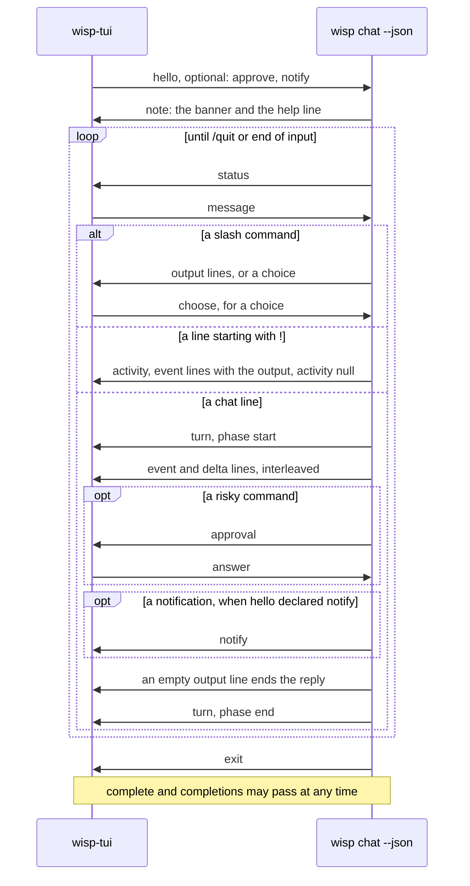

# wisp command reference

`wisp` runs Apple's on-device Foundation Model with tools. It has sixteen subcommands (`respond`,
`chat`, `tools`, `models`, `mcp`, `logs`, `config`, `doctor`, `approvals`, `facts`, `notify`, `scan`, `redact`,
`watch`, `draft`, `classifier`), plus hidden maintainer ones under `classifier`; `respond` is the
default, so `wisp "<prompt>"` works.

## Subcommands

### `wisp respond [<prompt>]` (default)

One prompt in, one reply out. The prompt is read from stdin when omitted and stdin is a pipe; on a
terminal with no prompt, `wisp` prints its help instead of waiting for input.

| Flag | Meaning |
| --- | --- |
| `-i, --instructions <text>` | Instructions for this conversation, added under wisp's own system prompt and `config.json`'s `systemPromptExtension`. See [ADR 0017](decisions/0017-three-layer-instructions.md). |
| `--tool <name>` (repeatable) | Enable only these tools. Default: all registered tools, `memory` among them ([tools/memory.md](tools/memory.md)). |
| `--no-tools` | Give the model no tools: a text-only conversation, which a model that declares no tool calling can still run. |
| `--stream` / `--no-stream` | Stream the reply as it is generated (default on). |
| `--unsafe` | Disable the `run_command` policy and sandbox (warns on stderr). |
| `-m, --model <model>` | `system` (default, on device), `private-cloud` (alias `pcc`; Apple Private Cloud Compute; data leaves the Mac, noted on stderr), or `<backend>:<name>` for a local runtime (`ollama:qwen3-coder`; `wisp models` lists every backend's models). A request that needs tool calling is refused before generation when the model does not declare it; see [ADR 0019](decisions/0019-model-backends.md). Defaults to `config.json`. |
| `-y, --yes` | Approve risky commands without asking. Without it, `respond` refuses commands at or above the approval threshold. |
| `--schema <path>` | A JSON Schema file; the reply is JSON of that shape through guided generation, printed whole (not streamed). The accepted subset and the capability rule are in [mcp.md](mcp.md), "Structured output". |

```
wisp "What is the date in Tokyo?"
echo "Summarise this" | wisp --tool current_date
wisp --no-stream --instructions "Answer in French" "How are you?"
wisp --no-tools --schema verdict.json "Which language is this: fn main() {}"
```

### `wisp chat`

Interactive session. Lines starting with `/` are commands; a line starting with `!` is a shell command you run
yourself ("Commands you run yourself", below); anything else goes to the model. Replies stream.

When the configured model (`config.json`'s `model`) is unavailable as chat starts, Ollama not running, say, chat
starts on `system` instead and says so before the first prompt, so you reach `/model`:

```
ollama:granite4.1:8b is unavailable (no Ollama server at http://127.0.0.1:11434: Could not connect to the server);
using system. /model ollama:granite4.1:8b once Ollama is running
```

It is recorded as `model.fallback` ([logging.md](logging.md)). A model named with `--model` is not replaced: chat
fails as before, since you asked for that one, and so it does when `system` is unavailable or disabled too.
`wisp respond` and MCP `respond` never fall back ([ADR 0056](decisions/0056-models-enabled-and-disabled.md)).

On a terminal, when `wisp-tui` is installed beside `wisp`, or in a `bin` beside the folder `wisp` is in (the
Homebrew formula installs `wisp` in `libexec` and `wisp-tui` in `bin`), `wisp chat` hands the session to it;
`wisp doctor`'s `front end` finding says where it found it, or where it looked: the conversation scrolls in the terminal's own scrollback above a pinned band
with the reply in progress, an approval dialog, the input, and the status
([ADR 0029](decisions/0029-tui-front-end.md)). `--plain` keeps the line-based chat below; a piped
session is always plain. `wisp-tui` takes the same arguments as `wisp chat` and can be run directly.
In `wisp-tui`, Up and Down recall the lines submitted this session (the latest 100, a line repeating
the one before it kept once): Up from a fresh line keeps what was typed as a draft, and Down past the
newest line brings it back. The plain chat reads whole lines and has no recall; `/history` lists them
in both.

`wisp-tui`'s input edits in place, with readline's keys:

| Keys | Effect |
| --- | --- |
| Left, Right | Move a character. |
| Alt-Left, Alt-Right (or Ctrl-), Alt-B, Alt-F | Move a word. macOS terminals send Alt-B and Alt-F for Option-Left and Option-Right. |
| Home, End, Ctrl-A, Ctrl-E | Move to the start or end. |
| Backspace, Delete | Delete the character before or at the cursor. |
| Ctrl-W, Alt-Backspace | Delete back to the previous whitespace. |
| Ctrl-U, Ctrl-K | Delete to the start or to the end. |
| Alt-Enter | A newline, for a message of several lines. |
| Paste | Inserted whole (bracketed paste), newlines kept, so pasting never sends. |
| Tab | Complete the slash command being typed: the command, `/config`'s words, a setting, a setting's values, `/approvals`'s words and the approval ids after `/approvals revoke`, a model after `/model`, a view after `/inspect` (`next` or `turns` after `/inspect context`, `all` after `/inspect facts` or `/inspect summary`), a subject kind, a fact id, or `delete` after `/fact`, a fact id after `/fact delete`, and a scope after `/fact ID`, and a session id after `/audit`. One match fills in; several fill in what they share and show above the input, and Tab again cycles through them. |

Two keys open a panel over the band, a rounded border around up to 16 rows, with its keys in the bottom
border: Up and Down scroll a row, PageUp and PageDown a page, and Esc (or the key that opened it) closes
it. Typing is held while it is open; an approval or a choice arriving closes it and takes its place.

| Keys | Panel |
| --- | --- |
| Ctrl-O | The last tool output in full. In the scrollback each output shows its first `shownOutputLines` lines (20), in the quiet tone, then `… 84 more lines · ctrl-o shows all`; lines already in the scrollback cannot be changed, so expanding is this panel and folding is closing it. |
| Ctrl-T | The model's context, live: what the next request carries (`/inspect context next`), at no model cost. Left steps back a turn to the context composed at that turn's start (`/inspect context N`), Right forward and past the latest turn back to the next request. `/inspect context turns` typed shows the turn list in the same panel. Only between turns. |

A line you send goes into the scrollback styled like the input it came from, a shade darker: its tint
edge to edge, halfway from the input's blue to black, with half-block strips above and below.

Command mode is a state of `wisp-tui`'s input box ([ADR 0049](decisions/0049-commands-typed-in-chat.md)).
Typing `!` at the start of the line, into an empty box or in front of what you have typed, switches it to
command mode: the `!` is the switch, not text, the box turns a muted pale amber (`command`, #E8B577) with
bold black text, its marker becomes `!`, and what you type is the command. A `!` typed after other text,
or at the start in command mode, stays text. Backspace with the cursor at the start of the line switches
back to the normal prompt, keeping what you typed as ordinary text, so a stray `!` costs one key; Delete
in an empty box does the same. A paste that starts with `!` at the start of the line enters command mode
the same way. Enter runs the command and the box returns to the normal prompt; an empty command sends
nothing. In the scrollback the command's line is a stripe in a darker, faded shade of the same colour
(`commandSent`, #745A3C) with light text, `! git status --short`, as a prompt's is the darker shade of the
input. Up and Down bring a command back in command mode.

While a turn runs, or a command you typed, the input box is inactive: dimmed, with what wisp is doing in
place of the cursor, `… working: read_file README.md`, `… working: running git status`, or `… working:
waiting for the model`. Keys typed meanwhile are held, not shown as typed and not lost: the box says how many
(`· 3 keys held`), and they are applied in order when the turn ends, as if typed then (a held `!` into the
empty box enters command mode). Enter is not held: a message is sent only once you can see it.

The input grows a row for each line or wrapped line of the message, up to six rows; beyond that it
scrolls within them to keep the cursor's row in sight. It shrinks back only once the input is empty, as
it is when the message is sent, so deleting across a wrap does not resize the band as you type. The
terminal's own cursor marks where typing goes. ratatui fixes an inline band's height when it is made, so
the band is redrawn at the new height; after it shrinks it can sit a row or two above the bottom of the
terminal until the next output closes the gap. Each frame is sent as one synchronized update, so a
terminal that supports it (Ghostty, iTerm2, kitty, WezTerm, Alacritty) shows only finished frames, and
lines are added above the band by scrolling a region rather than redrawing it. The band is redrawn only
when something changes it (a line from wisp, a key, a paste, a resize), never while idle. Keys other than a dialog's answers are ignored while an approval is asked;
while a turn runs they are held, as above.

An approval takes the input's place in the band: a rounded border in the level's colour, titled with
the level, around the command (wrapped to four rows), the whole line when the command is one part of
it, the directory, each reason, the pattern the answer is remembered under, and the keys, as `wisp
chat` offers them. Lines too long for the dialog end in an ellipsis. The answer is recorded in the
scrollback as one line, `⚠ approved for this session: git push` or `⚠ refused: …`, and the band gives
the rows back to the input. Ctrl-C or Ctrl-D refuses.

A choice, such as `/config set approval.classifier` without a value, takes the input's place the same
way: a border titled `choose` around the question, up to eight options with `▸` on the highlighted one
and `*` on the value in force, and the keys. Up and Down move, Enter chooses, and Esc or Ctrl-C leaves
the setting as it was. Where the setting takes a typed value (a number, text, a model not listed), a
row below the options takes typing, and Enter with something typed sends that instead. In the plain
chat the same choice is a numbered list: type a number or a value, or press Enter to leave it; a line
starting with `/` leaves it too.

Replies are rendered as each line goes into the scrollback, in the little Markdown the model writes:
`#` headings in bold, `-`, `*`, and `+` bullets as `•`, and `` `code` ``, `**strong**`, and `*emphasis*`
styled with their markers removed. A fenced block keeps its lines as they are, in the code colour, with
the fences dimmed; a fence left open closes at the end of the turn. Anything that is not clearly markup,
such as `2 * 3` or `snake_case`, is left as typed. The line still being streamed is shown raw until it
is complete.

#### Commands you run yourself

A line that starts with `!` is a command you run, not a message: `! git status --short` and `!git status
--short` both run `git status --short` in the conversation's working directory, as `run_command` would, with
its bounds (the output tail, the timeout), and no model turn starts
([ADR 0049](decisions/0049-commands-typed-in-chat.md)). A bare `!` runs nothing and says so. A `!` inside a
message is text. `wisp-tui` has a command mode for it (above); the plain chat, which has no box, colours the
line's prompt marker in the command colour once you press Enter.

The checks that protect the Mac stay; the ones that stand in for you go:

| Step | For the model's command | For a command you type |
| --- | --- | --- |
| Policy deny and allow lists | yes | yes: a denied command is refused with the reason, `· blocked by policy: …` |
| Seatbelt sandbox, writable roots | yes | yes, the same profile: a command the sandbox refuses fails as the model's would, and chat adds what the check found ([ADR 0054](decisions/0054-the-sandboxs-refusals-checked.md)): `· the sandbox refused writing to /x, …` for a path outside the writable roots, `· not the sandbox: /x is inside wisp's writable roots`, or, with no path in the error, `· the sandbox may have refused it (no path to check), …; no policy rule denied it` |
| Risk classifier | yes | no |
| Your approval | at `moderate` and above | no: typing it is the approval |
| Audit log | yes | yes: `policy.decision` and `command.outcome` marked `origin: "person"`, then `command.typed` ([logging.md](logging.md)) |

What the command printed (stdout, then stderr) is shown as a tool's output is: `↳ exit 0`, then up to
`shownOutputLines` lines and the fold line, `… 84 more lines, 3210 bytes in all: /show 8a7b6c5d`, which
`/show` and `/last` (or Ctrl-O in `wisp-tui`) print whole. The model is told on its next request, as a
reference after the turn: one entry, `` [the person ran `git status --short` themselves in
/Users/me/src/wisp (exit status 0, 4 lines); this was not your action; …] ``, with the output itself when it
is short (320 bytes or less), or its first and last lines and `memory "recall entry 7"` to read the rest. It is never presented as something the
model did. Facts are taken from the output as from `run_command`'s (the working directory, a test result, the
git branch), with you as their source. A command that was refused is audited and not told to the model.

Each command runs in its own shell, as the model's do: `!cd elsewhere` does not change the conversation's
directory. `respond` over MCP does not interpret `!`; there the prompt goes to the model as text.

What a session shows, and where it goes:

- A banner with the version, model, tool count, and audit session, then a status line above every
  prompt, in two halves:
  - On the left, `system:15% used · ~/src/wisp:main+12-3`: the model and how much of its window the
    conversation uses (amber past 80%), then the directory, its git branch, and the lines added (green)
    and removed (red) in tracked files since the last commit, staged or not.
  - On the right edge, the approval mode (`approve at moderate`, `never asks`, `--yes`).

  Each part is omitted when unknown. Before a repository's first commit there is nothing to count, so a
  change shows as `*`. `GitState` reads the branch from `.git/HEAD` and the counts from
  `git diff --numstat HEAD`, with a two-second cap. `wisp-tui` shows the same left half. Its right half
  adds the last turn and its tokens, `approve at moderate · last:3.1s · ↓4,009 ↑79`, with tokens read
  (↓) in pale yellow and written (↑) in pale blue, or the working line while a turn runs. When the row is
  too narrow, the directory shortens to its last folder.
- The model's tool activity as it happens, one dim line per call and result, from the same events the
  audit log records: `⚙ run_command git status`, then `↳ exit 0`; `⚙ read_file README.md`, then
  `↳ 2048 bytes in 0.0 s: 1\t# wisp`.
- Under each result, the output itself, as the tool returned it, indented and in the quiet tone: up to
  `shownOutputLines` lines (20; a [setting](#home-directory-and-configuration)) and at most 2 KiB, then, when there is more,
  `… 84 more lines, 3210 bytes in all: /show 8a7b6c5d`. `/show` with that id (the start of the output's
  `tool.result` audit event id) or with its store entry id prints the output whole, and `/last` the last
  one. You see the real output rather than the model's copy of it, and the model is told so, so its reply
  comments on the output instead of retyping it (decision D12 of the
  [layered-context proposal](proposals/2026-09-29-layered-context.md)). Like the tool lines, the output
  goes to stderr.
- The model's thinking, for a reasoning model that reports it (Ollama streams it for `qwen3.8:27b`,
  `gemma4:12b`, `gemma4:26b`, `ornith:9b` and others; [ADR 0053](decisions/0053-the-models-thinking-shown.md)): when
  it stops thinking, a dim line `∴ thought for 4.2 s, 42 tokens`, and the thinking under it folded as a tool's output
  is, with `/show` and the id on its fold line for the rest. It is kept for you: no request carries it back to the
  model, and the model's `memory` does not recall it. `/inspect thinking` shows every stretch the conversation
  kept.
- What the gate decided for each command, under its call:
  - its rating: `· safe by rules: a known read-only command (0.2 ms)`, or `(remembered)` when the
    session reused an earlier verdict;
  - how it was let through: `· approved (session)`, `· allowed by your approval for this session`, or
    `· allowed by your standing approval`;
  - or why it was not: `· denied`, `· no answer in time, denied`, `· blocked by policy: …`.
  A task routed to a model says so: `· secrets runs on system: …`.
- While a turn runs, a dim line that says what it is doing and for how long, redrawn each second on
  a terminal: `… 12 s · running git status (8 s)`, `… 3 s · waiting for the model`, and while a reasoning model
  thinks, `… 9 s · thinking (6 s)` ([ADR 0053](decisions/0053-the-models-thinking-shown.md)); the plain chat keeps
  to this one line, which it redraws in place, rather than an animation. It is erased
  before anything else is written, and is not drawn while a reply is streaming or an approval is asked.
- Under each reply, what the turn actually ran, counted by wisp from the turn's audit events, never from
  the reply ([ADR 0051](decisions/0051-the-turns-tool-calls-beside-the-reply.md)):
  `ran: read_file ×2 · run_command ×10 (2 failed, 1 denied) · edit_file ×3 · notify`. Tools are in the order
  of their first call, with a count above one; `failed` is a non-zero exit status, a timeout, a command
  that could not start, or a tool error; `denied` (by the policy) and `declined` (by you, or no answer in
  time) are counted apart, since those never ran. At most six tools are named, then `+N more`. A turn
  that ran no tool shows nothing, unless its reply names one of the conversation's tools, when it shows
  `ran: no tools`. A command you typed after `!` is not a turn and has no line.
- Beside it, when the reply cites entries in wisp's reference forms (`entry 19`, `memory "recall entry 7"`,
  `entries 16-30`, `entries 19, 20 and 21`) that the conversation does not hold, a muted line names them:
  `cited but not in this conversation: entries 19–30 (12)` ([ADR 0055](decisions/0055-cited-entries-checked.md)).
  Ranges are expanded up to 100 numbers in all, and the line says when it checked only those.
- Under each reply, how long the turn took and, when the model reports usage, the tokens it read and
  wrote across the turn's requests: `3.1 s · ↓4,009 ↑79`. `wisp-tui` puts the same figures in its
  status line. The count is the agent's running total across every session it has used, so a turn in which wisp
  replaced the model's session (references, condensing, an overflow retry) is still counted in full; `/new` keeps
  the total. `/tokens` is a different figure: the size of the transcript.
- Replies on stdout; everything else (banner, status, prompt, tool lines, notes, approval dialogs) on
  stderr, so `wisp chat > transcript.txt` captures only the replies.
- Colour when stdout is a terminal, from wisp's palette (`Style.Palette`, shared with `wisp-tui`'s `palette.rs`; `scripts/check palette` fails the gate if they differ): one
  green-blue in tones: the brightest for the prompt, the git branch, tokens written, and a context
  from half to 80% used; the main tone for status facts and ok states; a quiet tone for tool lines,
  notes, separators, and a context under half used. Amber marks approvals, moderate, and a context
  past 80%; ember marks dangerous and errors; green and red mark lines added and removed; pale yellow
  marks tokens read; a muted pale amber (`command`, apart from the approvals' amber) marks a command you
  typed: the plain chat's prompt marker, and `wisp-tui`'s input box in command mode, whose scrollback stripe
  is its darker shade (`commandSent`). White is for the conversation, bold for your own words. Colour is off when piped,
  when `NO_COLOR` is set, or when `TERM` is `dumb`.

| Flag | Meaning |
| --- | --- |
| `-i, --instructions <text>` | As for `respond`. |
| `--tool <name>` (repeatable) | As for `respond`. |
| `--no-tools` | Give the model no tools: a text-only conversation any model can run. |
| `-r, --resume <name>` | Continue a transcript saved under `~/.wisp/transcripts/<name>.json`, with the entries' links to the audit log from `<name>.store`. A transcript saved without one (by an older wisp) cannot be resumed. |
| `--save <name>` | Save the transcript under this name on exit. Defaults to the resumed name. |
| `--list` | Print the names of saved transcripts and exit. |
| `--unsafe` | Disable the `run_command` policy and sandbox. |
| `-m, --model <model>` | As for `respond`. |
| `-y, --yes` | Approve risky commands without asking; the status line says `--yes`. |
| `--plain` | The line-based chat even when `wisp-tui` is installed. |
| `--json` | Headless: JSON Lines on stdin and stdout; see "Headless chat". |

| Command | Effect |
| --- | --- |
| `/help`, `/?`, a bare `help` or `?` | List every command with its arguments; the IDs `/fact` and `/show` take are explained there. Under `wisp-tui` the list ends with its keys (`!` for command mode, Ctrl-O, Ctrl-T, Left and Right in the context panel). |
| `!COMMAND` | Run a shell command yourself, in the sandbox and without asking; the model is told on its next request. See "Commands you run yourself". |
| `/tools` | List the tools the model can call. |
| `/tokens` | Tokens used by the transcript, turns, and how often older turns were dropped. |
| `/inspect context` | Save the exact context the next request carries, as Markdown and JSON, to `~/.wisp/context/<session>-turn<N>.md` and `.json`, and say where and how many tokens. Every condensation saves the context before and after it the same way ([context-management.md](context-management.md)). A reply that retyped a tool output of its turn shows there as the marker the model now reads in its place ("Output handling" on that page); what chat printed is unchanged. Needs `audit.enabled`. |
| `/status` | wisp's own state, as the model's `inspect` tool shows it, in YAML: the model, tools, policy, and session. |
| `/approvals`, `/approvals revoke [ID]` | The standing approvals, in YAML; `revoke` removes one at once, in this session and later ones, and without an ID offers them to choose from. |
| `/audit [sessions\|ID]` | The latest 20 audit events of every session, one line each, MCP calls and other terminals included. `sessions` lists the sessions in the log, each with its latest activity, how it began (`chat`, `mcp`, `scan`, …, or `-` for an MCP thread or a condensing call), and how many events it wrote. An id shows that session's latest events, such as `/audit git` for a `respond` thread named `git`; Tab completes ids. |
| `/inspect [config\|status\|approvals\|audit]` | Kept as an alias: the same views as `/config`, `/status`, `/approvals`, and `/audit`; with no view, `/status`. `/inspect context` is its own command, above. |
| `/inspect facts [all]` | The facts the model is given, as a table: id (`c…` the conversation's, `s…` the session's, `p…` the shared store's), subject, name, value, source (`the person`, `tool run_command, turn 3, entry 9`, `model, distilled: the person said, turns 1-12`, `model, noted, turn 4` for a fact the model noted with `memory`), class, and a note: which fact wins where sources disagree, and how to keep a proposed permanent fact. `all` adds superseded and deleted versions with what replaced them. Below it, "Proposed in other conversations" lists the permanent facts proposed in the process's other conversations (the one before a `/new`, say) and awaiting you, by the reference `/fact` takes (`CONVERSATION/ID`, such as `3f9a1c2e/c4`). The running summary is not here; it has its own view, `/inspect summary`. `wisp-tui` shows the facts in its panel; `wisp chat --json` sends them as a `view` of kind `facts`. See [context-management.md](context-management.md), "Facts". |
| `/inspect summary [all]` | The running summary of earlier turns that the model is given in place of the turns condensing dropped: its version, how many turns it covers, the model that wrote it and when, and its text; `all` adds the versions it superseded, newest first. Before the first, a line says so: one is written when condensing has dropped three or more turns that are not summarised yet (and `facts.summary` is not off). `wisp-tui` shows it in its panel; `wisp chat --json` sends it as a `view` of kind `summary`. See [context-management.md](context-management.md), "The running summary". |
| `/fact SUBJECT [NAME] = VALUE` | State a fact as you: it outranks what a tool or the model says about the same subject and name, and is how you correct one. `SUBJECT` is a subject kind (in `wisp-tui`, `/fact` then Tab lists them); `NAME` is what it is about, left out for `task`, `workdir`, and `branch`. A permanent kind (`decision`, `preference`, `entity`) goes straight to `~/.wisp/facts.json`, where every later conversation sees it. |
| `/fact ID permanent`, `/fact ID thread`, `/fact ID session` | Move a fact to the scope you name; scope and temporal class move together (`permanent` is the shared store, `thread` the conversation's own dynamic facts, `session` ephemeral facts shared by the process's conversations). To `permanent` writes it to `~/.wisp/facts.json` as yours, ranking with you; out of `permanent` takes it out of that file into this conversation's `thread` or the `session`. A proposed permanent fact moved to `thread` stops being proposed. The old copy stays as history, and the move is audited as `fact.scope.changed`. `ID` is this conversation's (`c4`, `s2`, `p1`) or, for `permanent` and `session`, another conversation's proposal by reference (`3f9a1c2e/c4`), as `/inspect facts` lists them. After each turn that recorded or changed facts, chat prints a quiet note under the reply, such as `2 new facts: c7 release codename = BLUE HERON (model), c8 branch = main (tool) — /fact <id> permanent\|thread\|session` (at most three named, then a count), and none when there are none. |
| `/fact delete ID` | Delete a fact, from any store: later requests leave it out, and the store keeps it as deleted history. Only you can delete; the model and tools can only add newer versions of their own facts. |
| `/task [text]` | The conversation's task, who set it, and its earlier versions; with text, set it as yours. The model sees the task next to each request. With `assessment.enabled`, the model infers the task and its objective from your requests and revises it as you go, but never replaces one you set. |
| `/last` | The last tool result in full; the live line shows only its first line. |
| `/show [ID]` | A tool output, a typed command's output, or a stretch of the model's thinking, in full, to stdout: by the id its fold line gives (the start of its `tool.result`, `command.typed`, or `model.reasoning` event id, four characters or more) or by its store entry id (the number `/inspect context`, `/inspect thinking`, and the model's references use); with no id, the last tool output. |
| `/inspect thinking [N]` | The model's thinking ([ADR 0053](decisions/0053-the-models-thinking-shown.md)): every stretch the conversation kept, oldest first, each under its store entry id and turn with its time and tokens; with a turn number, that turn's. Kept for you; no request carries it. `wisp-tui` shows it in its panel; `wisp chat --json` sends it as a `view` of kind `thinking`. |
| `/inspect context next\|N\|turns` | The model's context, shown rather than saved, at no model cost: with `next`, what the next request carries, entry by entry under its store id, with each reply whose copy of an output was cut and each output sent as a reference marked; with a turn number, the context composed at the start of that turn, its own entries (prompt, tool calls and output, reply) marked; with `turns`, one row per turn: time, estimated tokens, what changed since the turn before (entries condensed, replies cut, outputs referenced), and the start of the prompt. Markdown on stdout; `wisp-tui` shows it in its panel (Ctrl-T). |
| `/models` | The models this Mac can run, as the table `wisp models` prints (below), judged for this conversation's tools, with the model in use marked `*`, fitted to the terminal when its width is known. In `wisp-tui` it is a picker of the same table: ↑↓ move, Space turns the highlighted model on or off, Enter saves, Esc leaves them as they were ([ADR 0056](decisions/0056-models-enabled-and-disabled.md)). |
| `/models enable\|disable NAME…` | Turn models on or off, as `wisp models enable\|disable` does (below): a disabled model is not offered by `/model` or Tab and is refused; the default cannot be disabled. Holds in this chat at once; Tab after `enable` offers the disabled models. |
| `/model [name]` | Switch the conversation to `name` (`system`, `private-cloud`, `ollama:<name>`, `<backend>:<name>`), resuming the transcript on it; the status line shows the change. No name shows the current model and its capabilities. A model that cannot serve the conversation's tools is refused with the usual hint, and a disabled one with how to enable it; nothing changes. Tab offers the enabled models only. |
| `/stats` | Timings of this session's recent model turns and classifier calls: per kind and model, the count, failures, mean, P50, P95, and maximum seconds, and the mean prompt tokens where the runtime reports them (Ollama); then the latest eight calls by start time. Kept in memory only, the latest 256 calls; see below. |
| `/history` | The lines typed this session, numbered, oldest first: the latest 100, blank lines and a line repeating the one before it left out. |
| `/config`, `/config list` | The effective configuration as YAML (`wisp config` gives the same as JSON); `list` shows the settings that can be changed here, each with its value in `config.json` (or `(default)`) and what it does. |
| `/config get KEY` | One setting's effective value, and whether `config.json` sets it or it is the default; without a key, offers the settings. |
| `/config set KEY VALUE`, `/config unset KEY` | Change `~/.wisp/config.json`, as `wisp config set` does (below). Leave out the value and chat offers the setting's choices; leave out the key too and it offers the settings first. `unset` without a key offers the settings set in the file. |
| `/save [name]` | Save now; the name is remembered for exit. |
| `/new` | Start over with the same instructions and tools. |
| `/quit`, `/exit`, `/q`, a bare `exit`, `quit`, or `q`, Ctrl-D | Exit, saving if a name is set. |

`/stats` counts two kinds of call. A `turn` is one message through the conversation's model until the
reply; the framework runs the tool loop inside it, so its time includes the tools the model called and
any approval it waited for, and a turn that ends in an error counts as failed. A `classifier` call is one
risk classification by the model classifier `approval.classifier` names (`system-model` or `coreml`);
it fails when the classifier could not judge and fell back to `moderate`. The rules classifier is not
timed: it answers in microseconds, and a command on its read-only list never reaches the model classifier, so it is not counted. The store is a fixed-size ring in the session's memory, shared by
every conversation of the session including `/model` switches; nothing is written to disk, and the audit
log (`seconds` on `response` and `classifier.verdict`) is the durable record.

When the model wants to run a risky command, chat asks on stderr with a compact dialog: the level and
command, the whole line when the command is one part of it, the directory, each reason on a line
(shortened to 110 characters), the pattern the answer is remembered under, and one key line:
`[y]once [s]ession [p]roject 30d [a]lways 30d [n]o`. `y` approves it for the rest of this turn, `s`
for the session, `p` for this project (30 days, this directory), `a` always (30 days, anywhere); `n`, an
empty answer, or end of input refuses it ([approval.md](approval.md)).

Status lines and the `> ` prompt go to stderr, replies to stdout, so `wisp chat 2>/dev/null` prints only
what the model said. A *turn* is one message from you and everything the model does to answer it.

### Headless chat: `wisp chat --json`

`--json` replaces the terminal with JSON Lines on stdin and stdout so another program can be the face
while the session, tools, gate, and audit stay in this process. The `wisp-tui` front end in `tools/`
drives it ([ADR 0029](decisions/0029-tui-front-end.md)). One object per line, `type` names it; a front end
ignores types and fields it does not know, so new ones can be added without breaking it.

Out, to the front end:

| `type` | Fields | When |
| --- | --- | --- |
| `note` | `text` | The banner, the help line, and anything chat would say on stderr. |
| `status` | `model`, `directory`, `branch`, `dirty`, `added`, `removed` (lines in tracked files since the last commit), `approval`, `contextUsed` (nulls when unknown) | Before each prompt: the turn is over and input is wanted. |
| `activity` | `doing`, `asking`, `turnSeconds`, and `thinking` while the model thinks | What the turn under way is doing, sent each time it changes: `doing` is `waiting for the model`, `thinking`, `running <command>`, `<tool> <argument>`, `waiting for your approval`, or `condensing the context`, and null when the turn has ended. While a reasoning model thinks, `doing` is `thinking` and `thinking` is true; the field is absent otherwise ([ADR 0053](decisions/0053-the-models-thinking-shown.md)). `wisp-tui` draws it in its busy box as a thought bubble that grows and then cycles its dots, a frame every 280 ms: `.`, `.o`, `.oO`, `.oO( thinking )`, `.oO( thinking. )`, `.oO( thinking.. )`, `.oO( thinking... )`, then the last four again for as long as it thinks. A command you typed after `!` sends `running <command>` while it runs and null when it ends, with no `turn` lines. `asking` is true while a person is being asked. `turnSeconds` is how far into the turn it began. A front end times the rest itself; `wisp-tui` shows it in its status line. |
| `turn` | `phase`, `turn`, and at the end `seconds`, `outcome`, and, when the model reports usage, `inputTokens` and `outputTokens`, and `facts` when the turn recorded or changed any, and `ran` when there is a line of what the turn ran, and `cited` when the reply cites entries the conversation does not hold | `phase` `start` when a message goes to the model, `end` when its reply is complete; `turn` is the number the turn's `event` lines carry, `outcome` is `ok` or `error` (the error is a `note` just before). The tokens are the turn's, summed over the requests its tool loop made. `facts` lists the facts the turn recorded or changed, each `{ id, scope (permanent, thread, session), subject, name, value, source, proposed }`; the same facts arrive as a `note` line after the turn's end, which is what `wisp-tui` shows. `ran` is the line the terminal chat prints under the reply, such as `ran: read_file ×2 · run_command (1 failed)`, counted from the turn's audit events ([ADR 0051](decisions/0051-the-turns-tool-calls-beside-the-reply.md)); it is sent only here, and `wisp-tui` shows it under the reply as a muted note. `cited` is the line beside it naming the entries the reply cites that the conversation does not hold, such as `cited but not in this conversation: entries 19–30 (12)` ([ADR 0055](decisions/0055-cited-entries-checked.md)); `wisp-tui` shows it after `ran`. Slash commands and commands typed after `!` are not turns. |
| `delta` | `text` | A fragment of the streamed reply. |
| `output` | `text` | A whole line, as `/help` or `/last` print; an empty one ends a reply. |
| `event` | `kind`, `call`, `turn`, `details`, `text`, and for a `tool.result`, a `command.typed`, or a `model.reasoning` that ends a stretch of thinking `output` | Every audit event of the conversation, as `logging.md` describes them. `text` is the unstyled line the terminal chat shows for it, null when it shows none; a front end shows `text` so every face words tool activity alike, and reads the raw fields only for a view of its own. A `tool.result` also carries `output`, the tool's output for the front end to show, and so does a `command.typed` whose command printed something (what it printed, stdout then stderr), and a `model.reasoning` with `phase` `end` (the thinking): `id` (the event's, which `/show` takes), `text` (up to 16 KiB), `lines`, `bytes`, `truncated` (true when `text` is shorter than the output), and `shownLines`, how many lines the terminal chat shows before it folds (`shownOutputLines`). |
| `view` | `kind` (`context`, `turns`, `facts`, `summary`, or `thinking`), `turn` (null for the next request's context, the turn list, and every turn's thinking), `turns` (how many turns the conversation has had), `text` (Markdown) | The answer to `/inspect context next`, `N`, or `turns`, or to `/inspect facts [all]`, `/inspect summary [all]`, or `/inspect thinking [N]`: a view for a panel of the front end's own rather than the transcript. The terminal chat prints the same text. |
| `approval` | `id`, `command`, `line`, `pattern`, `directory`, `level`, `reasons`; for a request waiting in a `wisp mcp` server also `source` (`mcp`), `thread`, `client`, and `request`; for a fact to keep also `kind` (`fact`) and `fact` (`id`, `subject`, `name`, `value`, `source`) | A command needs a decision; answer with the `id` within `approval.timeoutSeconds` or it is refused. With `source` `mcp` it is another process's command, sent because the `hello` declared `approve-mcp`: the id is `mcp-<request>`, and the answer is written to the pending channel for that server ([ADR 0046](decisions/0046-approval-and-notifications-over-mcp.md)). With `kind` `fact` it is a fact a `wisp mcp` caller asked to keep as a permanent fact, sent because the `hello` declared `keep-facts`; `command` and `line` are the fact as one line (`release codename = BLUE HERON`), and the answer is `keep` or `drop`; any other answer drops ([ADR 0048](decisions/0048-permanent-facts-over-mcp.md)). |
| `withdrawn` | `id` | An `approval` sent earlier no longer waits: a `wisp mcp` request answered another way first (the client's dialog, `wisp approvals` or `wisp facts`, another `wisp-tui`), timed out, or its server or thread stopped. Drop the dialog; an answer sent after this is ignored. |
| `completions` | `id`, `from`, `candidates` | The answer to a `complete` request: the words that could replace the text from character `from` to the cursor, sorted. |
| `choice` | `id`, `title`, `options` (each `value`, `label`, `detail`), `current`, `acceptsText`; for a choice with toggles also `toggles` (true), `columns` (each `heading` and `drop`), and on each option `cells` and `on` | A chat command asks something, such as `/config set` without a value; answer with `choose` within `approval.timeoutSeconds`, or nothing changes. A choice with toggles is a table whose rows the person turns on and off and saves together: `/models` asks one, a row per model, `on` when it is enabled, `cells` one per column, and `drop` the rank in which a narrow front end drops a column (0 never, 1 first; `wisp models` drops by the same ranks). Answer it with `values`, the options left on ([ADR 0056](decisions/0056-models-enabled-and-disabled.md)). |
| `notify` | `title`, `subtitle` (null when none), `body`, `sound` | A notification for the front end to post, sent only when its `hello` declared `notify`; already bounded and rate-limited by wisp, and not answered. `wisp-tui` writes its terminal's sequence between frames. |
| `exit` | | The loop has ended. |

In, from the front end: first, optionally, `{"type":"hello","effects":["approve","notify"],"client":"wisp-tui","version":"0.15.0"}`,
the host effects the front end carries ([ADR 0044](decisions/0044-host-effects.md)). `approve`: it
answers `approval` lines; a `hello` without it has every approval denied without being asked.
`notify`: it posts notifications itself, so wisp sends `notify` lines and never writes to the terminal.
`approve-mcp`: it also answers commands waiting for approval in `wisp mcp` servers, so wisp lists
`~/.wisp/pending` every half second and sends each as an `approval` line with `source: "mcp"`, and a
`withdrawn` line when it no longer waits. `keep-facts`: it also answers requests from `wisp mcp` callers to
keep a fact as a permanent fact, sent the same way as `approval` lines with `kind: "fact"`.
Unknown effects are ignored; `client` and `version` are for the audit (`host.hello`). A front end that
sends no `hello` keeps the behaviour from before it existed: approvals over the protocol, notifications
posted by wisp's own process (never through the terminal, which the front end owns). `wisp-tui` sends
`approve`, `approve-mcp`, and `keep-facts`, and `notify` when its terminal has a notification sequence
(Ghostty, iTerm2, WezTerm, kitty). It queues an approval that arrives while another is shown, and marks one
from `wisp mcp` in the dialog: "waiting in wisp mcp for claude-code, thread git", and "· wisp mcp" in its
title. A fact to keep is a dialog of its own, titled "keep as a permanent fact? · wisp mcp", answered with
`k` (keep) or `d` (drop); Ctrl-C drops it, as it refuses a command.
Then `{"type":"message","text":"…"}` for a chat line, slash commands included; a text that starts with `!` is a
command the person runs, exactly as a line typed in the plain chat ([ADR 0049](decisions/0049-commands-typed-in-chat.md)).
`wisp-tui` sends what is typed in command mode this way, `{"type":"message","text":"!git status"}`, so the
protocol needs no type of its own for it and a front end without a command mode can still run one. No `turn`
lines follow: the command's audit events arrive as `event` lines (`policy.decision`, `command.outcome`,
`command.typed` with the output), then `status`. Then
`{"type":"answer","id":"…","decision":"once|session|project|always|no"}` for an approval (`keep` or
`drop` for a fact to keep), and
`{"type":"choose","id":"…","value":"…"}` for a choice, with `value` null or absent for no answer, or for a choice
with toggles `{"type":"choose","id":"…","values":["system","ollama:granite4.1:8b"]}`, the values left on; without
`values` nothing changes, so a front end that answers it as a plain choice changes nothing, and
`{"type":"complete","id":"…","text":"…","cursor":N}` to ask for completions of the input at character
`N`, answered by `completions` even while a turn is not running; completion comes from the same list of
settings and values as `/config`, and the models this Mac can run are looked up once per session. A line that
is not a JSON object is taken as a message, so the protocol can be driven by hand:

```
printf 'What is the date in Tokyo?\n/quit\n' | wisp chat --json
```

Everything else about the session is as for the terminal chat: the same flags, transcripts, and audit.
Only the presentation moves out of the process.

The order in which the lines pass, from the banner to `exit`:



### `wisp tools`

On a terminal, lists the registered tools the way `wisp --help` lists subcommands: a `TOOLS:` heading,
each name in a column, its description wrapped to the terminal's width (from the terminal, else
`COLUMNS`, else 80), and a pointer to the full catalogue:

```
TOOLS:
  current_date  Returns the current local date and time.
  run_command   Runs a shell command on this Mac and returns its exit status
                and output. Use it to build or test software, list or read
                files, and inspect the system.

  See 'wisp tools --markdown' (or --json) for parameters and example prompts.
```

Piped or redirected, it prints one `name<TAB>description` line per tool, for scripts. `--json` prints the full catalogue (description,
JSON Schema arguments, limits, example prompt) and `--markdown` the same as Markdown; these are the texts
served to MCP clients as `wisp://tools` and `wisp://tools.md`. See [tools/](tools/README.md).

### `wisp logs`

Shows the audit log (`~/.wisp/logs/audit.jsonl` and rotated files) as one-line summaries, oldest first.

| Flag | Meaning |
| --- | --- |
| `--session <id>` | Only this session. |
| `--kind <kind>` (repeatable) | Only these kinds, e.g. `tool.call`, `policy.decision`. |
| `--tool <name>` | Only tool events for this tool. |
| `-l, --last <n>` | Only the last n matching events. |
| `--json` | Raw JSON Lines instead of summaries. |
| `-f, --follow` | Keep printing matching events as they are written, until Ctrl-C, starting with the last 10 (or `--last`). Watches what MCP clients have wisp do, live: `wisp logs -f --session git`. A rotated log is followed into its new file. |

See [logging.md](logging.md) for the event catalogue.

### `wisp models`

Lists the models `--model` and `config.json` can use, with everything wisp knows about each: Apple's two, then every
model each local backend serves, each shown only if it can serve a conversation. That is decided by logic, not a
list of names: the model must resolve (installed, reachable, entitled, and able to converse; an Ollama model that
does not report `completion`, such as an embedding model, cannot) and must declare tool calling, since a
conversation has tools. The listing also shows what you can turn on: every disabled model, and, in a build with MLX,
every complete `mlx-community` model in the Hugging Face cache that the MLX models folder does not link yet. A
backend that does not answer gets one line in parentheses. The configured default is marked `*`
([ADR 0056](decisions/0056-models-enabled-and-disabled.md)).

| Column | Shows |
| --- | --- |
| `MODEL` | The name, as `--model` takes it, `*` before the default (in chat, the model in use) |
| `RUNTIME` | `on-device` (Apple's model), `Private Cloud`, `Ollama`, `MLX`, or `Core AI` |
| `PARAMS` | The parameter count, as the runtime reports it (Ollama) |
| `SIZE` | The weights on disk |
| `FORMAT` | Family or architecture and quantisation: Ollama's `granite Q4_K_M`, an MLX model's `qwen3 4-bit`, a Core AI bundle's kind and compression |
| `CONTEXT` | The context window wisp would use, in tokens |
| `FROM` | How the window is known: `memory` (sized from the weights and this Mac's memory, [Context window](#context-window)), `config` (`ollama.contextLength` or `mlx.contextLength`), `bundle` (declared by a Core AI bundle), `default` (8,192, with no shape to size from), `model` (the model's own, Apple's) |
| `WHERE` | MLX only: `models folder` (a directory of its own), `HF cache` (linked to the Hugging Face cache), `HF cache, not linked` (enabling it links it) |
| `ENABLED` | `yes`, or `no` for a model you disabled or a cached one not linked |
| `CAPABILITIES` | `tools`, `structured replies`, `thinking`, `vision`, or `text only` |

A column no listed model has a value for is left out, and an empty cell stays empty. On a terminal the table is
fitted to its width (from the terminal, else `COLUMNS`, else 80): when the columns do not leave the last 20 cells,
`FORMAT` goes first, then `RUNTIME`, `FROM`, `WHERE`, `PARAMS`, `SIZE`, and `CONTEXT`; `MODEL`, `ENABLED`, and
`CAPABILITIES` always stay, and the capabilities wrap under themselves. Rendered by the tests from a listing with a
model of each runtime, at 120 columns:

```
  MODEL                 PARAMS  SIZE      CONTEXT  FROM    WHERE                 ENABLED  CAPABILITIES
  system                                  8,192    model                         yes      tools, structured replies,
                                                                                          vision
* ollama:granite4.1:8b  8.8B    5.35 GB   65,536   memory                        yes      tools, structured replies
  ollama:qwen3.8:27b    27.3B   17.74 GB  32,768   memory                        no       tools, structured replies,
                                                                                          thinking
  mlx:Qwen3-1.7B-4bit           984 MB    40,960   memory  HF cache              yes      tools, structured replies
  mlx:Qwen3-4B-4bit             2.26 GB                    HF cache, not linked  no
```

At 80:

```
  MODEL                 SIZE      CONTEXT  ENABLED  CAPABILITIES
  system                          8,192    yes      tools, structured replies,
                                                    vision
* ollama:granite4.1:8b  5.35 GB   65,536   yes      tools, structured replies
  ollama:qwen3.8:27b    17.74 GB  32,768   no       tools, structured replies,
                                                    thinking
  mlx:Qwen3-1.7B-4bit   984 MB    40,960   yes      tools, structured replies
  mlx:Qwen3-4B-4bit     2.26 GB            no
```

Piped, each model is one tab-separated line with every column, in the order above, whether or not it has a value,
so a field is at the same position on every line; the name comes after `* ` or two spaces, and a model that cannot
be used has its reason as one more field. `--json` is the form for scripts: `models`, one object per model with a
field per column (`model`, `runtime`, `parameters`, `size` and `bytes`, `format`, `context` as a number,
`contextFrom` and `contextNote`, `location` as `modelsFolder`, `hubCache`, or `hubCacheNotLinked`, `enabled`,
`capabilities`), `default`, `usable`, and `problem`, absent facts null; and `unreachable`, the backends that did not
answer.

| Flag | Effect |
| --- | --- |
| `--no-tools` | Judge for a conversation with no tools, so text-only models are listed too |
| `--all` | Add the excluded models, each with the reason it cannot be used |
| `--json` | Print the listing as JSON |

With `--all` on a terminal, a model that cannot be used has an empty capabilities cell and its reason on the lines
under it, indented and wrapped to the full width; piped, the reason is the last field:

```
  MODEL         SIZE      ENABLED  CAPABILITIES
  ollama:embed  274.3 MB  yes
    not usable: it cannot hold a conversation
```

`private-cloud` is refused from every unsigned build; see [backends.md](backends.md), "Private Cloud
Compute".

`wisp tools --markdown` and `--json` include a `Measured:` line, or a `measurements` field, for each
tool the eval harness has measured ([measurements.md](measurements.md)).

`wisp models` is `wisp models list`; its other subcommands turn models on and off and fetch a model.

#### `wisp models enable|disable <name>…`

Turns models on and off, by the names `--model` takes. A disabled model is not offered by `/model`, Tab, or
`/config set model`, and is refused wherever a model is chosen: `/model`, `--model`, `config.json`'s `model`, and an
MCP caller's `respond` `model`, each with `model 'X' is disabled; enable it with wisp models enable X, or /models
enable X in chat`. The listing still shows it, with `ENABLED` `no`. The default model (`config.json`'s `model`, or
`system` when it names none) cannot be disabled until another is made the default, so wisp never starts on a model
it refuses; a `config.json` that disables its own default does not load.

The list is `models.disabled` in `config.json`; each change is a `config.change` with `source` `cli` (`/models
enable|disable` and the `wisp-tui` picker record `chat`), and the rest of the file is kept. A chat applies its own
change at once; other running processes, such as a `wisp mcp` server, from their next session.

Enabling a complete MLX model in the Hugging Face cache that is not linked links it, as `wisp models pull` would
with nothing to fetch: no request is made, so nothing is asked, and it says what it linked to what. It is recorded
as `model.pull` with outcome `linked`.

```
$ wisp models disable ollama:nomic-embed-text:latest private-cloud
disabled ollama:nomic-embed-text:latest: hidden from /model and refused until enabled
disabled private-cloud: hidden from /model and refused until enabled
$ wisp models enable mlx:Qwen3-4B-4bit
linked mlx:Qwen3-4B-4bit: ~/.wisp/models/mlx/Qwen3-4B-4bit → …/snapshots/<revision> in the Hugging Face cache; nothing was downloaded
mlx:Qwen3-4B-4bit is enabled
$ wisp models disable system
Error: system is the default model, so it cannot be disabled; make another model the default first (config.json's model: wisp config set model <name>, or /config set model in chat)
```

#### `wisp models pull <repository>`

Fetches an `mlx-community` model from Hugging Face into the Hugging Face cache and links the MLX models
directory (`mlx.modelsDirectory`, default `<home>/models/mlx`) to it, after asking. The cache is
`huggingface_hub`'s, shared with Hugging Face's own tools: `HF_HUB_CACHE`, else `HUGGINGFACE_HUB_CACHE`, else
`$HF_HOME/hub`, else `$XDG_CACHE_HOME/huggingface/hub`, else `~/.cache/huggingface/hub`. A file already there
is not fetched again. The pull lists the repository, says per file whether the cache has it, and, when anything
is to be downloaded, waits for `y`; anything else fetches nothing:

```
$ wisp models pull mlx-community/Qwen3-1.7B-4bit
mlx-community/Qwen3-1.7B-4bit at 0123456789ab: 7 files, 938 MB
  config.json            1 KB    already in the Hugging Face cache
  model.safetensors      938 MB  to fetch
  …
Snapshot: /Users/you/.cache/huggingface/hub/models--mlx-community--Qwen3-1.7B-4bit/snapshots/0123…
Link: /Users/you/.wisp/models/mlx/Qwen3-1.7B-4bit to the snapshot, as mlx:Qwen3-1.7B-4bit
Fetch 6 of them, 938 MB? [y/N]
```

(The revision, file count, and sizes above are illustrative; the pull prints the repository's own.) Each
cached weights file is announced on stderr while its SHA-256 is checked, and each download as it starts
(`[2/6] model.safetensors (938 MB)`). When every file is already in the cache there is no question: the pull
says so and links. Then the model is `mlx:<name>`, and its capabilities are yours to declare in `config.json`.

| Rule | Detail |
| --- | --- |
| Who | The person: it runs only from a terminal, and the default command policy refuses `wisp models pull` to the model |
| What | Only `mlx-community/<name>` (`mlx:` before it is accepted), and only the top-level `json`, `safetensors`, `jinja`, `txt`, `model`, and `tiktoken` files; no README, images, or other formats |
| Where | `<cache>/models--mlx-community--<name>`, in `huggingface_hub`'s layout (`blobs/`, `snapshots/<commit>/` of relative links, `refs/main`); `<models>/<name>` links to the snapshot |
| Reuse | A file whose blob is in the cache with the listed size, and for weights the listed SHA-256, is reused; a missing or wrong one is fetched |
| Checks | Each fetched file's size against the listing, and each weights file's SHA-256; refused before any download when the disk lacks what will be downloaded plus 1 GiB |
| At `<models>/<name>` | Nothing, or a link to another snapshot of the model: the link is made. A real directory: kept, unless you answer yes to a second question once the snapshot is complete, which moves it to the Trash and links in its place. Anything else: the pull is refused |
| Interrupted | Finished files stay in the cache; running the pull again fetches the rest. A file cut off part-way (`blobs/<id>.incomplete`) starts again. Another program fetching the same file holds its lock, and the pull is refused until it finishes |
| Audit | `model.pull`, with the outcome `fetched`, `linked`, `declined`, or `failed` ([logging.md](logging.md)) |

See [backends.md](backends.md), "MLX Swift", and [ADR 0052](decisions/0052-mlx-on-a-par-with-ollama.md).

### `wisp config`

`wisp config` (or `config show`) prints the effective configuration as JSON: every setting with its
default applied, the model, the `run_command` policy, and the paths under `~/.wisp`, with whether
`config.json` exists. The same view the model's [`inspect`](tools/inspect.md) tool and the
`wisp://config` resource give.

`wisp config get KEY` prints one setting's effective value and `set in config.json` or `the default`.
`wisp config list` prints the settings that can be changed without editing the file, one per line:
the setting, its value in `config.json` or `(default)`, and what it does. `wisp config set KEY VALUE`
sets one and `wisp config unset KEY` removes one so its default applies
([ADR 0040](decisions/0040-config-from-chat.md)); chat's `/config set` and `unset` do the same.

```
wisp config set approval.classifier coreml
wisp config set approval.coremlModel risk@0.14.0-default
wisp config set routing.ladder system ollama:qwen3.8:27b     # or a JSON array
wisp config set routing.tasks.secrets ollama:qwen3.8:27b
wisp config unset approval.timeoutSeconds
```

| Setting | Accepts |
| --- | --- |
| `model` | A model, as `--model` spells it; not a disabled one. |
| `models.disabled` | Models, as a JSON array or separated by commas or spaces; not the default. `wisp models enable\|disable` adds and removes names instead. |
| `approval.threshold` | `safe`, `moderate`, `dangerous`, or `never`. |
| `approval.classifier` | `rules`, `system-model`, or `coreml`. |
| `approval.coremlModel` | A classifier version, `risk@<version>` (`wisp classifier list`); a Core ML model under `~/.wisp/models/coreml`; or an absolute or `~` path. Unset, the default this release ships. |
| `approval.coremlMinimumConfidence` | A number from 0 to 1. |
| `approval.timeoutSeconds` | Seconds, 0 to 86,400; 0 waits forever. |
| `approval.persistDays` | Days, 1 to 365. |
| `approval.outOfBand` | `true` or `false`: whether `wisp mcp` also files a waiting command for `wisp approvals` and `wisp-tui`, with a notification. |
| `routing.ladder` | Models, least capable first. |
| `routing.tasks.secrets` | A model for the thorough pass of `wisp scan`, `wisp redact`, and the MCP tools `scan_secrets` and `redact`; unset, `system`. |
| `commandTimeoutSeconds` | Seconds, 0 to 86,400. |
| `commandMaxOutputBytes` | Bytes, 256 to 1,048,576. |
| `tools.disabled` | Built-in tool names. |
| `shownOutputLines` | 0 to 10,000; 0 shows a tool call's note alone. |
| `notifications.enabled`, `notifications.viaTerminalApp`, `audit.enabled` | `true` or `false` (`on`, `off`, `yes`, `no`). |
| `notifications.perMinute` | 1 to 60. |
| `ollama.baseURL`, `systemPromptExtension` | Text. |
| `ollama.contextLength` | 1,024 to 1,048,576, for every Ollama model; unset, each model's window is sized from its shape and the Mac's memory. |
| `ollama.think` | `true`, `false`, `low`, `medium`, `high`, or `max`: sent as `/api/chat`'s `think` to a model Ollama reports can think (`thinking` among its capabilities), and to no other; unset sends nothing and leaves it to Ollama and the model, which think in full. `false` asks a reasoning model to answer without thinking. The values are the ones Ollama 0.35.1 accepts, read from its own refusal message (2026-10-04); how a model without levels takes a level is Ollama's to decide. `config.json` may also hold a JSON `true` or `false`. |
| `mlx.contextLength` | 1,024 to 1,048,576, for every MLX model; unset, each model's window is sized from its `config.json` and the Mac's memory. |
| `mlx.executor` | `wisp` (the default) or `bridge`: what runs MLX models ([backends.md](backends.md), "What runs the model"). |
| `assessment.enabled` | `true` or `false`; off by default. |
| `assessment.tools` | `request`, `task`, or `all`. |
| `context.target` | A number from 0.1 to 0.8: the share of the window condensing brings the context down to. It is used at no more than the context budget (85%) less 0.2, so 0.65 at most: a target at or near the budget would leave the context just under the point that triggers the next condensation, which would then run on almost every turn, each one distilling. `wisp doctor` says when a configured value is used as the cap. |
| `context.headroomTurns` | 0 to 64: how many of the latest turns' average size is kept free for the next turn; 0 keeps none. |
| `watch.settle` | Seconds, 0 to 60 (decimals allowed): how long file changes must be quiet before `wisp watch` runs; 0 runs on every change batch. |

Each change is checked before it is written: an unknown setting, a value the setting does not take, or
a file that would no longer load is refused with the reason, and nothing changes. The rest of the file,
the command policy and custom tools included, is kept as it is; the file is written readable by its
owner only. A change that weakens the gate or the audit (the threshold at `never` or `dangerous`, the
classifier at `rules`, the audit off) prints a note, and so does `coreml` without a model, which then uses the default this release ships. Changes are
audited as `config.change` and apply from the next session: a running chat keeps the settings it
started with. The model cannot change the configuration; there is no tool for it.

### `wisp doctor`

Checks that this install can work and exits non-zero if anything fails: macOS 27 or later, the on-device
model available, the configured model available when it is not `system` (for `ollama:<name>`, that the
server answers and lists the model), the Core ML risk classifier preparing when `approval.classifier` is
`coreml` (the default), MLX's Metal library loading in a build with MLX, `/usr/bin/sandbox-exec` present,
`config.json` parses, `~/.wisp` writable. Run it first
when something is wrong. `wisp --version` prints the version: bare (`0.16.0`) for a release build, and for any other build the version, `-dev`, and the commit it was built from (`0.16.0-dev+4ab6eec`), with ` (modified)` after it when tracked files had uncommitted changes (untracked files do not count) (`0.16.0-dev+4ab6eec (modified)`), so a build from `main` is not taken for the release whose number it carries. Where the commit is unknown (a source archive) it is `0.16.0-dev`. `wisp-tui --version` follows the same rule. The banner and `wisp doctor` print the same form; the audit log's `version`, the classifier versions, and the MCP handshake keep the bare version.

It also checks what wisp keeps and how it is set. A finding is either ok or not; there is no third
state, so an ok that needs a caveat carries it in its detail.

| Finding | Not ok when |
| --- | --- |
| `context window` | Never; it says the window wisp would use for the configured model and how it is known: reported by the framework, sized from memory (with the [ADR 0043](decisions/0043-context-window-from-memory.md) reason, for an Ollama or MLX model), configured (`ollama.contextLength` or `mlx.contextLength`), declared by a Core AI bundle's `metadata.json`, the default when the model gave no shape, or unknown (wisp then assumes 8,192 tokens until an overflow tells it). It is `not checked` when the model check failed or the model does not resolve; for Ollama it reuses the configured-model check's bounded calls. |
| `MLX` | This build carries MLX (the release does) and its Metal library is missing from where MLX looks, or does not load on the GPU. The detail names the library found (`Metal library <path> loads`), or the directory searched and the fix: copy the build's `default.metallib` beside `wisp` as `mlx.metallib` ([backends.md](backends.md), [ADR 0047](decisions/0047-mlx-in-the-release.md)). A build without the `MLX` trait passes with `not in this build`. |
| `settings` | `facts.share` or `facts.summaryShare` is outside 0 to 0.5, `context.target` outside 0.1 to 0.8, or `context.headroomTurns` outside 0 to 64, which loading the config refuses. A negative `inlineOutputBytes` or `shownOutputLines` is clamped to 0, and a `context.target` above 0.65 is used as 0.65, so each is ok with a note. |
| `facts store` | `~/.wisp/facts.json` does not parse (wisp then starts with no permanent facts) or is readable by others (fix: `chmod 600 <path>`). Absent is ok; present, the detail counts the current permanent facts by subject. |
| `subject kinds` | A kind names an unknown normaliser or temporal class. The detail gives the count and names any kinds `facts.kinds` adds or changes. Config loading already rejects an unknown normaliser or class, so this is a positive confirmation. |
| `saved transcripts` | A saved transcript has no `.store` beside it, or one that does not decode or match, so it cannot be resumed: the detail lists them. Delete them or start new conversations. |
| `notify` | Notifications are on and no route can post one (no terminal sequence, the app route off or without a bundle identifier, and no `/usr/bin/osascript`). Otherwise it names the route `wisp notify` would take here and why, and the routes passed over: `terminal: Ghostty posts OSC 9 notifications`, or `osascript: banners come from Script Editor; terminal: Terminal.app has no notification sequence; app: off (notifications.viaTerminalApp)`. Nothing is posted: the terminal route is judged by whether `/dev/tty` opens. `off (notifications.enabled)` when turned off. `wisp-tui` posts through its own terminal whatever this says. |
| `front end` | Never; it says where `wisp chat` finds `wisp-tui`, or the folders it looked in and that `wisp chat` is then the plain chat. |
| `pending approvals` | `~/.wisp/pending` is not a directory, belongs to another user, or is open to others (fix: `chmod 700 <path>`). Absent is ok (`wisp mcp` makes it when it first waits for approval); present, the detail says how many commands wait, how many facts wait to be kept (`wisp facts pending`, when any do), and how many stale requests the next `wisp approvals pending` removes ([ADR 0046](decisions/0046-approval-and-notifications-over-mcp.md), [ADR 0048](decisions/0048-permanent-facts-over-mcp.md)). |

### `wisp notify <message>`

Shows a macOS notification: `--title` (default `wisp`), `--subtitle`, `--sound`. The same notifier as the
model's `notify` tool, so the same bounds, per-minute limit, and off switch apply, and the same routes: in
Ghostty, iTerm2, WezTerm, or kitty the terminal posts it, elsewhere `osascript` does
([tools/notify.md](tools/notify.md)). The request is audited as `notification` with source `user` and the
route taken. Exits non-zero with the reason when it is refused.

`--route host|terminal|app|osascript` uses that route alone, says which on stderr, and fails with the
reason (and no usage text) when it cannot be used; `app` is tried even with `notifications.viaTerminalApp`
off, which is how to probe it (below).

```
make test && wisp notify "Tests pass" --title "Build" --sound
wisp notify --route app "probe"      # is the banner attributed to your terminal app?
```

### `wisp scan [<file>…]`

Scans files, or standard input, for credentials and prints each finding's location, kind, and a masked
preview; the value is never printed. A unified diff is scanned by its added lines and located as
`path:line`, so a pre-commit hook can check a commit before it is made. Exits 1 when anything is
found, 0 otherwise. The rules are in [ADR 0031](decisions/0031-secret-scanning-and-redaction.md); they
are a best effort, not a guarantee.

| Flag | Meaning |
| --- | --- |
| `--personal` | Report personal data too: emails, phone and card numbers, public IPs, addresses, private hostnames, user names, and lines the personal-data classifier flags, shown `(classifier)` ([ADR 0042](decisions/0042-personal-data-classifier.md)). |
| `--thorough` | Add the model's pass over the rule-redacted text, for names, customer numbers, and unusual credentials. Up to three turns per 4 KiB. |
| `-m, --model <model>` | The model for `--thorough`. Defaults to `routing.tasks.secrets`: `system` unless set, the model measured best for this pass. |
| `--json` | One JSON object per input, the shape `scan_secrets` returns ([mcp.md](mcp.md)). |

```
git diff --cached | wisp scan        # in .git/hooks/pre-commit: a finding fails the commit
wisp scan --personal export.csv
```

Each input is audited as `secrets.scan` with the kinds found, never the values.

### `wisp redact [<file>]`

Prints a file, or standard input, with credentials and personal data replaced by numbered markers
(`[REDACTED:email#1]`; the same value gets the same number) and a one-line summary on stderr. For text on
its way to an issue, a chat, or a cloud model.

| Flag | Meaning |
| --- | --- |
| `--secrets-only` | Replace credentials only and keep personal data. |
| `--thorough` | Add the model's pass for names, addresses, and identifiers the rules cannot see. |
| `-m, --model <model>` | The model for `--thorough`. Defaults to `routing.tasks.secrets`: `system` unless set, the model measured best for this pass. |

```
wisp redact crash.log | pbcopy
wisp redact --thorough support-ticket.txt > ticket-clean.txt
```

Audited as `redaction` with the counts replaced per kind.

### `wisp draft [commit|pr|changelog]`

Drafts a commit message (the default), a pull request description, or a changelog line from a diff piped
to it, or from `git diff --cached` run here under the policy, sandbox, and approval. The model summarises
the diff per file and writes from the summary; the subject is kept to 72 characters, and a commit body
ends with `Why: <…>` for you to replace ([ADR 0035](decisions/0035-change-drafts.md)). `-m, --model`
chooses the model: the system model drafts small changes well, and a larger local model such as
`ollama:qwen3.8:27b` does much better on a change of many files. `-y, --yes` approves running `git diff`
without asking. An empty diff is refused.

```
wisp draft > /tmp/msg && $EDITOR /tmp/msg && git commit -F /tmp/msg
git diff main... | wisp draft pr
```

### `wisp watch <command>`

Runs a command at once, then again each time a file changes under the watched paths and, with `--every`,
on an interval, and posts a notification when its outcome turns. A failing run is triaged by the model
into its failures, shown under the run's line; a failure that repeats without a notification is not
triaged again. Changes under `.git`, `.build`, `.swiftpm`, `target`, `node_modules`, `DerivedData`,
`.venv`, `__pycache__`, `dist`, `.next`, and `.cache`, and editor scratch files, are ignored. The command is
classified and, when risky, approved once, before the first run; every run still passes the policy and
runs under the sandbox, and approving the watch covers its reruns ([ADR 0033](decisions/0033-watch-mode.md)).
A burst of changes (a checkout, a formatter, save-all) starts one run, after the changes have been quiet for
the settle period, so a run does not start part-way through the burst; changes during a run still collapse
into one pending run.

| Flag | Meaning |
| --- | --- |
| `-C, --directory <dir>` | Where the command runs. Default: the current directory. |
| `--path <dir>` (repeatable) | Directories to watch. Default: `--directory`. |
| `--no-files` | Do not watch files; needs `--every`. |
| `--every <seconds>` | Also run on this interval (at least 1). |
| `--settle <seconds>` | A file-triggered run starts only once no change has arrived for this long, 0 to 60; `0` runs on every change batch, as before 0.16.0. Default: `watch.settle`, 1. The first run and `--every` runs are never delayed. |
| `--notify <when>` | `change` (default: when it starts or stops failing, and on a first run that fails), `failure`, `always`, `never`. |
| `--no-triage` | Do not triage failing output. |
| `--max-runs <n>` | Stop after this many runs. |
| `-m, --model <model>` | The model for triage. Defaults to `config.json`. |
| `-y, --yes` | Approve risky commands without asking. |

```
wisp watch 'swift test 2>&1'                   # rerun the tests on every save
wisp watch --no-files --every 300 'make check'  # every five minutes
```

Each run prints a line (`[22:15:34] run 2 (change): pass, exit 0, 1.3 s; was fail`) and is audited as
`watch.run`; notifications are audited as `notification` with source `watch`. Ctrl-C stops after the
current run; a second Ctrl-C stops at once.

### `wisp classifier`

Risk classifier versions live in `~/.wisp/classifiers/risk`: the default each release ships,
`risk@X.Y.Z-default`, never changed, and those trained here, `risk@X.Y.Z-local.<n>`, never overwritten.

`wisp classifier list` shows them, the one in use marked `*`, each with its source and latest
measurement. `wisp classifier train [--examples <file>] [--from-audit] [--exclude <file>]… [--use]` trains a new version with
Create ML from labelled commands (`level<TAB>command` per line) or the bundled examples; `--from-audit`
adds the on-device model's verdicts on the commands in this Mac's audit log, and `--use` switches to it.
Anything overlapping `~/.wisp/classifiers/risk/held-out.tsv`, or a file given with `--exclude`, is left
out, so a test set of this Mac's commands is never trained on.
`wisp classifier use risk@<version>` sets `approval.classifier` to `coreml` and `approval.coremlModel`
to it, from the next session; `wisp classifier remove risk@<version>` deletes one trained here, not the
default or the one in use.
`wisp classifier measure [risk@<version>] [--examples <file>] [--classifier rules|system-model|coreml] [--coreml-model <path>]`
runs a classifier, with the rules beside it, over labelled commands and prints its exact, over-, and
under-ratings, misses, and latency per verdict, recording them in the version's manifest; it exits 1
when a dangerous command is rated safe.
Training is audited as `classifier.train`. See [approval.md](approval.md), "Training and measuring a
classifier".
Three hidden subcommands serve the repository rather than users:
- `ship` trains the default risk classifier a release embeds (`scripts/check classifier-default`,
  [release.md](release.md)). With `--task personal` it trains the personal-data classifier, by hand
  ([ADR 0042](decisions/0042-personal-data-classifier.md)).
- `split` deals a labelled set into parts by family.
- `baseline` prints the label today's rules give each line; for secrets, `--classifier` adds the
  personal-data classifier.

`split` and `baseline` are described in `training/README.md`.

### `wisp approvals`

`wisp approvals` (or `approvals list`) prints standing approvals: id, scope, expiry, directory, pattern
(such as `head *`). On a terminal they are aligned columns under a header, the pattern last and wrapped
to the terminal's width; piped, each is one tab-separated line, for scripts.

```
ID        SCOPE    EXPIRES      WHERE               PATTERN
a1b2c3d4  project  31 Oct 2026  /Users/me/src/wisp  git push *
e5f6a7b8  always   29 Oct 2026  any directory       head *
```

`wisp approvals revoke <id>` removes one; `wisp approvals clear` removes all. See
[approval.md](approval.md).

`wisp approvals pending` lists the commands waiting for approval in `wisp mcp` servers, oldest first, after
removing stale ones (a server that stopped, a wait that expired). Piped, each is one tab-separated line:
id, level, seconds waited, client/thread, directory, command.

```
ID        LEVEL     WAITING  FROM             IN       COMMAND
a1b2c3d4  moderate  12 s     claude-code/git  ~/src/x  git push origin main
```

`wisp approvals approve <id> [--scope once|session|project|always]` approves one (`once`, the rest of
the turn, by default; scopes as in chat, and a dangerous command is never remembered beyond the session);
`wisp approvals deny <id>` refuses it. Both run only from a terminal, so an agent's shell cannot answer for
you, and wait up to three seconds for the server to take the answer:

```
$ wisp approvals approve a1b2c3d4 --scope session
approved (session): git push origin main for thread git
```

An id that is unknown, stale, already answered, or whose request file was altered is refused with the
reason; one answered another way first says so and exits 1. The notification that announced the request
names the id ([ADR 0046](decisions/0046-approval-and-notifications-over-mcp.md); [mcp.md](mcp.md), "Approval").
`wisp approvals approve` on a fact a caller asked to keep is refused with a pointer to `wisp facts`.

### `wisp facts`

Answers a `wisp mcp` caller's request to keep one of its thread's facts as a permanent fact, which only you
admit ([ADR 0048](decisions/0048-permanent-facts-over-mcp.md); [mcp.md](mcp.md), "`set_fact_scope`"). The
request waits in `~/.wisp/pending`, and a notification names it:

```
wisp: keep as a permanent fact?
release codename = BLUE HERON — wisp facts keep a1b2c3d4
```

`wisp facts pending` (the default) lists the facts waiting, oldest first, after removing stale requests.
Piped, each is one tab-separated line: id, seconds waited, client/thread, the fact's id, who proposed it,
subject, name, value.

```
ID        WAITING  FROM             FACT  SOURCE  KEEP AS PERMANENT
a1b2c3d4  12 s     claude-code/git  c3    model   release codename = BLUE HERON
```

`wisp facts keep <id>` admits the fact to `~/.wisp/facts.json` as yours, as `/fact ID permanent` does in
chat; `wisp facts drop <id>` leaves it in its thread (not deleted), and that thread does not ask about the
same fact again. Both run only from a terminal, so an agent's shell cannot answer for you, and wait up to
three seconds for the server to take the answer:

```
$ wisp facts keep a1b2c3d4
kept as a permanent fact: release codename = BLUE HERON (thread git)
```

An id that is unknown, stale, already answered, altered, or a command waiting for approval (answer that with
`wisp approvals`) is refused with the reason. A request nobody answers within `approval.timeoutSeconds`
keeps nothing. A running `wisp-tui` shows the same requests as dialogs. The default policy refuses
`wisp facts keep|drop` when the model runs it.

### `wisp mcp`

Serves the Model Context Protocol over stdio until the client closes the pipe. See [mcp.md](mcp.md). A
command that needs approval is asked through the client's dialog, when it has one, and, with
`approval.outOfBand` (the default), filed for `wisp approvals approve|deny` and `wisp-tui` at the same
time; the first answer wins ([`wisp approvals`](#wisp-approvals)).

| Flag | Meaning |
| --- | --- |
| `-i, --instructions <text>` | Conversation instructions for threads whose `respond` call supplies none. |
| `--tool <name>` (repeatable) | Tools threads get unless a `respond` call names its own. Default: all. |
| `--no-tools` | Threads get no tools unless a `respond` call names some: text-only, for any model. |
| `--unsafe` | Disable the `run_command` policy and sandbox for every call. |
| `-m, --model <model>` | Default model for new threads; callers may override per thread. |
| `-y, --yes` | Approve risky commands without asking the client's user. |

## Home directory and configuration

State lives in `~/.wisp`, or `$WISP_HOME` when set. Any command that writes there creates it: `respond`,
`chat`, and `mcp` write the audit log (unless `audit.enabled` is false), `chat` writes transcripts, and
`doctor` probes that it is writable. `tools` and `logs` never create it.

| Path | Contents |
| --- | --- |
| `config.json` | Optional settings, below. |
| `transcripts/<name>.json` | Saved conversations. |
| `transcripts/<name>.store` | The conversation store's links to the audit log, saved with the transcript (dropped entries included) so `--resume` keeps them; user-only. Required to resume: `--resume` refuses a transcript without it, or with one that does not decode or match. |
| `context/<session>-<label>.md` and `.json` | The exact context a model saw: saved by `/inspect context`, and before and after each condensation. User-only. |
| `facts.json` | Permanent facts: the ones you stated with `/fact` under a permanent kind, moved there with `/fact ID permanent`, or kept with `wisp facts keep` (or in `wisp-tui`) when an MCP caller asked. Every conversation, chat or MCP thread, sees them. User-only; written only when you change one. Delete a fact with `/fact delete`, or the file to forget them all. |
| `approvals.json` | Standing command approvals (`project` and `always` scopes), user-only. |
| `pending/` | Questions waiting under `wisp mcp`: commands waiting for approval (`<id>.request.json`) and facts a caller asked to keep (`<id>.fact.json`) from the server, `<id>.answer.json` from `wisp approvals`, `wisp facts`, or `wisp-tui`. Directory 0700, files 0600; removed when answered, withdrawn, or swept as stale. |
| `logs/audit.jsonl` | The audit log, user-only, rotated by size. See [logging.md](logging.md). |
| `classifiers/risk/<version>/` | Risk classifier versions, each a read-only `model.mlmodel` and a `manifest.json`; `held-out.tsv` beside them is never trained on. See `wisp classifier`. |

`config.json` fields, all optional:

| Field | Default | Meaning |
| --- | --- | --- |
| `systemPromptExtension` | none | Text added under wisp's own system prompt for every session and thread on this Mac: house style, standing assumptions. `instructions` is the pre-0.2 name and is read when this key is absent. See [ADR 0017](decisions/0017-three-layer-instructions.md). |
| `model` | `system` | `system`, `private-cloud`, or `<backend>:<name>`: `ollama:<name>`, `coreai:<name>`, or `mlx:<name>` ([backends.md](backends.md)). See [ADR 0013](decisions/0013-model-selection.md), [ADR 0016](decisions/0016-local-runtimes-through-an-executor.md), and [ADR 0019](decisions/0019-model-backends.md). |
| `models` | `{ "disabled": [] }` | `disabled`: models turned off, as `--model` spells them: not offered by `/model` and Tab, and refused by `/model`, `--model`, `model`, and an MCP caller's `model`; never the default. Changed by `wisp models enable\|disable` and `/models` ([ADR 0056](decisions/0056-models-enabled-and-disabled.md)). |
| `ollama` | `{ "baseURL": "http://127.0.0.1:11434", "timeoutSeconds": 120 }` | Where Ollama serves `ollama:<name>` models and how long one generation request may take. `contextLength`, when set, is the context window asked of the server for every model (`num_ctx`), which wisp condenses against; unset, each model's window is sized when it is selected from its shape and the Mac's memory ([ADR 0043](decisions/0043-context-window-from-memory.md)). See [backends.md](backends.md). |
| `coreai` | `{ "modelsDirectory": "<home>/models/coreai" }` | Where exported Core AI bundles live for `coreai:<name>` models. See [backends.md](backends.md). |
| `routing` | `{ "ladder": [], "tasks": { "secrets": "system" } }` | Models from least to most capable, such as `["system", "ollama:qwen3.8:27b"]`. A task that routes by input size (today `draft_change` and `wisp draft`) uses the first rung whose measured result covers the input, at a pass rate of 80% or better, and the last rung beyond every measured size; an explicit `--model` or `model` always wins. Empty turns routing off. `tasks` names the model for a task's model pass when the caller names none; the one task today is `secrets` (the thorough pass of `wisp scan`, `wisp redact`, and the MCP tools `scan_secrets` and `redact`), whose default is `system`, the model measured best for it. See [ADR 0037](decisions/0037-routing-by-input-size.md). |
| `tools` | `{ "disabled": [], "custom": [] }` | Built-in tools to leave out, and your own command-template tools; see [tools/custom.md](tools/custom.md). Naming `memory` in `disabled` keeps it off every conversation, which otherwise gets it with all tools ([tools/memory.md](tools/memory.md)). A definition that breaks the rules makes the config malformed. |
| `notifications` | `{ "enabled": true, "perMinute": 5, "viaTerminalApp": true }` | Whether the `notify` tool and `wisp notify` post at all, and at most how many in any minute across the process. `viaTerminalApp` is the third route, `display notification` sent to the terminal app by its bundle identifier; on by default since a probe on 2026-09-30 showed macOS attributing the banner to the app (Terminal.app, Ghostty); see [tools/notify.md](tools/notify.md). |
| `mlx` | `{ "modelsDirectory": "<home>/models/mlx", "models": {}, "executor": "wisp" }` | Where MLX model directories, or links to them, live for `mlx:<name>` models (`wisp models pull` links a Hugging Face cache snapshot there), and per model the capabilities the operator declares (`toolCalling`, `guidedGeneration`, `reasoning`, `vision`). `contextLength`, when set, is the window of every MLX model; unset, each is sized from its `config.json` and the Mac's memory as an Ollama model's is. `executor` is `wisp`, wisp's own executor (exact counts, usage, the processed prefix reused; no images), or `bridge`, mlx-swift-lm's, as before 0.19.0 (for a vision model) ([ADR 0052](decisions/0052-mlx-on-a-par-with-ollama.md)). Needs a build with `--traits MLX`, which the release is. See [backends.md](backends.md). |
| `commandTimeoutSeconds` | 60 | Wall-clock limit for `run_command`. |
| `commandMaxOutputBytes` | 4096 | Bytes kept from each of stdout and stderr by `run_command`. |
| `maxThreads` | 32 | Live MCP conversation threads before the least recently used is evicted. |
| `inlineOutputBytes` | 1024 | The largest tool output an MCP `respond` result carries inline in `calls`; larger output is a `wisp://threads/{thread_id}/output/{id}` reference ([mcp.md](mcp.md)). `0` makes every output a reference. |
| `shownOutputLines` | 20 | Lines of each tool's output chat shows under the call's note, in the quiet tone, before folding the rest behind a line naming `/show` and the output's id; at most 2 KiB are shown whatever the lines. `0` shows the note alone. `wisp chat --json` passes it to the front end as each output's `shownLines`, and `wisp-tui` folds there. Settable with `/config set`. |
| `facts` | `{ "enabled": true, "distil": true, "share": 0.1, "summary": true, "summaryShare": 0.05 }` | Facts, as [context-management.md](context-management.md) ("Facts") describes them. `enabled: false` keeps none: no extraction, no distillation, no summary, nothing added to requests. `distil: false` keeps the mechanical facts from tool output but makes no model call to distil facts when turns leave the window. `share` is the most of the window the facts may take in a request, from 0 to 0.5 (never less than 1 KiB). `summary: false` writes no running summary of the turns condensing drops ("The running summary" there); `summaryShare` is the most of the window the summary may take, on top of `share`, from 0 to 0.5 (never less than 512 bytes). `kinds` adds subject kinds or changes wisp's (below); `testCommands` replaces the list of command prefixes whose exit status is a `tests` fact (`swift test`, `swift build`, `cargo test`, `cargo build`, `scripts/check`, `npm test`, `npm run test`, `pytest`, `go test`, `make test`). |
| `assessment` | `{ "enabled": false, "tools": "request" }` | The assessment of each request, as [context-management.md](context-management.md) ("The assessment per request") describes it: before each turn, rules or one call to the conversation's model (outside its context, audited as `context.assessment`) choose the tools the request registers, the facts repeated next to it, and, in chat, the task and its objective. Off by default until the eval decides, since the call costs time on requests the rules do not settle. `tools` is which tools an assessed request registers: `request` (those chosen, with `run_command` and `memory` always, and a one-line-per-tool catalogue in the instructions), `task` (those chosen since the task last changed), or `all` (every tool, no catalogue). Settable with `wisp config set assessment.enabled true` and `/config set`. |
| `context` | `{ "target": 0.5, "headroomTurns": 8 }` | Condensing, as [context-management.md](context-management.md) ("Condensing") describes it. A condensation is due when the context, the next prompt, and a turn of average size would pass 85% of the model's window; it then condenses, in steps, until the context is at or below `target` of the window (and low enough that the prompt and an average turn fit under 85%), keeping at least the last turn. `target` is from 0.1 to 0.8, and is used at no more than 0.65 (the budget less 0.2; see `context.target` above); `headroomTurns` is how many of the latest turns the average covers, from 0 to 64 (1 is the last turn alone; 0 keeps no room, so condensing waits until the context and the prompt alone pass 85%). When even the last turn and the request are above the target, the turn goes on and you are told (chat prints a note; MCP `respond` returns `contextNote`). Settable with `wisp config set context.target 0.6` and `/config set`. |
| `watch` | `{ "settle": 1 }` | `wisp watch`: seconds without a file change before a run starts, 0 to 60; `0` runs on every change batch. `--settle` overrides it. Settable with `wisp config set watch.settle 2`. |
| `commandPolicy` | see [tools/run_command.md](tools/run_command.md) | Deny/allow patterns and sandbox settings for `run_command`. Partial objects are fine: `{"commandPolicy":{"sandbox":{"allowNetwork":false}}}` keeps every other default. |
| `audit` | `{ "enabled": true, "maxFileBytes": 10485760, "keepFiles": 5 }` | Audit log switch and rotation. |
| `approval` | `{ "threshold": "moderate", "classifier": "coreml", "coremlMinimumConfidence": 0.6, "timeoutSeconds": 600, "persistDays": 30, "outOfBand": true }` | When to ask a human before `run_command`, which classifier judges commands (`coreml`, the shipped version unless `coremlModel` names another, with `coremlMinimumConfidence`; `system-model`; or `rules`), how long silence is tolerated before it counts as a refusal (`0` waits forever), how long persisted approvals last, and whether `wisp mcp` also files each waiting command for `wisp approvals` and `wisp-tui`, with a notification (`outOfBand`; `false` asks through the client's dialog alone); see [approval.md](approval.md). |

Environment: `WISP_HOME` relocates the directory; `WISP_LOG=debug|info|error` mirrors diagnostics to
stderr. `wisp models pull` and `wisp models` find the Hugging Face cache through `huggingface_hub`'s variables
(`HF_HUB_CACHE`, `HUGGINGFACE_HUB_CACHE`, `HF_HOME`, `XDG_CACHE_HOME`).

```json
{ "systemPromptExtension": "Prefer British spelling.", "commandTimeoutSeconds": 120 }
```

A malformed file or an invalid `commandPolicy` pattern is an error; a missing file is fine. Unknown fields are
ignored.

`facts.kinds` entries each name a kind and set any of `class` (`permanent`, `dynamic`, or `ephemeral`),
`normaliser` (how names under it are made one: `casefold`, `trim`, `single` for one fact per conversation,
`command` for a command line's core, `path` for a path relative to its git repository's root),
`description` (what the distiller is told such facts are), and `distil` (`false` leaves the kind to the
tools: the model is not asked for such facts; wisp's `file`, `service`, and `machine` say so). An entry with a known kind's name changes only
the fields it sets; any other name adds a kind, `dynamic` and `casefold` unless it says otherwise. wisp's
kinds are `task`, `decision`, `preference`, `entity`, `tests`, `file`, `service`, `machine`, `workdir`, and
`branch` ([context-management.md](context-management.md) lists them). An unknown normaliser, a kind without
a name, or a `share` outside 0 to 0.5 makes the config malformed.

```json
{ "facts": { "kinds": [
  { "name": "ticket", "class": "dynamic", "description": "A ticket, its number, and its state." },
  { "name": "entity", "class": "dynamic" }
] } }
```

## Context window

The on-device model's window is 8,192 tokens on macOS 27, measured on 2026-09-29; an Ollama or MLX model's is
sized from its shape and the Mac's memory when it is selected, or is `ollama.contextLength` or
`mlx.contextLength` when that is set; a Core AI model's is the one its bundle was exported for.

The model does not carry the whole conversation. Each request is composed from the conversation's store:
the instructions, the facts and the running summary, the recent turns with each tool's output whole in its
own turn and a short reference after it, and the request ([ADR 0045](decisions/0045-layered-context.md)).
When the context, your next message, and a turn of average size would pass 85% of the window, wisp
condenses to `context.target` (half the window by default): earlier output as references, then the oldest
turns distilled into facts and the summary and dropped, measuring after each step and always keeping the
last turn. A request that overflows anyway is condensed the same way and retried once. `chat` prints a note
when this happens, and MCP results carry `condensed: true`. The model's `memory` tool brings back what the
context holds only as a reference, a summary, or a fact ([tools/memory.md](tools/memory.md)). See
[context-management.md](context-management.md).

## Exit codes

| Code | Meaning |
| --- | --- |
| 0 | Success, including a reply in which the model reports that a command was refused; the refusal itself is in the audit log (`wisp logs --kind approval.decided`). |
| 1 | Runtime failure, such as the model being unavailable. |
| 64 | Usage error: bad flags, unknown `--tool` or `--model`, empty stdin prompt, malformed `config.json`, a `--resume` name that is invalid, not saved, or saved by an older wisp without its `.store` file. |

## Requirements

macOS 27 or later. The on-device model must be enabled in System Settings (Apple Intelligence); `fm available`
reports its state.
