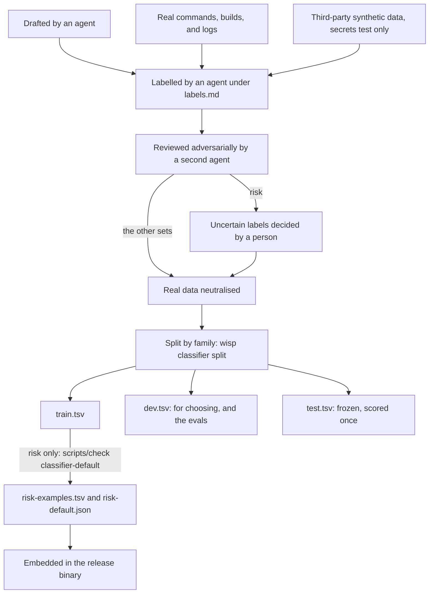

# Training sets

Labelled examples for the fast, specialised classifiers of
[ADR 0038](../docs/decisions/0038-fast-specialised-classifiers.md), one `label<TAB>text` per line, `#`
for comments. Each file's header states its labels and every judgement rule applied, so a reviewer can
check the labels against them. Only one is built into the binary: `risk/train.tsv`, which
`scripts/check classifier-default` copies to `harness/Sources/WispCore/Resources/risk-examples.tsv`, the
bundled examples the shipped risk classifier is trained from (`TrainingSetsTests` fails if the copy
differs).

Each task has its own directory with three parts, kept apart by family: `train.tsv` to learn from,
`dev.tsv` to choose between options (algorithms, tokenisation, training sets), and `test.tsv`, frozen,
for the numbers a decision is reported on and never used to choose anything. `labels.md` holds the
label definitions and judgement rules. Lines are compared in a canonical form, with shell plumbing that does not
change what a command is removed (`2>&1`, `2>/dev/null`, a `VAR=$(…)` wrapper, `VAR=value` prefixes,
`git -C <dir>`, `-q`) and case kept, since it matters in flags. A family is that form with what varies
between near-identical lines replaced: URLs, hex ids (glued to a name too), numbers (glued to letters
too, but not a flag's digit), file names, and path components other than dotfiles. Quoted text is kept,
since in a command it is often the code that runs. Near matches join a family too: 80% of words shared,
or the same words for lines under three words. `wisp classifier split` deals whole
families into parts, each label in proportion, the same way every time for a given seed, and
`TrainingSetsTests` fails if any two parts of a task, or the shipped risk examples and the risk dev set,
share an example exactly, after normalising, by family, or by near match. No overlap is allowed.
`wisp classifier baseline --task risk|failures|log-severity|secrets --examples <file>` prints the label
today's rules give each line (the risk rules, `none` where no rule matches; `KnownFailures` for
failures; `LogDigest`'s keywords for log severity; `SecretScanner` for secrets, the most severe
category it finds), so a trained classifier can be compared with what it would replace.

| Task | train | dev | test | Labels |
| --- | --- | --- | --- | --- |
| `risk` | 2,135 (1,060 drafted, 1,075 real) | 392 (123 drafted, 269 real) | 996 (627 safe, 344 moderate, 25 dangerous) | safe, moderate, dangerous |
| `secrets` | 527 | 93 | 645 (216 none, 218 personal, 211 secret; third-party synthetic data, see `secrets/NOTICE.md`) | secret, personal, none |
| `failures` | 542 | 96 | 400 (169 none, 71 test-failure, 59 error, 51 warning, 50 crash) | error, test-failure, warning, crash, none |
| `log-severity` | 451 | 80 | 381 (275 info, 64 error, 41 warning, 1 fault) | fault, error, warning, info |

The risk dev set is what the evals measure (`RiskEvalSet` reads it): 123 drafted commands and, since
2026-09-26, 269 real ones. It is used to choose, so its scores are not test scores. The real train and
dev commands are the developer's own, like the test set: labelled by an agent under `risk/labels.md`,
reviewed adversarially (`reviews/risk-real.md`, 34 fixes: seven under-ratings, two neutralising
leaks, and 21 copies of test lines that the first overlap check missed), with five conflicting
precedents decided by a person (`risk/labels.md`, "Decided 2026-09-26"), then neutralised and split
by family apart from every other part.

The test sets are real data: commands a developer ran through Claude Code and wisp, output of real
builds and test runs, and a Mac's own logs. Each was labelled by an agent that had not seen the training
data, reviewed adversarially by another (`reviews/*-test.md`, and `reviews/checks.md` for the overlap
checks), corrected, and, for risk, had its 29 uncertain labels decided by a person. They were
neutralised for publication (names of the user, machines, networks, and projects replaced; paths,
session ids, time zones, and credentials removed) and checked with `wisp scan --personal` and a search
for every replaced value. The risk test set's original wording stays on the Mac it came from, in
`~/.wisp/classifiers/risk/held-out.tsv`, so `wisp classifier train --from-audit` there never learns it.

The secrets test set is the exception: it is third-party synthetic data (scanner fixtures and
synthetic PII sets, attributed in `secrets/NOTICE.md`), relabelled by `secrets/labels.md`, reviewed
adversarially (`reviews/secrets-test.md`), and neutralised the same way. Its labels come mostly from
their own sources, so code against prose predicts the class, and it has no home paths or private
hostnames; report it by source and by its hard-negative slice.

The risk train set also has 74 lines on credentials printed into output (`printenv`, `echo`, `jq`,
`kubectl`, `op`, `vault`, and more, inside `docker exec`, `ssh`, and `$(…)`), drafted in real shapes with
safe and moderate near-misses so the word `token` alone does not predict the label, and reviewed
adversarially (`reviews/risk-credentials.md`).

What they cannot yet measure: risk has 25 dangerous commands, so no dangerous command rated safe bounds
that rate only below about 12%; log severity has one fault. Both need more real cases.

## How they were made

The path every set takes, from its sources to the three parts, and for risk into the release:

On 2026-09-26 one agent drafted the four sets, the risk set starting from the bundled examples. A
second agent, which had not written them, reviewed each adversarially (`reviews/`): mislabels,
inconsistent rules, templated near-duplicates, leakage into the eval sets, shortcut tokens that predict
a label, unrealistic text, and data that could be real. Its 382 fixes were applied as proposed, and
then, by hand:

- **risk**: the fake host `x.example` marked 27 dangerous lines and 2 others, a shortcut the eval set
  shares; it was replaced by ten reserved documentation hosts and addresses (RFC 2606, RFC 5737), and
  16 moderate commands contacting the same hosts were added. No line equals an eval command.
- **secrets**: the drafts marked fake keys with `EXAMPLE`, a shortcut; the review replaced them with
  realistic invented values, so a U+200B sits after the fourth character of each value that looks
  like a credential, and inside private-key headers and AWS keys. Secret scanners then do not take the
  file for a leak; `RiskExamples.parse` strips U+200B, and any loader for these sets must too. A real
  address and a real person's name in the drafts were replaced.
- **log-severity**: aligned with `LogDigest`, which reads a level only from `log show`'s columns and
  guesses every other line's from keywords. `debug` became `info`, lines where a process died became
  `fault`, and about 40 lines gained written levels (`ERROR`, `[warn]`, `level=info`, glog's `E0926`),
  with some whose written level is wrong about the line. `fault` is small, 29 lines.

## Measured

On the three-way split, with every choice made on dev and each test set scored once; the figures and
the decisions they led to are in [ADR 0038](../docs/decisions/0038-fast-specialised-classifiers.md)'s amendment "measured on the three-way split". In short: the
trained risk classifier over-rates real commands (376 of 996 exact with the rules, against 574 for the
rules alone), because the drafted training data is shorter and cleaner than real commands; a trained
failures classifier beats `KnownFailures` (macro-F1 0.60 against 0.34 on test); and `LogDigest`'s
keywords beat a trained log-severity classifier (0.62 against 0.36). Every task scores well below
its dev figure on test, so the next training data comes from real use, not more drafting.
It did: with 1,075 real commands added to `risk/train.tsv`, the shipped default rates 817 of the 996
test commands exactly beside the rules, and four of the 25 dangerous ones safe (ADR 0038, amendment
"trained on real commands, and the rules follow the labels").
For secrets, a trained classifier beside `SecretScanner` found more secrets on test but flagged
ordinary lines as secret too often (precision 0.53), so the rules were widened instead. They find
67 of 211 test secrets, up from 27, with 9 false alarms, down from 10
([ADR 0031](../docs/decisions/0031-secret-scanning-and-redaction.md), amendment of 2026-09-27).
The rules together with the on-device model's thorough pass find 132 of the 211 test secrets and 144 of
the 218 personal lines (macro-F1 0.67). With `ollama:granite4.1:8b` for the pass they reach 0.56 (ADR 0031, second
amendment of 2026-09-27).
